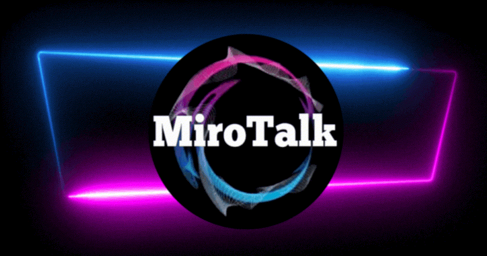

<p align="center">
    <a href="https://docs.mirotalk.com"></a>
</p>

<h1 align="center">MiroTalk Documentation - Open Source Self-Hosted WebRTC Platform</h1>

<h3 align="center">
Complete documentation for MiroTalk WebRTC video conferencing, peer-to-peer calling, live broadcasting, click-to-call, video SaaS, APIs, integrations, deployment, and administration.
</h3>

<br />

<p align="center">
MiroTalk is an open-source, self-hosted WebRTC ecosystem for real-time audio and video communication directly in web browsers.
This documentation covers setup, configuration, APIs, integrations, customization, deployment, and administration for all MiroTalk applications.
</p>

<hr />

<p align="center">
    <a href="https://docs.mirotalk.com">Explore MiroTalk DOCS</a>
</p>

<hr />

## Installation

### Using a virtual environment (recommended)

```bash
python3 -m venv .venv
source .venv/bin/activate
python -m pip install --upgrade pip
python -m pip install -r requirements.txt
```

With fish shell, activate the environment with:

```fish
source .venv/bin/activate.fish
```

---

## Quick Start

```bash
# Clone the repo
$ git clone https://github.com/miroslavpejic85/mirotalk-docs.git

# Go to Docs dir
$ cd mirotalk-docs

# Create and activate a virtual environment
$ python3 -m venv .venv
$ source .venv/bin/activate

# Install the documentation dependencies
$ python -m pip install -r requirements.txt

# Start the built-in dev-server
$ python -m mkdocs serve
```

Open up [http://127.0.0.1:8000](http://127.0.0.1:8000/) in your browser.

---

## Self hosting

[Here the documentation](./docs/docs/self-hosting.md)

---

## Credits

- **[MkDocs](https://github.com/mkdocs/mkdocs)**
- **[MkDocs-material](https://github.com/squidfunk/mkdocs-material)**
