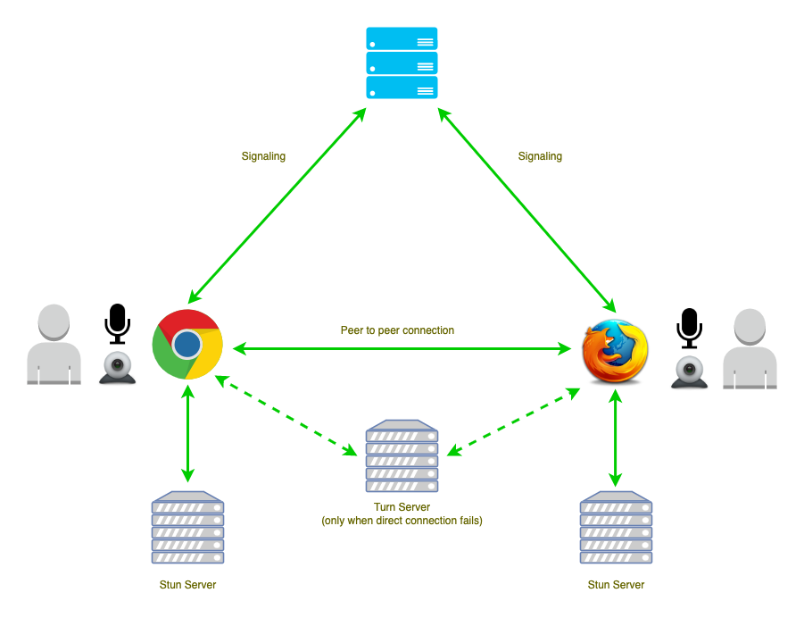

# Coturn STUN/TURN Server



## Requirements

- Server Selection: Recommended [Hetzner](https://www.hetzner.com/cloud) (CX11) or [Contabo](https://www.dpbolvw.net/click-101027391-14462707) (VPS-1) OS: Ubuntu 22.04 LTS.
- Use my [personal link](https://hetzner.cloud/?ref=XdRifCzCK3bn) to receive `€⁠20 in cloud credits` on Hetzner.
- Domain or Subdomain Name (e.g., `YOUR.DOMAIN.NAME`) with a DNS A record pointing to your server's IPv4 address.
- [Certbot](https://certbot.eff.org/) to generate `cert` & `pkey` for `/etc/turnserver.conf`.

## Installation

Install [Coturn](https://github.com/coturn/coturn):

```bash
$ sudo apt-get -y update
$ sudo apt-get -y install coturn
```

Install [Certbot](https://certbot.eff.org/)


```bash
$ sudo apt-get -y update
$ sudo apt-get -y install certbot
```

## Request SSL Certificate

Replace `YOUR.DOMAIN.NAME` with your real domain or subdomain name.

```bash
# The certificates can be found in /etc/letsencrypt/live/YOUR.DOMAIN.NAME/
$ sudo certbot certonly --standalone -d YOUR.DOMAIN.NAME

# Automatically renew the certificates
$ sudo certbot renew
# OR if you have running Nginx
$ sudo certbot renew --nginx
```

## Turn_Server config

Open `/etc/turnserver.conf` and add the following by replacing `YOUR.DOMAIN.NAME` with your real domain or subdomain name.

```ini
listening-port=3478
tls-listening-port=5349

min-port=10000
max-port=20000

fingerprint
lt-cred-mech

user=YOUR.USERNAME:YOUR.PASSWORD

server-name=YOUR.DOMAIN.NAME
realm=YOUR.DOMAIN.NAME

total-quota=100
stale-nonce=600

cert=/etc/letsencrypt/live/YOUR.DOMAIN.NAME/fullchain.pem
pkey=/etc/letsencrypt/live/YOUR.DOMAIN.NAME/privkey.pem

cipher-list="ECDHE-RSA-AES256-GCM-SHA512:DHE-RSA-AES256-GCM-SHA512:ECDHE-RSA-AES256-GCM-SHA384:DHE-RSA-AES256-GCM-SHA384:ECDHE-RSA-AES256-SHA384"

no-stdout-log
```

Uncomment the following line to run Coturn as an automatic system service daemon in `/etc/default/coturn`

```ini
TURNSERVER_ENABLED=1
```

If you can't reach coturn on `tls-listening-port`, try to edit `/etc/systemd/system/multi-user.target.wants/coturn.service`

```ini
[Service]
User=root
Group=root
```

Reload daemon:

```bash
$ sudo systemctl daemon-reload
```

## Coturn commands

```bash
$ sudo service coturn status
$ sudo service coturn stop
$ sudo service coturn start
$ sudo service coturn restart
```

---

## Using Docker


```bash
# Step 1: Pull the Coturn Docker image from Docker Hub (https://hub.docker.com/r/coturn/coturn)
$ docker pull coturn/coturn

# Step 2: Run a Coturn container in detached mode with host network mode
# and mount a local configuration file into the container
docker run -d \
  --network=host \
  --user root \
  -v /etc/turnserver.conf:/etc/coturn/turnserver.conf \
  -v /etc/letsencrypt/live/YOUR.DOMAIN.NAME/fullchain.pem:/etc/letsencrypt/live/YOUR.DOMAIN.NAME/fullchain.pem \
  -v /etc/letsencrypt/live/YOUR.DOMAIN.NAME/privkey.pem:/etc/letsencrypt/live/YOUR.DOMAIN.NAME/privkey.pem \
  coturn/coturn
```

Useful commands:

```bash
# List the currently running Docker containers
$ docker ps

# Stop the Coturn container with the name "compassionate_swanson"
$ docker stop compassionate_swanson

# Start the Coturn container with the name "compassionate_swanson"
$ docker start compassionate_swanson
```

## Docker compose

If you prefer `docker-compose.yml`:

```yaml
services:
  coturn:
    image: coturn/coturn
    container_name: coturn
    network_mode: "host"
    user: "root"
    restart: unless-stopped
    volumes:
      - /etc/turnserver.conf:/etc/coturn/turnserver.conf
      - /etc/letsencrypt/live/YOUR.DOMAIN.NAME/fullchain.pem:/etc/letsencrypt/live/YOUR.DOMAIN.NAME/fullchain.pem
      - /etc/letsencrypt/live/YOUR.DOMAIN.NAME/privkey.pem:/etc/letsencrypt/live/YOUR.DOMAIN.NAME/privkey.pem
```

Then run `docker-compose up -d`

## Test

Test if it's working:

- [trickle-ice](https://webrtc.github.io/samples/src/content/peerconnection/trickle-ice/)
- [icetest](https://icetest.info/)

You can also utilize the built-in MiroTalk service by simply replacing `YOUR.DOMAIN.NAME`, `your.username` and `your.password` with your own values in the following URLs:

```ini
# Default listening port
https://p2p.mirotalk.com/icetest?iceServers=[{"urls":"stun:YOUR.DOMAIN.NAME:3478"},{"urls":"turn:YOUR.DOMAIN.NAME:3478","username":"your.username","credential":"your.password"}]

# Tls listening port
https://p2p.mirotalk.com/icetest?iceServers=[{"urls":"stun:YOUR.DOMAIN.NAME:5349"},{"urls":"turn:YOUR.DOMAIN.NAME:5349","username":"your.username","credential":"your.password"}]
```
