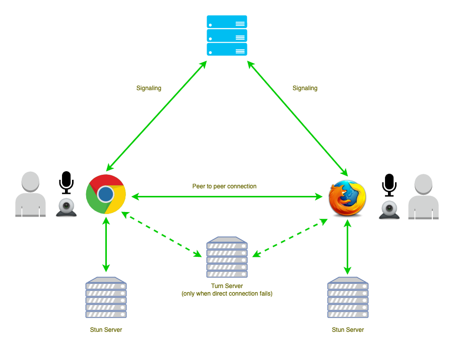

# Coturn STUN/TURN Server



## Requirements

| Requirement | Details |
| :--- | :--- |
| **Server** | [Hetzner](https://www.hetzner.com/cloud) (CX11 — [get €20 credit](https://hetzner.cloud/?ref=XdRifCzCK3bn)), [Hostinger](https://hostinger.com/?REFERRALCODE=MIROTALK) (KVM 2), or [Contabo](https://www.dpbolvw.net/click-101027391-14462707) (VPS-1) |
| **OS** | Ubuntu 22.04 LTS |
| **Domain** | A domain or subdomain (e.g., `YOUR.DOMAIN.NAME`) with a DNS **A record** pointing to your server's IPv4 address |
| **SSL** | [Certbot](https://certbot.eff.org/) to generate the certificate and private key for `/etc/turnserver.conf` |

## Step 1 — Install Coturn and Certbot

Install [Coturn](https://github.com/coturn/coturn) and [Certbot](https://certbot.eff.org/):


```bash
sudo apt-get -y update
sudo apt-get -y install coturn certbot
```

## Step 2 — Request an SSL Certificate

Replace `YOUR.DOMAIN.NAME` with your actual domain or subdomain.

```bash
# Generate the certificate (files saved to /etc/letsencrypt/live/YOUR.DOMAIN.NAME/)
sudo certbot certonly --standalone -d YOUR.DOMAIN.NAME

# Set up automatic renewal
sudo certbot renew
# If Nginx is running, use:
sudo certbot renew --nginx
```

## Step 3 — Configure the TURN Server

Edit `/etc/turnserver.conf`, replacing `YOUR.DOMAIN.NAME`, `YOUR.USERNAME`, and `YOUR.PASSWORD` with your actual values.

See the [official configuration reference](https://github.com/coturn/coturn/wiki/turnserver) for all available options.

```ini
listening-port=3478
tls-listening-port=5349

min-port=10000
max-port=20000

fingerprint
lt-cred-mech

user=YOUR.USERNAME:YOUR.PASSWORD

server-name=YOUR.DOMAIN.NAME
realm=YOUR.DOMAIN.NAME

total-quota=500
stale-nonce=600

cert=/etc/letsencrypt/live/YOUR.DOMAIN.NAME/fullchain.pem
pkey=/etc/letsencrypt/live/YOUR.DOMAIN.NAME/privkey.pem

cipher-list="ECDHE-RSA-AES256-GCM-SHA512:DHE-RSA-AES256-GCM-SHA512:ECDHE-RSA-AES256-GCM-SHA384:DHE-RSA-AES256-GCM-SHA384:ECDHE-RSA-AES256-SHA384"

no-loopback-peers
no-multicast-peers

simple-log
```

Enable the Coturn system service by uncommenting the following line in `/etc/default/coturn`:

```ini
TURNSERVER_ENABLED=1
```

!!! tip "Can't reach the TLS port?"
    If Coturn is unreachable on the `tls-listening-port`, edit `/etc/systemd/system/multi-user.target.wants/coturn.service`:

    ```ini
    [Service]
    User=root
    Group=root
    ```

    Then reload the daemon:

    ```bash
    sudo systemctl daemon-reload
    ```

---

## Security


Harden your Coturn server to prevent abuse. See the [Coturn Security Configuration Guide](https://www.enablesecurity.com/blog/coturn-security-configuration-guide/) by Enable Security for details.

Key recommendations:

- Use `denied-peer-ip` to block private IP ranges (`10.0.0.0/8`, `172.16.0.0/12`, `192.168.0.0/16`)
- Enable `lt-cred-mech` with strong credentials
- Set `no-multicast-peers` and `no-loopback-peers`
- Limit quotas with `user-quota` and `total-quota`
- Enable TLS with strong cipher lists

---

## Service Commands

```bash
sudo service coturn status
sudo service coturn stop
sudo service coturn start
sudo service coturn restart
```

---

## Docker


Pull the image from [Docker Hub](https://hub.docker.com/r/coturn/coturn) and run it:

```bash
docker pull coturn/coturn

docker run -d \
  --network=host \
  --user root \
  -v /etc/turnserver.conf:/etc/coturn/turnserver.conf \
  -v /etc/letsencrypt/live/YOUR.DOMAIN.NAME/fullchain.pem:/etc/letsencrypt/live/YOUR.DOMAIN.NAME/fullchain.pem \
  -v /etc/letsencrypt/live/YOUR.DOMAIN.NAME/privkey.pem:/etc/letsencrypt/live/YOUR.DOMAIN.NAME/privkey.pem \
  coturn/coturn
```

Manage the container:

```bash
docker ps                          # List running containers
docker stop <container_name>       # Stop the Coturn container
docker start <container_name>      # Start the Coturn container
```

### Docker Compose

Alternatively, use a `docker-compose.yml`:

```yaml
services:
  coturn:
    image: coturn/coturn
    container_name: coturn
    network_mode: "host"
    user: "root"
    restart: unless-stopped
    volumes:
      - /etc/turnserver.conf:/etc/coturn/turnserver.conf
      - /etc/letsencrypt/live/YOUR.DOMAIN.NAME/fullchain.pem:/etc/letsencrypt/live/YOUR.DOMAIN.NAME/fullchain.pem
      - /etc/letsencrypt/live/YOUR.DOMAIN.NAME/privkey.pem:/etc/letsencrypt/live/YOUR.DOMAIN.NAME/privkey.pem
```

```bash
docker-compose up -d
```

## Testing

Verify your setup with these tools:

- [Trickle ICE](https://webrtc.github.io/samples/src/content/peerconnection/trickle-ice/)
- [ICE Test](https://icetest.info/)

Or use MiroTalk's built-in tester — replace `YOUR.DOMAIN.NAME`, `your.username`, and `your.password`:

```ini
# Default port (3478)
https://p2p.mirotalk.com/icetest?iceServers=[{"urls":"stun:YOUR.DOMAIN.NAME:3478"},{"urls":"turn:YOUR.DOMAIN.NAME:3478","username":"your.username","credential":"your.password"}]

# TLS port (5349)
https://p2p.mirotalk.com/icetest?iceServers=[{"urls":"stuns:YOUR.DOMAIN.NAME:5349"},{"urls":"turns:YOUR.DOMAIN.NAME:5349","username":"your.username","credential":"your.password"}]
```

## STUN vs. STUNS

| Protocol | Port | Transport | Best For |
| :--- | :--- | :--- | :--- |
| `stun:` | 3478 | Plain UDP/TCP (no encryption) | General use — fastest and most widely supported |
| `stuns:` | 5349 | TLS-encrypted (like HTTPS) | Restricted networks or VPNs that block plain UDP |

!!! note
    Not all browsers support `stuns:`, especially older ones and mobile WebViews. Prefer `stun:` unless your network requires TLS.