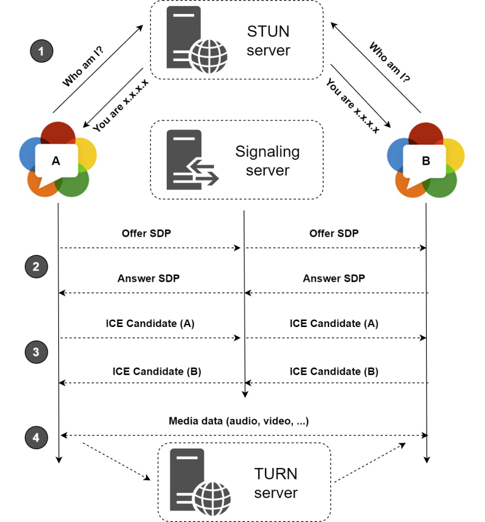

# STUN and TURN Server

WebRTC (Web Real-Time Communication) uses both **STUN** (Session Traversal Utilities for NAT) and **TURN** (Traversal Using Relays around NAT) servers to facilitate peer-to-peer communication when direct connections are hindered by NAT or firewall configurations.

## STUN Server

**STUN** (Session Traversal Utilities for NAT):

- Discovers the public IP address and port of a device, which is essential for establishing peer-to-peer connections behind NAT or firewalls.
- Determines the NAT type, aiding in establishing direct connections when possible.
- Does not relay media traffic — only assists during initial connection setup.
- Works best when both peers can communicate directly after discovering their public addresses.

## TURN Server

**TURN** (Traversal Using Relays around NAT):

- Acts as an intermediary when direct peer-to-peer communication is not possible due to restrictive NAT or firewall configurations.
- Relays media and data traffic between peers when direct connections fail.
- Typically used as a fallback when STUN alone cannot establish a direct connection.
- While STUN discovers public addresses, TURN actively relays traffic, making it more versatile for addressing connectivity issues.

## Summary

In WebRTC applications, both STUN and TURN servers can be configured to handle various networking scenarios. These servers are crucial for achieving robust and reliable real-time communication, especially when dealing with the complexities of NAT traversal.
