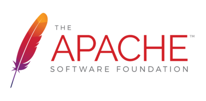

# MiroTalk DOCS - Self Hosting


## Requirements

- Server Selection: Recommended [Hetzner](https://www.hetzner.com/cloud) (CX11) or [Contabo](https://www.dpbolvw.net/click-101027391-14462707) (VPS-S) OS: Ubuntu 22.04 LTS.
- Use my [personal link](https://hetzner.cloud/?ref=XdRifCzCK3bn) to receive `€⁠20 in cloud credits` on Hetzner.
- Mandatory [MkDocs](https://www.mkdocs.org/)
- Domain or Subdomain Name (e.g., `your.domain.name`) with a DNS A record pointing to your server's IPv4 address.

---

## Installation

To install `MkDocs`, you can use one of this method:

### Using `pip`

```bash
$ pip install mkdocs
```

---

### Using `apt`

```bash
$ sudo apt update
$ sudo apt install mkdocs
```

---

### Using `snap`

```bash
$ sudo apt update
$ sudo apt install snapd
$ sudo snap install mkdocs
```

---

## Quick start

```bash
# Clone the repo
$ git clone https://github.com/miroslavpejic85/mirotalk-docs.git

# Go to Docs dir
$ cd mirotalk-docs

# Start to build site
$ mkdocs build

# Enable a web server to access and serve files from that directory
$ sudo chown -R www-data:www-data /root/mirotalk-docs/site

# Move the site folder in /var/www/
$ sudo mv /root/mirotalk-docs/site /var/www/
```

## Configuring Nginx & Certbot


In order to have encrypted communications (https), we going to install [nginx](https://www.nginx.com) and [certbot](https://certbot.eff.org)

```bash
# Install Nginx
$ sudo apt-get install nginx

# Install Certbot (SSL certificates)
$ sudo apt install snapd
$ sudo snap install core; sudo snap refresh core
$ sudo snap install --classic certbot
$ sudo ln -s /snap/bin/certbot /usr/bin/certbot

# Configure Nginx
$ sudo vim /etc/nginx/sites-enabled/default
```

Add the following:

```bash
# HTTP — redirect all traffic to HTTPS
server {
    if ($host = your.domain.name) {
        return 301 https://$host$request_uri;
    }
        listen 80;
        listen [::]:80  ;
    server_name your.domain.name;
    return 404;
}
```

```bash
# Test Nginx configuration
$ sudo nginx -t

# Enable HTTPS with Certbot (follow the instruction)
$ sudo certbot certonly --nginx

# Add Let's Encrypt configuration to Nginx
$ sudo vim /etc/nginx/sites-enabled/default
```

Add the following:

```bash
# MiroTalk P2P - HTTPS — proxy all requests to the Node app
server {
    # Enable HTTP/2
    listen 443 ssl http2;
    listen [::]:443 ssl http2;
    server_name your.domain.name;

    # Use the Let’s Encrypt certificates
    ssl_certificate /etc/letsencrypt/live/your.domain.name/fullchain.pem;
    ssl_certificate_key /etc/letsencrypt/live/your.domain.name/privkey.pem;

    # Directory where the website is located
    root /var/www/site;
    index index.html;

    location / {
        try_files $uri $uri/ =404;
    }
}
```

```bash
# Test Nginx configuration again
$ sudo nginx -t

# Restart nginx
$ service nginx restart
$ service nginx status

# Set up auto-renewal for SSL certificates
$ sudo certbot renew --dry-run

# Show certificates
$ sudo certbot certificates
```

Check Your MiroTalk DOCS instance: [https://your.domain.name](https://your.domain.name)

---

## Apache Virtual Host (Alternative to Nginx)



If you prefer `Apache`, configure it with the equivalent settings provided in this guide.

```bash
# Edit the apache sites
vim /etc/apache2/sites-enabled/your.domain.name.conf
```

Add the following:

```bash
# HTTP — redirect all traffic to HTTPS
<VirtualHost *:80>
    ServerName your.domain.name
    Redirect permanent / https://your.domain.name
</VirtualHost>

# MiroTalk DOCS - HTTPS — proxy all requests to the site Dir
<VirtualHost *:443>
    ServerName your.domain.name

    # SSL Configuration
    SSLEngine on
    SSLCertificateFile /etc/letsencrypt/live/your.domain.name/fullchain.pem
    SSLCertificateKeyFile /etc/letsencrypt/live/your.domain.name/privkey.pem
    Include /etc/letsencrypt/options-ssl-apache.conf

    # Enable HTTP/2 support
    Protocols h2 http/1.1

    DirectoryIndex index.html

    <Directory "/var/www/site">
        Options FollowSymLinks
        AllowOverride All
        Require all granted
    </Directory>

    ErrorDocument 404 /404.html

    <Location />
        Options FollowSymLinks
        AllowOverride All
    </Location>
</VirtualHost>
```

---

## Updating Your Instance

To keep your MiroTalk DOCS instance up to date, create an update script:

```bash
cd
# Create a file docsUpdate.sh
$ vim docsUpdate.sh
```

---

Add the following:

```bash
#!/bin/bash

cd mirotalk-docs
git pull
mkdocs build
sudo chown -R www-data:www-data /root/mirotalk-docs/site
sudo rm -r /var/www/site/*
sudo mv /root/mirotalk-docs/site /var/www/
```

---

Make the script executable

```bash
$ chmod +x docsUpdate.sh
```

To update your MiroTalk DOCS instance to the latest version, run the script:

```bash
./docsUpdate.sh
```

---

## Changelogs

Stay informed about project updates by following the commits of the MiroTalk DOCS project [here](https://github.com/miroslavpejic85/mirotalk-docs/commits/main)

---
