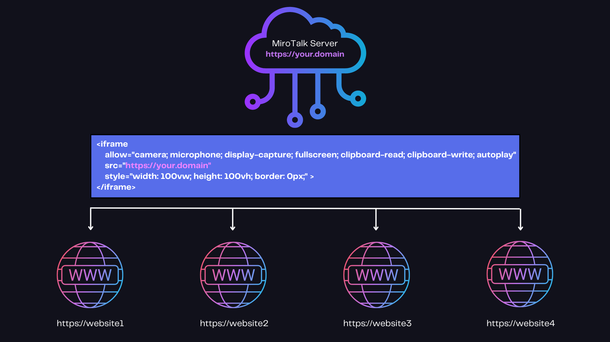

# MiroTalk Home


## MiroTalk projects

| Project           | Live demo                                                  |
| ----------------- | ---------------------------------------------------------- |
| `🏆 MiroTalk SFU` | [https://sfu.mirotalk.com](https://sfu.mirotalk.com)       |
| `🚀 MiroTalk P2P` | [https://p2p.mirotalk.com](https://p2p.mirotalk.com)       |
| `✨ MiroTalk C2C` | [https://c2c.mirotalk.com](https://c2c.mirotalk.com)       |
| `📡 MiroTalk BRO` | [https://bro.mirotalk.com](https://bro.mirotalk.com)       |
| `🛠 MiroTalk WEB` | [https://webrtc.mirotalk.com](https://webrtc.mirotalk.com) |

---

## License

`Support` the ongoing `development` and adapt MiroTalk to your unique needs.

🌐 [Check our licensing options](./license/licensing-options.md)

---

## Join for Questions & Support

To engage in `questions`, `discussions`, or seek `assistance and support`, we invite you to join us on our [Discord server](https://discord.gg/rgGYfeYW3N).

---

## About

MiroTalk WebRTC is a real-time communication technology that enables audio and video communication over the internet through web browsers without the need for additional plugins or software installations. It stands out as a core component of many web-based video conferencing and communication platforms, offering several advantages:

Pros of MiroTalk WebRTC:

| PROS                               | Description                                                                                                                                                         |
| ---------------------------------- | ------------------------------------------------------------------------------------------------------------------------------------------------------------------- |
| `🌐 Ease of Use:`                  | MiroTalk WebRTC simplifies online communication by allowing users to connect via web browsers, eliminating the need for complex setups or downloads.                |
| `⚡ Low Latency:`                  | It provides low-latency audio and video transmission, ensuring a smooth and near-instantaneous conversation experience, crucial for real-time interactions.         |
| `🔒 Security:`                     | WebRTC offers end-to-end encryption, enhancing the security and privacy of your online conversations, making it suitable for confidential or sensitive discussions. |
| `💻 Cross-Platform Compatibility:` | MiroTalk WebRTC works on various platforms, including Windows, macOS, Linux, Android, and iOS, ensuring broad accessibility.                                        |
| `📈 Scalability:`                  | It is highly scalable, making it suitable for both one-on-one conversations and large-scale conferences, adapting to your communication needs.                      |
| `🔗 Integration:`                  | Many communication platforms and applications integrate MiroTalk WebRTC, enabling seamless communication within existing software or services.                      |
| ` 🛠️ Flexible and Extensible:`     | MiroTalk WebRTC's allows developers to tap into code, facilitating innovation and enabling tailored solutions to meet specific communication requirements.          |
| `💰 Reduced Costs:`                | Since it doesn't require dedicated hardware or software licenses, it can be a cost-effective solution for businesses and individuals.                               |
| `🎮 Versatile Applications:`       | Besides video conferencing, MiroTalk WebRTC can be used for various applications like online gaming, customer support, and live streaming.                          |

Overall, MiroTalk WebRTC is a versatile, user-friendly, and secure technology that has revolutionized online communication by providing high-quality, real-time audio and video capabilities directly through web browsers. Its widespread adoption has made it a fundamental tool for businesses, organizations, and individuals seeking efficient and effective online interactions.

---

## Fast integration



Easily incorporate MiroTalk into your website or app with a straightforward iframe and just a few lines of code!

[MiroTalk SFU example](https://codepen.io/Miroslav-Pejic/pen/LYXRbmE)

```html
<iframe
  allow="camera; microphone; display-capture; fullscreen; clipboard-read; clipboard-write; autoplay"
  src="https://sfu.mirotalk.com/newroom"
  style="width: 100vw; height: 100vh; border: 0px;"
></iframe>
```

[MiroTalk P2P example](https://codepen.io/Miroslav-Pejic/pen/jOQMVzx)

```html
<iframe
  allow="camera; microphone; display-capture; fullscreen; clipboard-read; clipboard-write; autoplay"
  src="https://p2p.mirotalk.com/newcall"
  style="width: 100vw; height: 100vh; border: 0px;"
></iframe>
```

[MiroTalk C2C example](https://codepen.io/Miroslav-Pejic/pen/ExOgNbJ)

```html
<iframe
  allow="camera; microphone; display-capture; fullscreen; clipboard-read; clipboard-write; autoplay"
  src="https://c2c.mirotalk.com"
  style="width: 100vw; height: 100vh; border: 0px;"
></iframe>
```

[MiroTalk BRO example](https://codepen.io/Miroslav-Pejic/pen/OJaRbZg)

```html
<iframe
  allow="camera; microphone; display-capture; fullscreen; clipboard-read; clipboard-write; autoplay"
  src="https://bro.mirotalk.com"
  style="width: 100vw; height: 100vh; border: 0px;"
></iframe>
```

[MiroTalk WEB example](https://codepen.io/Miroslav-Pejic/pen/jOQMVxx)

```html
<iframe
  allow="camera; microphone; display-capture; fullscreen; clipboard-read; clipboard-write; autoplay"
  src="https://webrtc.mirotalk.com"
  style="width: 100vw; height: 100vh; border: 0px;"
></iframe>
```

An example of how to integrate MiroTalk with a [React application](https://codepen.io/Miroslav-Pejic/pen/QWzmGaZ)

After setting up your MiroTalk instances, please update the `src` attribute with your custom domain or subdomain name.

---

## Quick custom integration

Refine and organize the steps for integrating MiroTalk into your existing application. Identify the specific module or page where you intend to integrate the video conferencing feature. This integration can be implemented into existing platforms such as `Perfex, PlayTube, Sngine, Wowonder`, or other web applications.

#### HTML Button:

Create a button element in the HTML of your chosen page to serve as the trigger for starting a video conference session.

```html
<!-- Button for Javascript -->

<button id="startConferenceButton">Start Video Conference></button>

<!-- Button for PHP-->

<form method="post">
  <button type="submit" name="startConferenceButton" id="startConferenceButton">
    Start Conference>
  </button>
</form>
```

#### JavaScript or PHP Function:

Use JavaScript or PHP to handle the button click event, opening a new window or tab for the video conference.

JavaScript button click event:

```javascript
document
  .getElementById("startConferenceButton")
  .addEventListener("click", function () {
    window.open("videoConference.html", "_blank");
    // toggleMiroTalk();
  });
```

PHP button click event:

```php
<?php
if ($_SERVER['REQUEST_METHOD'] === 'POST') {
 if (isset($_POST['startConferenceButton'])) {
  echo '<script> window.open("videoConference.html", "_blank"); </script>';
  // echo '<script> toggleMiroTalk(); </script>';
 }
}
```

#### Video Conference HTML Page:

Create a dedicated HTML page, named `videoConference.html`, to host the video conferencing functionality.

```html
<!-- videoConference.html -->
<!doctype html>
<html>
  <head>
    <meta charset="utf-8" />
    <meta http-equiv="X-UA-Compatible" content="IE=edge" />
    <meta name="viewport" content="width=device-width, initial-scale=1.0" />
  </head>

  <body>
    <!-- HTML container for the video conference -->
    <iframe
      id="mirotalkIframe"
      allow="camera; microphone; display-capture; fullscreen; clipboard-read; clipboard-write; autoplay"
      src="https://sfu.mirotalk.com/newroom"
      style="height: 100vh; width: 100vw; border: 0px;"
    ></iframe>
  </body>

  <!--
    The iframe 'src' attribute can be any of:
      - https://sfu.mirotalk.com
      - https://p2p.mirotalk.com
      - https://c2c.mirotalk.com
      - https://bro.mirotalk.com
      - https://webrtc.mirotalk.com
      - ...
	-->
</html>
```

Another approach is to embed the iframe within your current website or application page and control its visibility through toggling.

```javascript
function toggleMiroTalk() {
  const mirotalkIframe = document.getElementById("mirotalkIframe");
  mirotalkIframe.style.display =
    mirotalkIframe.style.display === "none" ||
    mirotalkIframe.style.display === ""
      ? "block"
      : "none";
}
```

After setting up your MiroTalk instances, please update the `src` attribute with your custom `domain` or `subdomain name`.

#### Customize your iframe scr attribute:

You can customize the URL for the `src` attribute using query parameters, as explained in the "join-room" section for each MiroTalk variant:

- [MiroTalk SFU direct join](./mirotalk-sfu/join-room.md)
- [MiroTalk P2P direct join](./mirotalk-p2p/join-room.md)
- [MiroTalk C2C direct join](./mirotalk-c2c/join-room.md)
- [MiroTalk BRO direct join](./mirotalk-bro/join-room.md)

---

Additionally, you have the option to generate the URL through our RestAPI:

- [MiroTalk SFU REST API](./mirotalk-sfu/api.md)
- [MiroTalk P2P REST API](./mirotalk-p2p/api.md)
- [MiroTalk C2C REST API](./mirotalk-c2c/api.md)
- [MiroTalk BRO REST API](./mirotalk-bro/api.md)
- [MiroTalk WEB REST API](./mirotalk-web/api.md)

---
