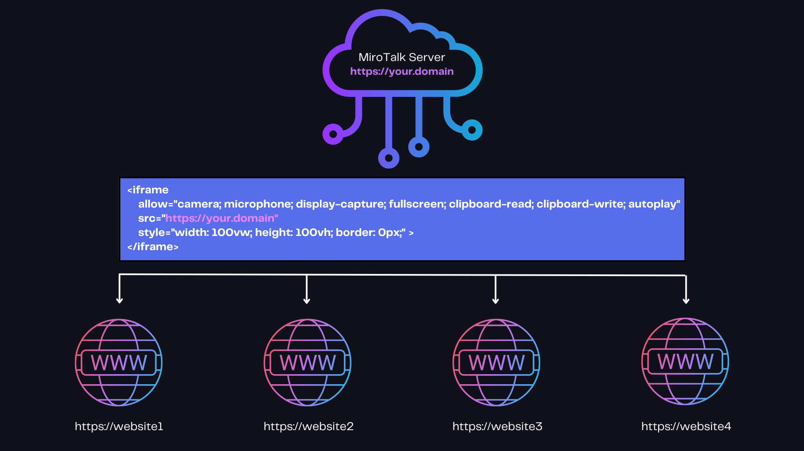

# MiroTalk Home


## MiroTalk Projects

| Project | Live Demo | Description |
| :--- | :--- | :--- |
| 🏆 **SFU** | [sfu.mirotalk.com](https://sfu.mirotalk.com) | Scalable group video conferencing |
| 🚀 **P2P** | [p2p.mirotalk.com](https://p2p.mirotalk.com) | Peer-to-peer video calls |
| ✨ **C2C** | [c2c.mirotalk.com](https://c2c.mirotalk.com) | Cam-to-Cam communication |
| 📡 **BRO** | [bro.mirotalk.com](https://bro.mirotalk.com) | Broadcasting one-to-many streaming |
| 🛠 **WEB** | [webrtc.mirotalk.com](https://webrtc.mirotalk.com) | Room scheduler and meeting manager |
| ⚙️ **ADMIN** | [Self-hosting guide](https://docs.mirotalk.com/mirotalk-admin/self-hosting) | Manage updates, configurations, and settings |

---

View the complete [MiroTalk projects overview and comparisons](html/overview.html).

---

## License

Support the ongoing development and adapt MiroTalk to your unique needs.

🌐 [Check our licensing options](./license/licensing-options.md)

---

## Questions & Support

Join our [MiroTalk Community Forum](https://discord.gg/rgGYfeYW3N) for questions, discussions, and support.

---

## About

MiroTalk WebRTC enables real-time audio and video communication directly through web browsers — no plugins or software installations required.

| Advantage | Description |
| :--- | :--- |
| 🌐 **Ease of Use** | Connect via any web browser — no complex setups or downloads needed |
| ⚡ **Low Latency** | Smooth, near-instantaneous audio and video for real-time interactions |
| 🔒 **Security** | End-to-end encryption for private and confidential conversations |
| 💻 **Cross-Platform** | Works on Windows, macOS, Linux, Android, and iOS |
| 📈 **Scalability** | Supports one-on-one calls through large-scale conferences |
| 🔗 **Integration** | Embeds seamlessly into existing platforms and applications |
| 🛠️ **Flexible** | Open codebase lets developers build tailored solutions |
| 💰 **Reduced Costs** | No dedicated hardware or software licenses required |
| 🎮 **Versatile** | Use for video conferencing, live streaming, customer support, and more |

---

## Fast Integration



Embed MiroTalk into your website or app with a simple iframe:

```html
<iframe
  allow="camera; microphone; speaker-selection; display-capture; fullscreen; clipboard-read; clipboard-write; web-share; autoplay; picture-in-picture"
  src="https://sfu.mirotalk.com/newroom"
  style="width: 100vw; height: 100vh; border: 0px;"
></iframe>
```

Just change the `src` to match the MiroTalk variant you need:

| Project | Source URL | CodePen |
| :--- | :--- | :--- |
| **SFU** | `https://sfu.mirotalk.com/newroom` | [Demo](https://codepen.io/Miroslav-Pejic/pen/LYXRbmE) |
| **P2P** | `https://p2p.mirotalk.com/newcall` | [Demo](https://codepen.io/Miroslav-Pejic/pen/jOQMVzx) |
| **C2C** | `https://c2c.mirotalk.com` | [Demo](https://codepen.io/Miroslav-Pejic/pen/ExOgNbJ) |
| **BRO** | `https://bro.mirotalk.com` | [Demo](https://codepen.io/Miroslav-Pejic/pen/OJaRbZg) |
| **WEB** | `https://webrtc.mirotalk.com` | [Demo](https://codepen.io/Miroslav-Pejic/pen/jOQMVxx) |

See also: [React integration example](https://codepen.io/Miroslav-Pejic/pen/QWzmGaZ)

After setting up your MiroTalk instances, update the `src` attribute with your custom domain or subdomain.

---

## Quick Custom Integration

Integrate MiroTalk into existing platforms like Perfex, PlayTube, Sngine, Wowonder, or any web application.

#### 1. HTML Button

Add a button to trigger a video conference session:

```html
<!-- Button for Javascript -->

<button id="startConferenceButton">Start Video Conference></button>

<!-- Button for PHP-->

<form method="post">
  <button type="submit" name="startConferenceButton" id="startConferenceButton">
    Start Conference>
  </button>
</form>
```

#### 2. Handle the Click Event

**JavaScript:**

```javascript
document
  .getElementById("startConferenceButton")
  .addEventListener("click", function () {
    window.open("videoConference.html", "_blank");
    // toggleMiroTalk();
  });
```

**PHP:**

```php
<?php
if ($_SERVER['REQUEST_METHOD'] === 'POST') {
 if (isset($_POST['startConferenceButton'])) {
  echo '<script> window.open("videoConference.html", "_blank"); </script>';
  // echo '<script> toggleMiroTalk(); </script>';
 }
}
```

#### 3. Video Conference Page

Create a dedicated `videoConference.html` page:

```html
<!-- videoConference.html -->
<!doctype html>
<html>
  <head>
    <meta charset="utf-8" />
    <meta http-equiv="X-UA-Compatible" content="IE=edge" />
    <meta name="viewport" content="width=device-width, initial-scale=1.0" />
  </head>

  <body>
    <!-- HTML container for the video conference -->
    <iframe
      id="mirotalkIframe"
      allow="camera; microphone; display-capture; fullscreen; clipboard-read; clipboard-write; web-share; autoplay"
      src="https://sfu.mirotalk.com/newroom"
      style="height: 100vh; width: 100vw; border: 0px;"
    ></iframe>
  </body>

  <!--
    The iframe 'src' attribute can be any of:
      - https://sfu.mirotalk.com
      - https://p2p.mirotalk.com
      - https://c2c.mirotalk.com
      - https://bro.mirotalk.com
      - https://webrtc.mirotalk.com
      - ...
	-->
</html>
```

Alternatively, embed the iframe in your existing page and toggle its visibility:

```javascript
function toggleMiroTalk() {
  const mirotalkIframe = document.getElementById("mirotalkIframe");
  mirotalkIframe.style.display =
    mirotalkIframe.style.display === "none" ||
    mirotalkIframe.style.display === ""
      ? "block"
      : "none";
}
```

After setting up your MiroTalk instances, update the `src` attribute with your custom domain or subdomain.

#### 4. Customize the iframe `src`

Use query parameters to customize the URL — see the "join-room" guide for each variant:

- [MiroTalk SFU direct join](./mirotalk-sfu/join-room.md)
- [MiroTalk P2P direct join](./mirotalk-p2p/join-room.md)
- [MiroTalk C2C direct join](./mirotalk-c2c/join-room.md)
- [MiroTalk BRO direct join](./mirotalk-bro/join-room.md)

---

You can also generate meeting URLs via the REST API:

- [MiroTalk SFU REST API](./mirotalk-sfu/api.md)
- [MiroTalk P2P REST API](./mirotalk-p2p/api.md)
- [MiroTalk C2C REST API](./mirotalk-c2c/api.md)
- [MiroTalk BRO REST API](./mirotalk-bro/api.md)
- [MiroTalk WEB REST API](./mirotalk-web/api.md)

---
