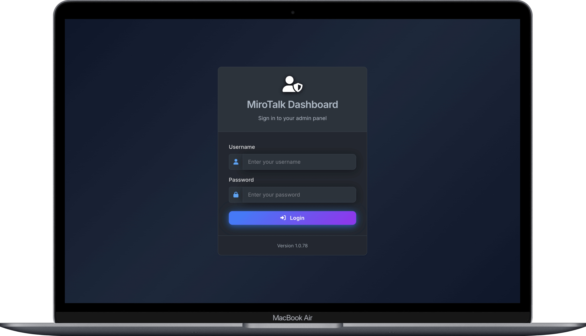

# MiroTalk Admin

A self-hosted control plane for operators who manage MiroTalk services. Admin centralizes configuration, updates, credentials, and process oversight; it is not a meeting or media service.

[Open the quick start](quick-start.md){ .md-button .md-button--primary }
[Self-host MiroTalk Admin](self-hosting.md){ .md-button }

{ .product-shot }

## What Admin manages

- MiroTalk service configuration and environment settings
- Application updates and process lifecycle operations
- Multiple deployed instances from one dashboard
- User and credential administration
- Operational status and process monitoring

## Choose an operating mode

| Mode | Use it when | Privileged boundary |
| --- | --- | --- |
| SSH | Services run on remote hosts | Admin receives credentials and remote shell access |
| Docker | Services run as containers | Admin requires access to the Docker daemon |
| PM2 | Node.js services use PM2 | Admin controls application processes and configuration |

Choose the least-privileged mode that supports your deployment. Restrict dashboard access and protect all credentials used to manage infrastructure.

## Start and deploy

| Goal | Documentation |
| --- | --- |
| Evaluate locally | [Quick start](quick-start.md) |
| Deploy for production | [Self-hosting guide](self-hosting.md) |
| Inspect the implementation | [GitHub repository](https://github.com/miroslavpejic85/mirotalk-admin) |

## Security responsibilities

- Serve the dashboard over HTTPS.
- Replace default credentials before exposing a deployment.
- Use strong JWT secrets and restrict privileged accounts.
- Protect SSH keys, Docker socket access, and managed-host credentials.
- Limit network access to the administration interface.
- Back up configuration before updates.

!!! warning "Admin has privileged infrastructure access"

    Compromise of the dashboard or its credentials can affect every managed service. Treat Admin as an operational control plane and isolate it accordingly.

## Related paths

[Compare MiroTalk products](../overview/index.md){ .md-button }
[Open all self-hosting guides](../self-host/index.md){ .md-button }
[Contact MiroTalk Enterprise](../enterprise/index.md){ .md-button .md-button--primary }