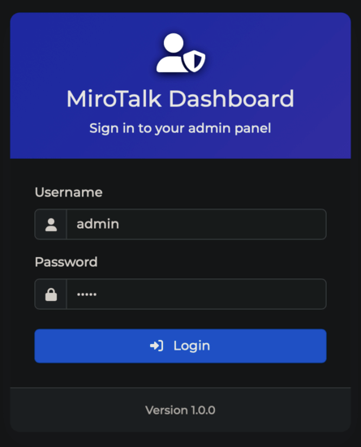

# MiroTalk Admin

A secure, modern web dashboard to manage **[MiroTalk](https://docs.mirotalk.com/html/overview.html)** updates, configuration, and settings with ease.

---



## Requirements

- [Node.js](https://nodejs.org/en/) (LTS) and npm

---

## Installation


Install `NodeJS` and `npm` using [Node Version Manager](../utility/nvm.md)

---

## 🚀 Quick Start (Local)

**1. Clone and Set Up the Backend**

```bash
git clone https://github.com/miroslavpejic85/mirotalk-admin.git
cd mirotalk-admin
cp backend/config/index.template.js backend/config/index.js
cp .env.template .env
npm install
npm start
```

**2. Open the Admin Dashboard**

- Visit: [http://localhost:9999/admin](http://localhost:9999/admin)
- Default credentials:
  - **Username:** `admin`
  - **Password:** `admin`

---

## 🐳 Quick Start with Docker

**1. Prepare your environment files:**

```bash
git clone https://github.com/miroslavpejic85/mirotalk-admin.git
cd mirotalk-admin
cp backend/config/index.template.js backend/config/index.js
cp .env.template .env
cp docker-compose.template.yml docker-compose.yml
```

**2. Build and run with Docker Compose:**

```bash
docker pull mirotalk/admin:latest
docker compose up
```

**3. Access the dashboard:**  
[http://localhost:9999/admin](http://localhost:9999/admin)

---

## ⚠️ Security Checklist

Before using MiroTalk Admin, **please update your environment settings** to keep your instance secure:

### 🔐 Admin Dashboard

- Set `ADMIN_DASHBOARD_ENABLED=true` to enable the dashboard.
- **Change the default credentials:**
  - `ADMIN_USERNAME`
  - `ADMIN_PASSWORD`
  - `ADMIN_JWT_SECRET`

### 🛠️ Management Mode (`APP_MANAGE_MODE`)

Choose how you want to manage your MiroTalk instance:

- **Local Device Management (via SSH):**
  - Set `APP_MANAGE_MODE=ssh`
  - Configure:
    - `SSH_HOST`
    - `SSH_PORT`
    - `SSH_USERNAME`
    - `SSH_PASSWORD` or `SSH_PRIVATE_KEY`

  - **Self-Hosted with Docker:**
    - Set `APP_MANAGE_MODE=docker`

  - **Self-Hosted with PM2:**
    - Set `APP_MANAGE_MODE=pm2`

---

✅ **Tip:**  
Regularly review and update your `.env` settings to keep your MiroTalk instance secure and manageable.

---
