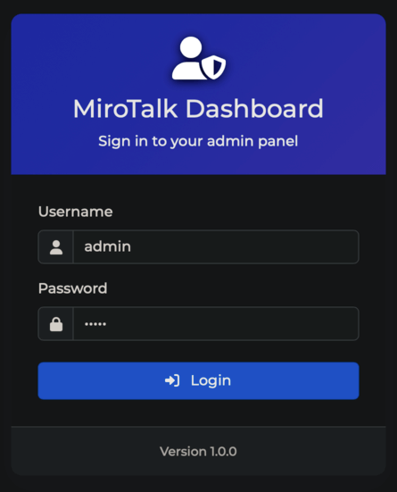

# MiroTalk Admin

A secure, modern web dashboard to manage **[MiroTalk](https://docs.mirotalk.com/html/overview/)** updates, configuration, and settings with ease.

---



---

## 🚀 Quick Start

1. **Clone the Repository and Set Up Backend**

    ```bash
    git clone https://github.com/miroslavpejic85/mirotalk-admin.git
    cd mirotalk-admin
    cp backend/config/index.template.js backend/config/index.js
    cp .env.template .env
    npm ci
    npm start
    ```

2. **Open the Admin Dashboard**

    - Go to: [http://localhost:9999/admin](http://localhost:9999/admin)
    - **Default credentials:**
        - **Username:** `mirotalk`
        - **Password:** `admin`

---

## ⚡ Quick Start with PM2

1. **Install PM2 globally (if not already installed):**

    ```bash
    npm install -g pm2
    ```

2. **Clone and set up the project:**

    ```bash
    git clone https://github.com/miroslavpejic85/mirotalk-admin.git
    cd mirotalk-admin
    cp backend/config/index.template.js backend/config/index.js
    cp .env.template .env
    npm ci
    ```

3. **Start the server with PM2:**

    ```bash
    pm2 start backend/server.js --name mirotalk-admin
    ```

4. **View logs and manage the process:**

    ```bash
    pm2 logs mirotalk-admin
    pm2 status
    ```

5. **Access the Dashboard:**
    - Open: [http://localhost:9999/admin](http://localhost:9999/admin)

---

## 🐳 Quick Start with Docker

!!! warning
    **Works only on `APP_MANAGE_MODE=ssh`**

1. **Prepare Your Environment Files**

    ```bash
    git clone https://github.com/miroslavpejic85/mirotalk-admin.git
    cd mirotalk-admin
    cp backend/config/index.template.js backend/config/index.js
    cp .env.template .env
    cp docker-compose.template.yml docker-compose.yml
    ```

2. **Pull and Run with Docker Compose**

    ```bash
    docker pull mirotalk/admin:latest
    docker compose up
    ```

3. **Access the Dashboard**
    - Open: [http://localhost:9999/admin](http://localhost:9999/admin)

---

## ⚠️ Security Checklist

> **Important:**  
> Before using MiroTalk Admin, update your environment settings to keep your instance secure.

### 🔐 Admin Dashboard

- Set `ADMIN_DASHBOARD_ENABLED=true` to enable the dashboard.
- **Change the default credentials:**
    - `ADMIN_USERNAME`
    - `ADMIN_PASSWORD_HASH`  

        👉 generate it by running:

        ```js
        node backend/scripts/hashPassword.js
        ```

    - `ADMIN_JWT_SECRET` 
  
        👉 generate it by running:

        ```js
        node backend/scripts/generateJwtSecret.js
        ```

### 🛠️ Management Mode (`APP_MANAGE_MODE`)

Choose how you want to manage your MiroTalk instance:

- **Local Device Management (via SSH):**

    - Set `APP_MANAGE_MODE=ssh`
    - Configure:
        - `SSH_HOST`
        - `SSH_PORT`
        - `SSH_USERNAME`
        - `SSH_PASSWORD` or `SSH_PRIVATE_KEY`
        - `SSH_HOST_FINGERPRINT_SHA256` — **required**. Pinned SHA-256 host-key fingerprint to prevent MITM.

            Obtain it with:

            ```bash
            ssh-keyscan -t ed25519 <host> | ssh-keygen -lf - -E sha256
            ```

            Paste the resulting `SHA256:…` value (or raw base64 / 64-char hex) into `.env`.

- **Self-Hosted with Docker:**

    - Set `APP_MANAGE_MODE=docker`

- **Self-Hosted with PM2:**
    - Set `APP_MANAGE_MODE=pm2`

Specify which instances you want to manage by listing their names (comma-separated), and provide the absolute paths to their directories:

```bash
APP_NAME=mirotalksfu,mirotalk,mirotalkc2c,mirotalkbro,mirotalkwebrtc,mirotalkadmin
MIROTALK_SFU_DIR=/root/mirotalksfu
MIROTALK_P2P_DIR=/root/mirotalk
MIROTALK_BRO_DIR=/root/mirotalkbro
MIROTALK_C2C_DIR=/root/mirotalkc2c
MIROTALK_WEB_DIR=/root/mirotalkwebrtc
MIROTALK_ADMIN_DIR=/root/mirotalk-admin
```

---

> ✅ **Tip:**  
> Regularly review and update your `.env` settings to keep your MiroTalk instance secure and manageable.

---

### 🔒 TLS / HTTPS in Production

The dashboard listens on a single HTTPS port (`ADMIN_PORT`) via the
Node.js stdlib `https` module — plaintext HTTP requests on this port are
rejected at the TLS layer and cannot reach the application.

- Defense-in-depth: when `NODE_ENV=production`, any request whose
  `req.secure` is false (e.g. arriving through a misconfigured reverse
  proxy that did not set `X-Forwarded-Proto: https`) is 301-redirected
  to HTTPS for `GET`/`HEAD` and rejected with `403` for any other
  method. Plaintext `ws://` socket upgrades are likewise refused.
- The bundled certificate in [backend/ssl/](backend/ssl/) is **self-signed**
  and intended for first-boot / local development only. For production,
  either:
    - replace `backend/ssl/key.pem` and `backend/ssl/cert.pem` with a
      certificate issued by a trusted CA (e.g. Let's Encrypt), or
    - put the dashboard behind a TLS-terminating reverse proxy
      (nginx, Caddy, Traefik, an ALB, etc.) and bind the dashboard to
      `127.0.0.1`. When doing so, set `TRUST_PROXY=true` so the
      `X-Forwarded-Proto` and `X-Forwarded-For` headers are honored.
- Responses include `Strict-Transport-Security: max-age=63072000; includeSubDomains`
  to pin compliant browsers to HTTPS.

#### Local development with a trusted cert

The bundled `backend/ssl/cert.pem` is self-signed, so on the first visit
your browser will show a "Not secure / self-signed certificate" warning.
Click through it once (Chrome: type `thisisunsafe` on the warning page,
or **Advanced → Proceed**; Firefox: **Accept the Risk and Continue**) and
the dashboard at <https://localhost:9999/admin> will load.

To remove the warning entirely in development, install
[`mkcert`](https://github.com/FiloSottile/mkcert) and issue a cert that
your OS / browsers actually trust. Place the dev cert in
`backend/ssl/dev/` — the server auto-detects it when `NODE_ENV` is not
`production` and falls back to `backend/ssl/` otherwise:

```bash
# macOS
brew install mkcert nss
mkcert -install

mkdir -p backend/ssl/dev
cd backend/ssl/dev
mkcert -key-file key.pem -cert-file cert.pem localhost 127.0.0.1 ::1
```

`backend/ssl/dev/` is gitignored, so the locally-trusted cert never
ships with the repo. In production the server always uses
`backend/ssl/key.pem` + `backend/ssl/cert.pem`, which should hold a
CA-issued cert (or be replaced by a TLS-terminating reverse proxy as
described above).

Restart the server and the lock icon will be green. The dev workflow is
otherwise unchanged — the dashboard is HTTPS-only in every environment
so behavior in dev matches production (`Secure` cookies, HSTS, mixed
content, `wss://` upgrades, etc.).

---