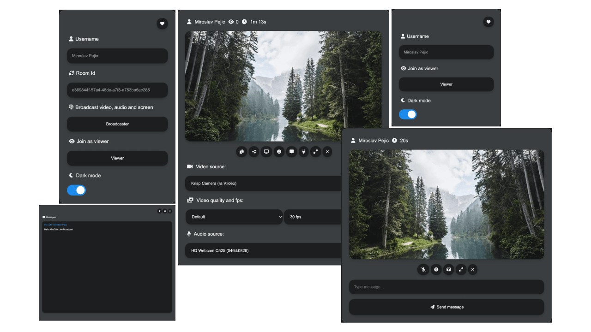

# MiroTalk BRO

A self-hosted one-to-many broadcasting experience for a presenter and audience. BRO supports direct P2P distribution and server-forwarded SFU distribution so the operating model can match the event.

[Try the live demo](https://bro.mirotalk.com){ .md-button .md-button--primary }
[Self-host MiroTalk BRO](self-hosting.md){ .md-button }

{ .product-shot }

## Choose a delivery mode

| Mode | Media path | Best fit | Main constraint |
| --- | --- | --- | --- |
| P2P | Presenter sends directly to viewers when possible | Smaller audiences and minimal media infrastructure | Presenter uplink and TURN relay demand grow with viewers |
| SFU | Presenter sends to a media server that forwards to viewers | Audiences that need server-side distribution | Server CPU and outbound bandwidth |

The appropriate mode depends on media quality, audience concurrency, presenter connectivity, region, and available infrastructure. Validate the intended workload before an event.

[Compare product architectures](../overview/index.md){ .md-button }
[Read about STUN and TURN](../coturn/stun-turn.md){ .md-button }

## Broadcast capabilities

- Live webcam, microphone, and screen broadcasting
- Viewer messaging and presenter controls
- Browser recording where configured
- Responsive viewer experience without a required plugin
- Iframe embedding for existing sites

## Build with BRO

| Goal | Documentation |
| --- | --- |
| Create broadcasts programmatically | [REST API](api.md) |
| Embed a broadcast | [Iframe integration](integration.md) |
| Construct direct broadcast links | [Join options](join-room.md) |

## Self-host and operate

| Stage | Documentation |
| --- | --- |
| Install | [Self-hosting guide](self-hosting.md) |
| Configure P2P or SFU behavior | [Configuration reference](configurations.md) |
| Develop locally | [Ngrok guide](ngrok.md) |

!!! warning "Distribution changes infrastructure demand"

    P2P mode moves distribution work toward the presenter and access network. SFU mode moves that work to server infrastructure. Neither mode has a universal viewer limit.

## Licensing and support

Use the official licensing page as the source of truth for commercial requirements.

[Compare licensing options](../license/index.md){ .md-button .md-button--primary }
[Review the BRO commercial package](https://codecanyon.net/item/mirotalk-bro-webrtc-p2p-live-broadcast/45887113){ .md-button }
[Contact MiroTalk Enterprise](../enterprise/index.md){ .md-button }