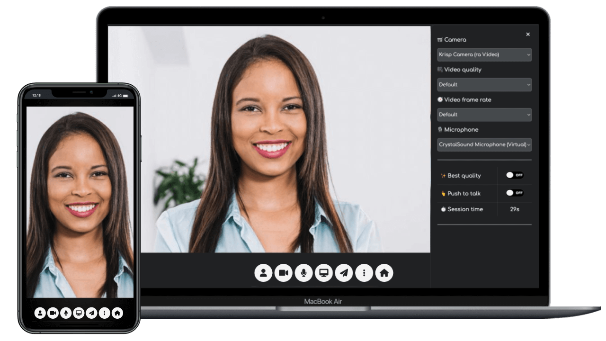

# MiroTalk C2C

A focused, self-hosted camera-to-camera experience for two participants. C2C suits support, consultations, tutoring, telehealth workflows, and applications that need an embeddable one-to-one call.

[Try the live demo](https://c2c.mirotalk.com){ .md-button .md-button--primary }
[Self-host MiroTalk C2C](self-hosting.md){ .md-button }

{ .product-shot }

## How C2C works

The two participants establish an encrypted WebRTC media path directly when possible. Signaling coordinates the call, and TURN can relay encrypted packets when firewalls or NAT prevent a direct connection.

| Concern | C2C behavior |
| --- | --- |
| Participation | Exactly two participants per call |
| Media | Direct peer-to-peer when possible |
| Network fallback | TURN relay when required |
| Server role | Signaling, room coordination, authentication, and optional relay |
| Primary trade-off | A compact one-to-one workflow rather than group meetings |

[Compare product architectures](../overview/index.md){ .md-button }
[Read about STUN and TURN](../coturn/stun-turn.md){ .md-button }

## Call capabilities

- Webcam, microphone, and screen sharing
- Text chat, emoji, and file transfer
- Local recording and device controls
- Responsive browser interface
- Iframe embedding for existing applications

## Build with C2C

| Goal | Documentation |
| --- | --- |
| Create or inspect calls programmatically | [REST API](api.md) |
| Embed a call | [Iframe integration](integration.md) |
| Construct direct call links | [Join options](join-room.md) |

## Self-host and operate

| Stage | Documentation |
| --- | --- |
| Install with Node.js, PM2, or Docker | [Self-hosting guide](self-hosting.md) |
| Configure application behavior | [Configuration reference](configurations.md) |
| Expose a local development instance | [Ngrok guide](ngrok.md) |

!!! note "Plan for restrictive networks"

    A production P2P service should provide TURN for participants who cannot connect directly. Relay use consumes server bandwidth even though the media remains encrypted in transit.

## Licensing and support

Use the official licensing page as the source of truth for commercial requirements.

[Compare licensing options](../license/index.md){ .md-button .md-button--primary }
[Review the C2C commercial package](https://codecanyon.net/item/mirotalk-c2c-webrtc-real-time-cam-2-cam-video-conferences-and-screen-sharing/43383005){ .md-button }
[Contact MiroTalk Enterprise](../enterprise/index.md){ .md-button }