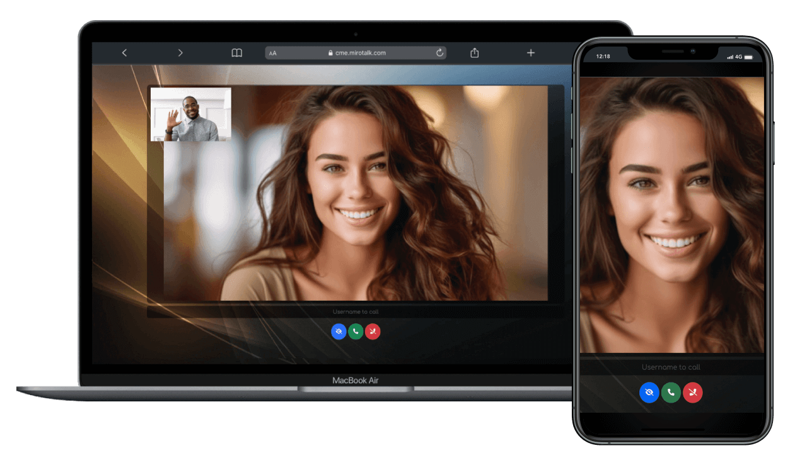

# MiroTalk CME Self-Hosting Guide



## Description

MiroTalk CME (Call-Me) enables instant one-to-one video calls directly from your web browser using WebRTC technology. Featuring end-to-end encryption, real-time chat, screen sharing, file sharing, and click-to-call functionality, perfect for customer support, telehealth, online tutoring, and consultations.

**Live demo**: [https://cme.mirotalk.com](https://cme.mirotalk.com)

## Requirements

- Server Selection:
    - [Hetzner](https://www.hetzner.com/cloud) - Use [this link](https://hetzner.cloud/?ref=XdRifCzCK3bn) to receive `€⁠20 in cloud credits`
    - [Netcup](https://www.netcup.com/en/?ref=309627)
    - [Hostinger](https://hostinger.com/?REFERRALCODE=MIROTALK)
    - [Contabo](https://www.dpbolvw.net/click-101027391-14462707)
- OS: Ubuntu 22.04 LTS.
- [Node.js](https://nodejs.org/en/) (LTS) and npm
- Domain or Subdomain Name (e.g., `YOUR.DOMAIN.NAME`) with a DNS A record pointing to your server's IPv4 address.
- It is recommended to use a [TURN Server](../coturn/stun-turn.md). Installation documentation is available [here](../coturn/installation.md).

---

## Automated Setup

!!! tip "Quick Automated Installation"

    You can automate the entire setup (Node.js, Nginx, SSL, PM2) using our installation scripts on a clean Ubuntu server. Check out the [MiroTalk CME Setup Script](https://docs.mirotalk.com/scripts/about/#mirotalk-cme) for details.

---

## Installation


Install `NodeJS` and `npm` using [Node Version Manager](../utility/nvm.md)

---

## Quick start

```bash
# Clone this repo
$ git clone https://github.com/miroslavpejic85/call-me.git

# Go to to dir call-me
$ cd call-me

# Copy the config file
$ cp public/config.template.js public/config.js

# Copy .env.template to .env
$ cp .env.template .env

# Install dependencies
$ npm install

# Start the server
$ npm start
```

Verify the installation: [http://YOUR.DOMAIN.NAME:8000](http://YOUR.DOMAIN.NAME:8000)

---

## Using [PM2](https://pm2.keymetrics.io) (Process Manager)


```bash
# Install pm2
$ npm install -g pm2

# Start the server
$ pm2 start app/server.js

# Takes a snapshot
$ pm2 save

# Add it on startup
$ pm2 startup
```

---

## Using Docker


```bash
# Install docker
$ sudo apt install -y docker.io

# Instal docker-compose
$ sudo apt install -y docker-compose

# Clone this repo
$ git clone https://github.com/miroslavpejic85/call-me.git

# Go to to dir call-me
$ cd call-me

# Copy .env.template to .env
$ cp .env.template .env

# Create your own docker-compose.yml
$ cp docker-compose.template.yml docker-compose.yml

# Pull the official Docker image
$ docker pull mirotalk/cme:latest

# Create and start containers (-d as daemon)
$ docker-compose up
```

Example of `docker-compose.yml`:

```yaml 
services:
    callme:
        image: mirotalk/cme:latest
        container_name: callme
        hostname: callme
        restart: unless-stopped
        ports:
            - '${PORT}:${PORT}'
        volumes:
            - .env:/src/.env:ro
            - ./app/:/src/app/:ro
            - ./public/:/src/public/:ro
```

```bash
# Pull the official Docker image
docker-compose pull

# Create and start containers (add -d to run in background)
docker-compose up
```

Verify the installation: [http://YOUR.DOMAIN.NAME:8000](http://YOUR.DOMAIN.NAME:8000)

---

## Configuring Nginx & Certbot


To use MiroTalk CME without the port number and with encrypted communications (required for WebRTC to work correctly), install [Nginx](https://www.nginx.com) and [Certbot](https://certbot.eff.org):

```bash
# Install Nginx
$ sudo apt-get install -y nginx

# Install Certbot (SSL certificates)
$ sudo apt install -y snapd
$ sudo snap install core; sudo snap refresh core
$ sudo snap install --classic certbot
$ sudo ln -s /snap/bin/certbot /usr/bin/certbot

# Configure Nginx
$ sudo vim /etc/nginx/sites-enabled/default
```

Add the following:

```bash
# HTTP — redirect all traffic to HTTPS
server {
    listen 80;
    listen [::]:80;
    server_name YOUR.DOMAIN.NAME;

    return 301 https://$host$request_uri;
}
```

```bash
# Test Nginx configuration
$ sudo nginx -t

# Enable HTTPS with Certbot (follow the instruction)
$ sudo certbot certonly --nginx

# Add Let's Encrypt configuration to Nginx
$ sudo vim /etc/nginx/sites-enabled/default
```

Add the following:

```bash
# MiroTalk CME - HTTPS — proxy all requests to the Node app
server {
    # Enable HTTP/2
    listen 443 ssl http2;
    listen [::]:443 ssl http2;
    server_name YOUR.DOMAIN.NAME;

    # Use the Let’s Encrypt certificates
    ssl_certificate /etc/letsencrypt/live/YOUR.DOMAIN.NAME/fullchain.pem;
    ssl_certificate_key /etc/letsencrypt/live/YOUR.DOMAIN.NAME/privkey.pem;

    location / {
        proxy_set_header X-Forwarded-For $proxy_add_x_forwarded_for;
        proxy_set_header Host $host;
        proxy_pass http://localhost:8000/;
        proxy_http_version 1.1;
        proxy_set_header Upgrade $http_upgrade;
        proxy_set_header Connection "upgrade";
    }
}
```

```bash
# Test Nginx configuration again
sudo nginx -t

# Restart Nginx
service nginx restart
service nginx status

# Set up auto-renewal for SSL certificates
sudo certbot renew --dry-run --cert-name YOUR.DOMAIN.NAME

# Show certificates
sudo certbot certificates
```

Verify your MiroTalk CME instance: [https://YOUR.DOMAIN.NAME](https://YOUR.DOMAIN.NAME)

---

## Apache Virtual Host (Alternative to Nginx)


If you prefer `Apache`, configure it with the equivalent settings provided in this guide.

```bash
# Install Apache with Certbot
apt install python3-certbot-apache -y

# Set up SSL
certbot --apache --non-interactive --agree-tos -d YOUR.DOMAIN.NAME -m your.email.address

# Edit the Apache site configuration
sudo vim /etc/apache2/sites-enabled/YOUR.DOMAIN.NAME.conf
```

Add the following:

```bash
# HTTP — redirect all traffic to HTTPS
<VirtualHost *:80>
    ServerName YOUR.DOMAIN.NAME
    Redirect permanent / https://YOUR.DOMAIN.NAME
</VirtualHost>

# MiroTalk CME - HTTPS — proxy all requests to the Node app
<VirtualHost *:443>
    ServerName YOUR.DOMAIN.NAME

    # SSL Configuration
    SSLEngine on
    SSLCertificateFile /etc/letsencrypt/live/YOUR.DOMAIN.NAME/fullchain.pem
    SSLCertificateKeyFile /etc/letsencrypt/live/YOUR.DOMAIN.NAME/privkey.pem
    Include /etc/letsencrypt/options-ssl-apache.conf

    # Enable HTTP/2 support
    Protocols h2 http/1.1

    <Location />
        # Proxy Configuration for Node.js App
        ProxyPass http://localhost:8000/
        ProxyPassReverse http://localhost:8000/

        ProxyPreserveHost On

        RequestHeader set X-Forwarded-For "%{REMOTE_ADDR}s"
        RequestHeader set X-Forwarded-Proto "https"
        RequestHeader set Host "%{HTTP_HOST}s"

        # Enable WebSocket proxy support for Socket.IO
        RewriteEngine On
        RewriteCond %{HTTP:Upgrade} =websocket [NC]
        RewriteRule /(.*) ws://localhost:8000/socket.io/$1 [P,L]
        # Adjust the WebSocket path according to your Socket.IO configuration
        # For Socket.IO 3.x or higher, use /socket.io/?EIO=4&transport=websocket
    </Location>
</VirtualHost>
```

```bash
# Check configuration
sudo apache2ctl configtest

sudo a2enmod proxy # Enables the `mod_proxy` module, which is essential for proxying HTTP and WebSocket connections.
sudo a2enmod proxy_http # Enables the `mod_proxy_http` module, which adds support for proxying HTTP connections.
sudo a2enmod proxy_wstunnel # Enables the `mod_proxy_wstunnel` module, which provides support for tunneling WebSocket connections

# Restart apache
sudo systemctl restart apache2
```

---

## Updating Your Instance

To keep your MiroTalk CME instance up to date, create an update script:

```bash
cd
# Create an update script
vim cmeUpdate.sh
```

---

For `PM2`:

```bash
#!/bin/bash

cd call-me
git pull
sudo npm install
pm2 restart app/server.js
```

---

For `Docker`:

```bash
#!/bin/bash

cd call-me
git pull
docker-compose down
docker-compose pull
docker image prune -f
docker-compose up -d
```

---

Make the script executable:

```bash
chmod +x cmeUpdate.sh
```

To update your MiroTalk CME instance to the latest version, run the script:

```bash
./cmeUpdate.sh
```

---

## Changelogs

Stay informed about project updates by following the commits of the MiroTalk CME project [here](https://github.com/miroslavpejic85/call-me/commits/main).

---
