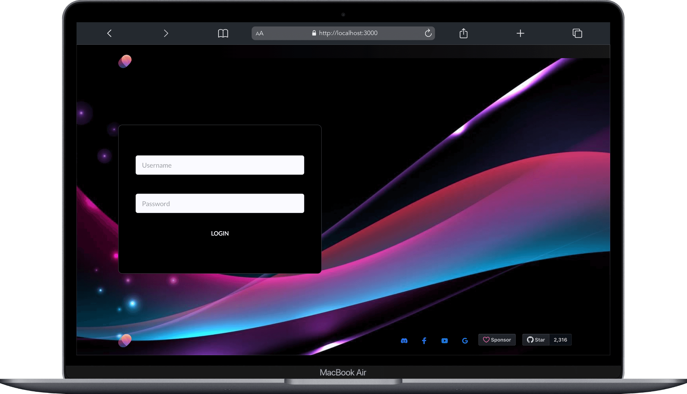

# Host protection



In the `.env` file set `HOST_PROTECTED` to `true` and add the valid users, identified by username and password that can access to your MiroTalk instance:

```bash
# When HOST_PROTECTED is set to true, valid username and password from the HOST_USERS list are required to initialize or join a room.
HOST_PROTECTED=true # true or false

# When HOST_USER_AUTH is set to true, valid username and password in URL parameters are required for authentication.
HOST_USER_AUTH=false # true or false

# List of valid host users along with their credentials in JSON format.
HOST_USERS='[{"username": "username", "password": "password"},{"username": "username2", "password": "password2"}]'
```

---

## Host Protection Logic

If `HOST_PROTECTED` is set to `true`, the following logic applies:

1. Host login with username and password is required.
2. Upon successful login, the IP is saved as a valid authentication IP.
3. After authentication, the host can create a room, join a room, and share the room link.
4. All guests can join until the host logs out.
5. When the host leaves the room or exits the browser, their IP is removed from valid auth IPs to prevent unauthorized access.
6. To access it again, the host needs to provide a username and password.

If `HOST_USER_AUTH` is set to `true`, additional authentication is required through URL parameters.

---

## Room Initialization

To bypass the login page and join a room, use the following URL with parameters:

- [https://your.domain.com/join/?room=test&username=username&password=password](https://p2p.mirotalk.com/join/?room=test&username=username&password=password)

---

## Participant Room Entry

### When `HOST_PROTECTED` is enabled:

Participants can join after host authentication using the URL path:

- [https://your.domain.com/join/test](https://p2p.mirotalk.com/join/test)

Alternatively, use query parameters for additional settings:

- [https://your.domain.com/join/?room=test&name=mirotalk&audio=0&video=0&screen=0&hide=0&notify=0](https://p2p.mirotalk.com/join/?room=test&name=mirotalk&audio=0&video=0&screen=0&hide=0&notify=0)

---

### When `HOST_USER_AUTH` is enabled:

Participants must join with mandatory credentials using the URL path:

- [https://your.domain.com/join/?room=test&username=username&password=password](https://p2p.mirotalk.com/join/?room=test&username=username&password=password)

Alternatively, use query parameters for additional participant settings:

- [https://your.domain.com/join/?room=test&name=mirotalk&audio=0&video=0&screen=0&hide=0&notify=0&username=username&password=password](https://p2p.mirotalk.com/join/?room=test&name=mirotalk&audio=0&video=0&screen=0&hide=0&notify=0&username=username&password=password)

---
