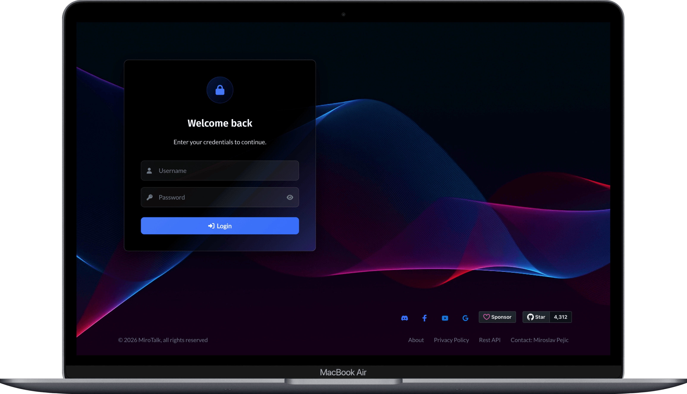
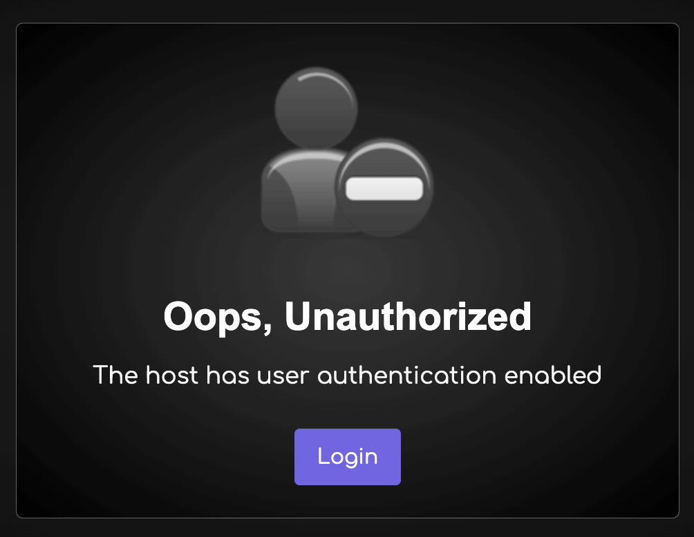

# Host Protection



Host protection lets you secure your MiroTalk P2P instance by requiring authentication before creating or joining a room.

## Configuration

Set these parameters in your `.env` file:

| Variable | Default | Description |
| :--- | :--- | :--- |
| `HOST_PROTECTED` | `false` | Require valid credentials to initialize or join a room |
| `HOST_USER_AUTH` | `false` | Require participants to authenticate before joining |
| `HOST_USERS` | — | List of valid users in JSON format |

**Example:**

```bash
HOST_PROTECTED=true
HOST_USER_AUTH=false
HOST_USERS='[{"username": "username", "password": "password"},{"username": "username2", "password": "password2"}]'
```

---

## How It Works

When `HOST_PROTECTED` is `true`:

1. The host must log in with a username and password.
2. On success, the host's IP is saved as an authenticated IP.
3. The host can now create rooms, join rooms, and share links.
4. Guests can join freely while the host is active.
5. When the host leaves the room or closes the browser, their IP is removed — preventing further unauthorized access.
6. The host must log in again to regain access.

When `HOST_USER_AUTH` is also `true`, **participants** are additionally required to authenticate before joining.

---

## Token

After authentication, a JWT token is stored in `window.sessionStorage.peer_token`. The default expiration is **1 hour**, configurable in the `.env` file. Tokens can also be generated through the [REST API](./api.md).

---

## Room Initialization

Bypass the login page and join a room directly with a token:

```
https://YOUR-DOMAIN-NAME/join/?room=test&token=TOKEN
```

---

## Participant Room Entry

### With `HOST_PROTECTED` enabled

After the host authenticates, participants can join using the room path:

```
https://YOUR-DOMAIN-NAME/join/test
```

Or with additional query parameters:

```
https://YOUR-DOMAIN-NAME/join/?room=test&name=mirotalk&audio=0&video=0&screen=0&hide=0&notify=0
```

---

### With `HOST_USER_AUTH` enabled

Participants are prompted to log in before accessing the room:



To skip the login prompt, pass a valid token in the URL:

```
https://YOUR-DOMAIN-NAME/join/?room=test&token=TOKEN
```

Or with additional participant settings:

```
https://YOUR-DOMAIN-NAME/join/?room=test&name=mirotalk&audio=0&video=0&screen=0&hide=0&notify=0&token=TOKEN
```

---
