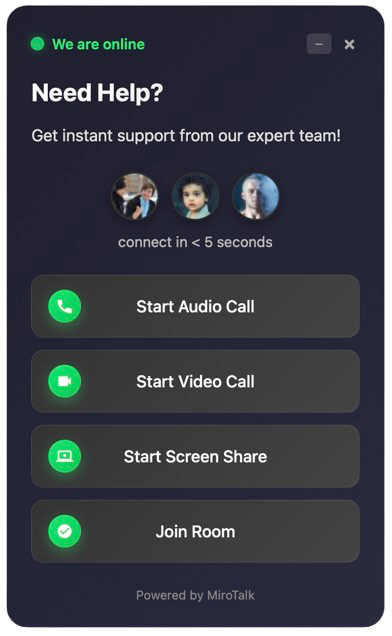

# MiroTalk P2P Integration

## Iframe

Easily integrate MiroTalk P2P into your website by embedding it with a simple `iframe`.

```html
<!doctype html>
<html>
    <head>
        <meta charset="utf-8" />
        <meta http-equiv="X-UA-Compatible" content="IE=edge" />
        <meta name="viewport" content="width=device-width, initial-scale=1.0" />
        <title>MiroTalk P2P - Simple Iframe Example</title>
    </head>
    <body>
        <iframe
            id="mirotalkIframe"
            allow="camera; microphone; display-capture; fullscreen; clipboard-read; clipboard-write; web-share; autoplay"
            src="https://YOUR-DOMAIN-NAME/newcall"
            style="height: 100vh; width: 100vw; border: 0px"
        ></iframe>
    </body>
</html>
```

## IframeAPI

This integration allows you to embed MiroTalk P2P into your website using an iframe. By leveraging the `IframeApi`, you can easily create and manage video conferencing rooms directly within your web application.

## Features

- Seamless iframe embedding
- Customizable room parameters
- Full control over audio, video, and screen sharing
- Configurable UI visibility options
- Room share notifications

## Usage

To integrate MiroTalk P2P via an iframe, add the provided HTML and JavaScript snippet to your webpage.

### Example Implementation

```html
<!doctype html>
<html lang="en">
  <head>
    <meta charset="UTF-8" />
    <meta name="viewport" content="width=device-width, initial-scale=1.0" />
    <title>MiroTalk P2P Iframe Demo</title>

    <script src="https://YOUR-DOMAIN-NAME/js/iframe.js" defer></script>

    <script>
      document.addEventListener("DOMContentLoaded", function () {
        const domain = "YOUR-DOMAIN-NAME";
        const options = {
          room: "test",
          name: "mirotalk",
          avatar: 0,
          audio: 0,
          video: 0,
          screen: 0,
          hide: 0,
          notify: 0,
          token: null,
          width: "100vw",
          height: "100vh",
          parentNode: document.querySelector("#meet"),
        };
        const api = new IframeApi(domain, options);
      });
    </script>
  </head>
  <body>
    <div id="meet"></div>
  </body>
</html>
```

## Configuration Options

| Parameter    | Type        | Description                                                                                              |
| ------------ | ----------- | -------------------------------------------------------------------------------------------------------- |
| `room`       | String      | The room ID to join                                                                                      |
| `name`       | String      | Display name of the participant                                                                          |
| `avatar`     | Mixed       | Participant's avatar image URL, or 0 to disable the avatar                                               |
| `audio`      | Number      | Enable (1) or disable (0) audio                                                                          |
| `video`      | Number      | Enable (1) or disable (0) video                                                                          |
| `screen`     | Number      | Enable (1) or disable (0) screen sharing                                                                 |
| `hide`       | Number      | Hide Self view (1 to enable, 0 to disable)                                                               |
| `notify`     | Number      | Enable (1) or disable (0) notifications                                                                  |
| `token`      | string      | Token for the user. Optional if `HOST_PROTECTED` or `HOST_USER_AUTH` is set to `true` in the `.env` file |
| `width`      | String      | Set the width of the iframe (e.g., "100vw")                                                              |
| `height`     | String      | Set the height of the iframe (e.g., "100vh")                                                             |
| `parentNode` | DOM Element | The parent HTML element where the iframe will be inserted                                                |

## Installation

1. Replace `YOUR-DOMAIN-NAME` with your actual MiroTalk P2P domain.
2. Include the `iframe.js` script in your HTML file.
3. Configure the `options` object according to your needs.
4. Add an empty `<div id="meet"></div>` where the iframe should be embedded.

## Notes

- Ensure your domain allows embedding via iframe by configuring the proper CORS and X-Frame-Options settings.
- The script must be included with the `defer` attribute to ensure proper execution.
- This integration works with MiroTalk P2P and requires a valid domain setup.

---

## Widgets Integration



To quickly add a support widget to your site, include the script in your `<head>` and place the widget `<div>` at the end of your `<body>`. Your support widget will be ready instantly!

```html
<!doctype html>
<html>
  <head>
    <script src="https://YOUR-DOMAIN-NAME/js/Widget.js"></script>
  </head>
  <body>
    <div
      id="support-widget"
      data-mirotalk-auto
      data-domain="YOUR-DOMAIN-NAME"
      data-room="support-room"
      data-theme="dark"
      data-widget-type="support"
      data-widget-state="normal"
      data-position="bottom-right"
      data-check-online="false"
      data-heading="Need Help?"
      data-subheading="Get instant support from our expert team!"
      data-connect-text="connect in &lt; 5 seconds"
      data-online-text="We are online"
      data-offline-text="We are offline"
      data-powered-by="Powered by MiroTalk"
    ></div>
  </body>
</html>
```

## Widget Configuration Options

| Attribute              | Type    | Description                                                                                   |
|------------------------|---------|-----------------------------------------------------------------------------------------------|
| `id`                   | String  | The HTML element ID for the widget container (should be `support-widget`).                    |
| `data-mirotalk-auto`   | Boolean | Automatically initializes the widget when present.                                            |
| `data-domain`          | String  | Your MiroTalk SFU domain name.                                                                |
| `data-room`            | String  | The room ID for the support session.                                                          |
| `data-theme`           | String  | Widget theme, either `dark` or `light`.                                                       |
| `data-widget-type`     | String  | Type of widget, e.g., `support`.                                                              |
| `data-widget-state`    | String  | Initial widget state: `normal`, `minimized`, or `closed`.                                     |
| `data-position`        | String  | Widget position on the page: `bottom-right`, `bottom-left`, `top-right`, or `top-left`.       |
| `data-check-online`    | Boolean | If `true`, checks if support is online before showing the widget.                             |
| `data-heading`         | String  | Main heading text displayed in the widget.                                                    |
| `data-subheading`      | String  | Subheading text for additional context.                                                       |
| `data-connect-text`    | String  | Text shown for connection status (supports HTML entities).                                    |
| `data-online-text`     | String  | Text displayed when support is online.                                                        |
| `data-offline-text`    | String  | Text displayed when support is offline.                                                       |
| `data-powered-by`      | String  | Footer text, usually for branding or credits.                                                 |


### Advanced Widget Configuration (JavaScript)

```html
<!doctype html>
<html>
  <head>
    <script src="https://YOUR-DOMAIN-NAME/js/Widget.js"></script>
  </head>
  <body>
    <script>
      window.addEventListener('DOMContentLoaded', function () {
        if (typeof MiroTalkWidget !== 'undefined') {
          const domain = 'YOUR-DOMAIN-NAME';
          const roomId = 'support-room';
          const userName = 'guest-' + Math.floor(Math.random() * 10000);

          new MiroTalkWidget(domain, roomId, userName, {
            theme: 'dark',
            widgetState: 'normal',
            widgetType: 'support',
            supportWidget: {
              position: 'bottom-right',
              expertImages: [
                'https://i.pravatar.cc/40?img=1',
                'https://i.pravatar.cc/40?img=2',
                'https://i.pravatar.cc/40?img=3',
              ],
              checkOnlineStatus: false,
              isOnline: true,
              customMessages: {
                heading: 'Need Help?',
                subheading: 'Get instant support from our expert team!',
                connectText: 'connect in < 5 seconds',
                onlineText: 'We are online',
                offlineText: 'We are offline',
                poweredBy: 'Powered by MiroTalk SFU',
              },
            },
          });
        } else {
          console.error('MiroTalkWidget is not defined. Please check Widget.js loading.');
        }
      });
    </script>
  </body>
</html>
```

## JavaScript Widget Options

| Option                | Type     | Description                                                                                   |
|-----------------------|----------|-----------------------------------------------------------------------------------------------|
| `theme`               | String   | Widget theme, either `dark` or `light`.                                                       |
| `widgetState`         | String   | Initial widget state: `normal`, `minimized`, or `closed`.                                     |
| `widgetType`          | String   | Type of widget, e.g., `support`.                                                              |
| `supportWidget`       | Object   | Configuration object for support widget (see below).                                          |

### `supportWidget` Object Properties

| Property              | Type     | Description                                                                                   |
|-----------------------|----------|-----------------------------------------------------------------------------------------------|
| `position`            | String   | Widget position: `bottom-right`, `bottom-left`, `top-right`, or `top-left`.                   |
| `expertImages`        | Array    | Array of expert avatar image URLs.                                                            |
| `checkOnlineStatus`   | Boolean  | If `true`, checks if support is online before showing the widget.                             |
| `isOnline`            | Boolean  | Sets the online status manually.                                                              |
| `customMessages`      | Object   | Customizable widget messages (see below).                                                     |

### `customMessages` Object Properties

| Property        | Type   | Description                                         |
|-----------------|--------|-----------------------------------------------------|
| `heading`       | String | Main heading text.                                  |
| `subheading`    | String | Subheading text.                                    |
| `connectText`   | String | Connection status text (supports HTML entities).    |
| `onlineText`    | String | Text when support is online.                        |
| `offlineText`   | String | Text when support is offline.                       |
| `poweredBy`     | String | Footer/branding text.                               |

---

Find more examples in the [widget](https://github.com/miroslavpejic85/mirotalk/tree/master/widgets) folder.
