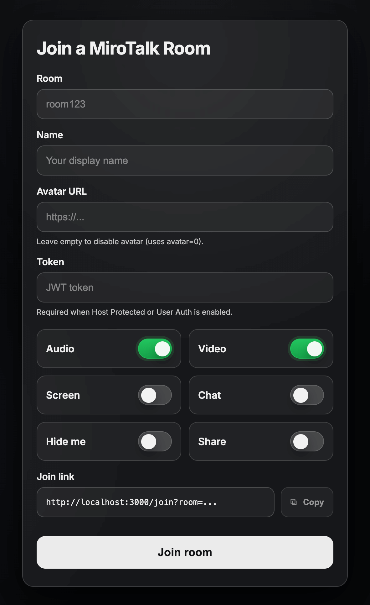

# Joining Room Options

---

**URL**: [https://YOUR-DOMAIN-NAME/join?room=test&name=mirotalk&avatar=0&audio=0&video=0&screen=0&chat=0&hide=0&notify=0&duration=unlimited](https://p2p.mirotalk.com/join?room=test&name=mirotalk&avatar=0&audio=0&video=0&screen=0&chat=0&hide=0&notify=0&duration=unlimited)

**Description**: This URL allows you to directly enter a `room` named test. You can specify your username using the `name` parameter and avatar image using the `avatar` parameter. Additionally, you have the option to control your audio, video, screen sharing, hide myself, and welcome message preferences through the `audio`, `video`, `screen`, `hide`, `notify` and `duration` parameters.

---

## Parameters

| Params   | Type    | Description                                                                                                                                  |
| -------- | ------- | -------------------------------------------------------------------------------------------------------------------------------------------- |
| `room`   | string  | This parameter represents the unique identifier or ID of the room you want to join. If set to `random`, a random room ID will be generated |
| `name`   | string  | This parameter represents your username or unique identifier, allowing you to define your identity within the room. If set to `random`, a random name will be generated |
| `avatar` | Mixed  | This parameter specifies the avatar image that will be displayed when your camera is turned off in the room                                                                      |
| `audio`  | boolean | Use this parameter to control your audio stream. Set to `0` for no audio or `1` to enable audio                                              |
| `video`  | boolean | Control your video stream using this parameter. Set to `0` for no video or `1` to enable video                                               |
| `screen` | boolean | To start screen sharing, use this parameter. Set to `0` for no start screen sharing or `1` to start screen sharing                           |
| `chat`   | boolean | To start chat, use this parameter. Set to `0` for no start chat on join or `1` to start chat on join                                         |
| `hide`   | boolean | Determines whether to hide the user from the room view. Set to `0` to not hide or `1` to hide                                                |
| `notify` | boolean | You can specify whether or not to display a welcome message upon joining the room by setting this parameter to `0` (disable) or `1` (enable) |
| `duration`     | string         | Defines the maximum allowed duration for the room in `HH:MM:SS` format. Once the specified duration is reached, the room will automatically close  |
| `token`  | string  | Represents the token for the user. Optional if `HOST_PROTECTED` or `HOST_USER_AUTH` is set to `true` in the `.env` file                      |

---

> **Important:** Replace `YOUR-DOMAIN-NAME` with your actual MiroTalk P2P server URL.

> **Note:** If the `name` or `room` parameter is set to `random`, a random value will be generated automatically.

By utilizing these URLs and parameters, you can seamlessly customize your room entry experience, including your identity, audio and video preferences, screen sharing options, hide myself, and welcome messages on the respective platforms.

---

`Demo`: [https//YOUR-DOMAIN-NAME/customizeRoom](https://p2p.mirotalk.com/customizeRoom)

