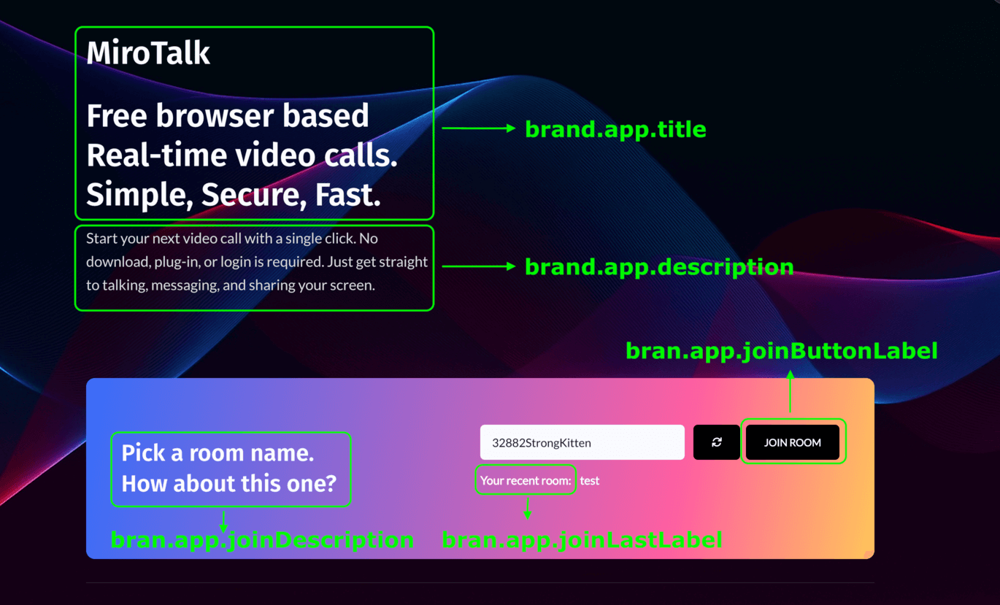
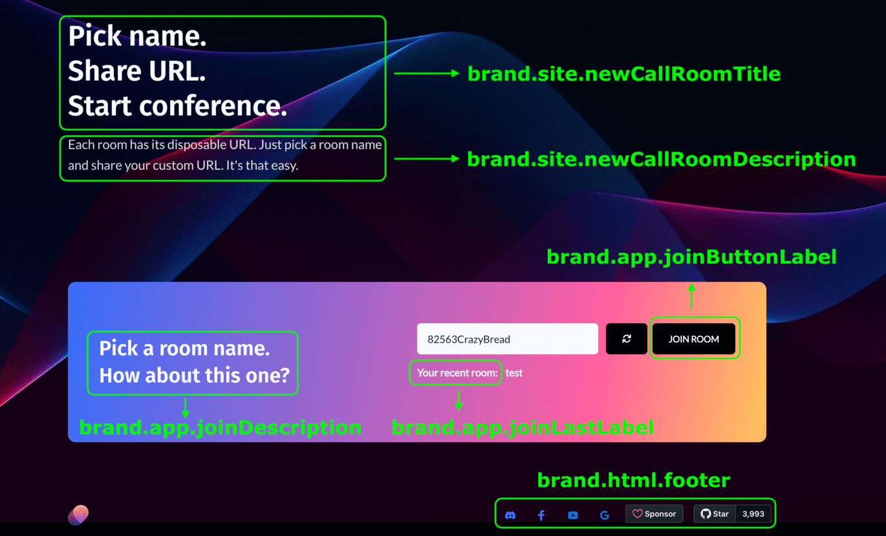

# Rebranding

!!! warning "License Required"

Rebranding requires at least a 👉 **[Regular License](https://codecanyon.net/item/mirotalk-p2p-webrtc-realtime-video-conferences/38376661)**, available on CodeCanyon.

---

There are two ways to rebrand MiroTalk P2P:

1. **From `config.js` file** with `htmlInjection` enabled (recommended)

---

## Landing Page

```js
    brand: {
        app: {
            title: '<h1>MiroTalk</h1>Free browser based Real-time video calls.<br />Simple, Secure, Fast.',
            description:
                'Start your next video call with a single click. No download, plug-in, or login is required. Just get straight to talking, messaging, and sharing your screen.',
            joinDescription: 'Pick a room name.<br />How about this one?',
            joinButtonLabel: 'JOIN ROOM',
            joinLastLabel: 'Your recent room:',
        },
				//...
		}
    //...
```



You can also hide optional landing page sections:

```js
html: {
	topSponsors: false,
	features: false,
	browsers: false,
	teams: false,
	tryEasier: false,
	poweredBy: false,
	sponsors: false,
	advertisers: false,
	footer: false,
}
```

---

## New Room Page



```js
brand: {
	//...
	site: {
			newCallRoomTitle: 'Pick name. <br />Share URL. <br />Start conference.',
			newCallRoomDescription:
					"Each room has its disposable URL. Just pick a room name and share your custom URL. It's that easy.",
	}
	//...
}
```

---

2. **By modifying the HTML files** with `htmlInjection` disabled

In this approach, brand injection is disabled and you can fully customize the project for your needs. The frontend files are located in the `app/public/views` folder.

---

## Reference

The full config configuration can be found [here](https://github.com/miroslavpejic85/mirotalk/blob/master/app/src/config.template.js)