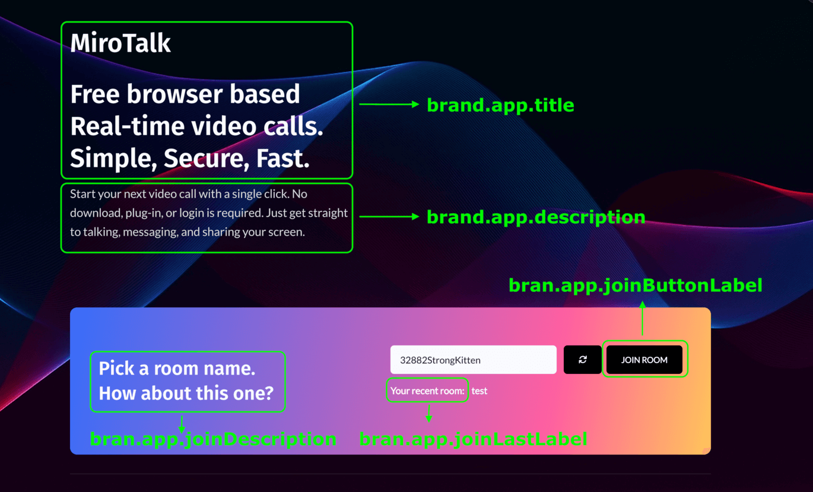
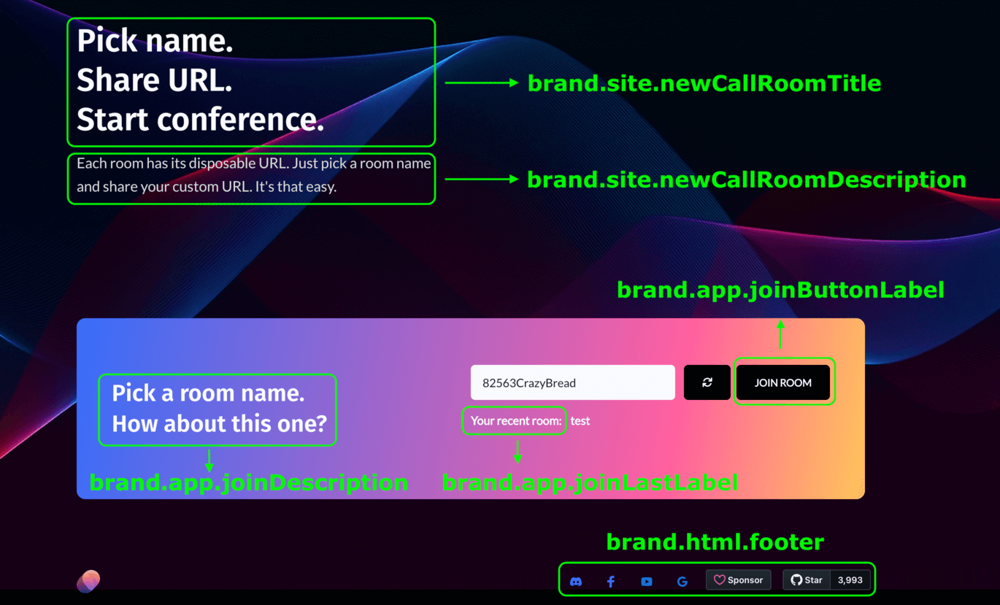
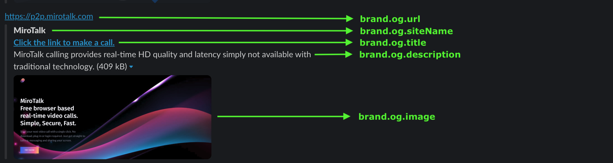

# Rebranding

!!! warning "License Required"

Rebranding requires at least a 👉 **[Regular License](https://codecanyon.net/item/mirotalk-p2p-webrtc-realtime-video-conferences/38376661)**, available on CodeCanyon.

---

There are two approaches to rebrand MiroTalk P2P, both configured in `app/src/config.js`.

---

## Approach 1 — HTML Injection (Recommended)

Enable brand injection to customize text and labels without modifying frontend files:

```js
brand: {
    htmlInjection: true,
    //...
}
```

---

### Landing Page

Customize the main landing page text:

```js
brand: {
    app: {
        title: '<h1>MiroTalk</h1>Free browser based Real-time video calls.<br />Simple, Secure, Fast.',
        description:
            'Start your next video call with a single click. No download, plug-in, or login is required. Just get straight to talking, messaging, and sharing your screen.',
        joinDescription: 'Pick a room name.<br />How about this one?',
        joinButtonLabel: 'JOIN ROOM',
        joinLastLabel: 'Your recent room:',
    },
    //...
}
```



Toggle optional landing page sections:

| Property | Section |
| :--- | :--- |
| `topSponsors` | Top sponsors banner |
| `features` | Features overview |
| `browsers` | Supported browsers |
| `teams` | Teams section |
| `tryEasier` | "Try easier" callout |
| `poweredBy` | Powered-by badge |
| `sponsors` | Sponsors section |
| `advertisers` | Advertisers section |
| `supportUs` | Support-us section |
| `footer` | Page footer |

```js
brand: {
    //...
    html: {
        topSponsors: false,
        features: false,
        browsers: false,
        teams: false,
        tryEasier: false,
        poweredBy: false,
        sponsors: false,
        advertisers: false,
        supportUs: false,
        footer: false,
    },
    //...
}
```

---

### New Room Page



```js
brand: {
    //...
    site: {
        newCallRoomTitle: 'Pick name. <br />Share URL. <br />Start conference.',
        newCallRoomDescription:
            "Each room has its disposable URL. Just pick a room name and share your custom URL. It's that easy.",
    },
    //...
}
```

---

## Approach 2 — Full Customization

Disable brand injection to get full control over the frontend files:

```js
brand: {
    htmlInjection: false,
    //...
}
```

Frontend views are located in `app/public/views` — edit them directly to match your brand.

---

## Open Graph (OG)

Control how your pages appear when shared on social media:



```js
brand: {
    //...
    og: {
        siteName: 'MiroTalk P2P',
        title: 'Click the link to make a call.',
        description: 'MiroTalk P2P calling provides real-time HD quality and latency simply not available with traditional technology.',
        image: 'https://p2p.mirotalk.com/images/preview.png',
        url: 'https://p2p.mirotalk.com',
    },
    //...
}
```

---

## Reference

- Full config: [`config.template.js`](https://github.com/miroslavpejic85/mirotalk/blob/master/app/src/config.template.js)
- Full environment config: [`.env.template`](https://github.com/miroslavpejic85/mirotalk/blob/master/.env.template)
