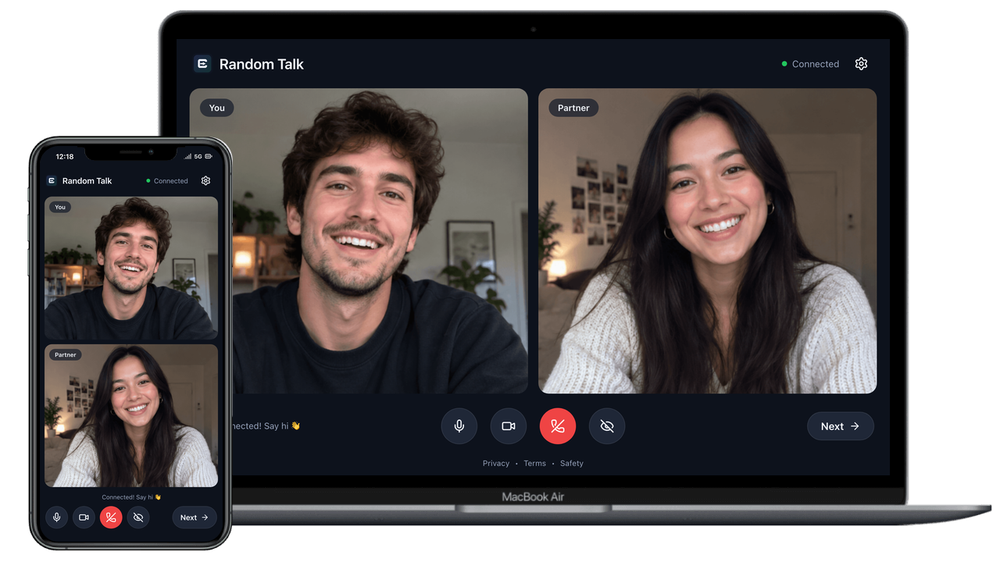

# MiroTalk RND Self-Hosting Guide



## Description

MiroTalk RND is a self-hosted random peer-matching app for one-to-one WebRTC video chat.

Repository: [miroslavpejic85/mirotalkrnd](https://github.com/miroslavpejic85/mirotalkrnd)

## Requirements

- OS: Ubuntu 22.04 LTS or 24.04 LTS (recommended)
- [Node.js](https://nodejs.org/) 24+ and npm (for local runtime)
- Docker Engine + Docker Compose v2 (for container runtime)
- Domain or subdomain with DNS `A` record to your server (recommended for HTTPS)
- TURN server for restrictive networks ([STUN/TURN overview](../coturn/stun-turn.md))

## Quick start (Node.js)


```bash
# Clone the repository
git clone https://github.com/miroslavpejic85/mirotalkrnd.git

# Enter project folder
cd mirotalkrnd

# Copy environment template
cp .env.template .env

# Install dependencies from lockfile
npm ci

# Start server
npm start
```

Open: [http://YOUR.DOMAIN.NAME:4010](http://YOUR.DOMAIN.NAME:4010)

## Run with PM2


```bash
# Install PM2 globally
npm install -g pm2

# Start app
pm2 start server.js --name mirotalkrnd

# Persist process list and enable startup
pm2 save
pm2 startup
```

## Run with Docker


```bash
# Clone repository
git clone https://github.com/miroslavpejic85/mirotalkrnd.git
cd mirotalkrnd

# Prepare env and compose files
cp .env.template .env
cp docker-compose.template.yml docker-compose.yml

# Pull image and start
docker compose pull
docker compose up -d
```

By default, RND listens on port `4010` (mapped from `PORT` in `.env`).

## Automated setup (clean Ubuntu server)

Install Node.js, Docker, Nginx, and a Let's Encrypt certificate in one step on a clean Ubuntu 22.04 or 24.04 LTS server. Run as root, with a domain pointing to the server's public IPv4. See the [MiroTalk RND setup script](../scripts/about.md#mirotalk-rnd) for install, uninstall, and update commands.

```bash
wget -qO rnd-install.sh https://docs.mirotalk.com/scripts/rnd/rnd-install.sh \
  && chmod +x rnd-install.sh \
  && ./rnd-install.sh
```

## Repository installer (Ubuntu)

From the repository root:

```bash
sudo ./install.sh
```

The installer supports:

- Docker setup (official image `mirotalk/rnd:latest` or local build)
- Local Node.js setup

## HTTPS reverse proxy (Nginx)


WebRTC camera/microphone permissions are most reliable on HTTPS in production.

```bash
sudo apt-get install -y nginx
```

Set your reverse proxy to forward traffic to `http://localhost:4010` and terminate TLS with a trusted certificate (for example, with Certbot).

## Next steps

- Review [configuration options](configurations.md)
- Expose local development safely with [ngrok](ngrok.md)
- Estimate infrastructure with [metrics guidance](metrics.md)
