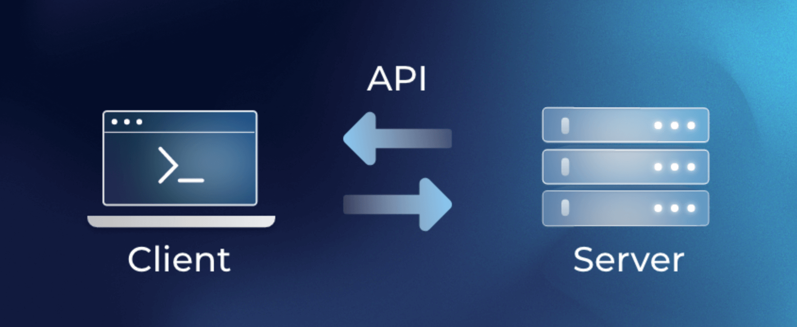

# REST API



The REST API is comprehensively documented using [Swagger](https://swagger.io/), accessible at [https://YOUR-DOMAIN-NAME/api/v1/docs](https://sfu.mirotalk.com/api/v1/docs).

---

## Stats Entry Point

Upon a successful request, the API response will provide the total of Rooms and Users. The authorization for this request is determined by the `api.keySecret` configuration specified in your `config.js` file.

### JavaScript Example

```javascript
"use strict";

// npm i node-fetch

async function getStats() {
  try {
    // Use dynamic import with await
    const { default: fetch } = await import("node-fetch");

    const API_KEY_SECRET = "mirotalksfu_default_secret";
    const MIROTALK_URL = "https://sfu.mirotalk.com/api/v1/stats";

    const response = await fetch(MIROTALK_URL, {
      method: "GET",
      headers: {
        authorization: API_KEY_SECRET,
        "Content-Type": "application/json",
      },
    });
    const data = await response.json();
    if (data.error) {
      console.log("Error:", data.error);
    } else {
      if (data) {
        const formattedData = JSON.stringify(data, null, 2);
        console.log(formattedData);
      }
    }
  } catch (error) {
    console.error("Error fetching data:", error);
  }
}

getStats();
```

### PHP Example

```php
<?php

$API_KEY_SECRET = "mirotalksfu_default_secret";
$MIROTALK_URL = "https://sfu.mirotalk.com/api/v1/stats";

$ch = curl_init();
curl_setopt($ch, CURLOPT_URL, $MIROTALK_URL);
curl_setopt($ch, CURLOPT_RETURNTRANSFER, 1);
curl_setopt($ch, CURLOPT_HTTPGET, true);

$headers = [
    'authorization:' . $API_KEY_SECRET,
    'Content-Type: application/json'
];

curl_setopt($ch, CURLOPT_HTTPHEADER, $headers);
$response = curl_exec($ch);
$httpcode = curl_getinfo($ch, CURLINFO_HTTP_CODE);

curl_close($ch);

echo "Status code: $httpcode \n";

if ($response) {
    echo json_encode(json_decode($response), JSON_PRETTY_PRINT);
} else {
    echo "Failed to retrieve data.\n";
}
```

### Python Example

```python
# pip3 install requests
import requests
import json

API_KEY_SECRET = "mirotalksfu_default_secret"
MIROTALK_URL = "https://sfu.mirotalk.com/api/v1/stats"

headers = {
    "authorization": API_KEY_SECRET,
    "Content-Type": "application/json",
}

response = requests.get(
    MIROTALK_URL,
    headers=headers
)

print("Status code:", response.status_code)

if response.status_code == 200:
    data = response.json()
    pretty_printed_data = json.dumps(data, indent=4)
    print(data)
else:
    print("Failed to retrieve data. Error:", response.text)
```

### Bash Example

```bash
#!/bin/bash

API_KEY_SECRET="mirotalksfu_default_secret"
MIROTALK_URL="https://sfu.mirotalk.com/api/v1/stats"

curl $MIROTALK_URL \
    --header "authorization: $API_KEY_SECRET" \
    --header "Content-Type: application/json" \
    --request GET
```

---

## Active meetings

Upon a successful request, the API response will provide the active Meetings. The authorization for this request is determined by the `api.keySecret` configuration specified in your `config.js` file.

### JavaScript Example

```javascript
"use strict";

// npm i node-fetch

async function getMeetings() {
  try {
    // Use dynamic import with await
    const { default: fetch } = await import("node-fetch");

    const API_KEY_SECRET = "mirotalksfu_default_secret";
    const MIROTALK_URL = "https://sfu.mirotalk.com/api/v1/meetings";

    const response = await fetch(MIROTALK_URL, {
      method: "GET",
      headers: {
        authorization: API_KEY_SECRET,
        "Content-Type": "application/json",
      },
    });
    const data = await response.json();
    if (data.error) {
      console.log("Error:", data.error);
    } else {
      if (data && data.meetings) {
        const meetings = data.meetings;
        const formattedData = JSON.stringify({ meetings }, null, 2);
        console.log(formattedData);
      }
    }
  } catch (error) {
    console.error("Error fetching data:", error);
  }
}

getMeetings();
```

### PHP Example

```php
<?php

$API_KEY_SECRET = "mirotalksfu_default_secret";
$MIROTALK_URL = "https://sfu.mirotalk.com/api/v1/meetings";

$ch = curl_init();
curl_setopt($ch, CURLOPT_URL, $MIROTALK_URL);
curl_setopt($ch, CURLOPT_RETURNTRANSFER, 1);
curl_setopt($ch, CURLOPT_HTTPGET, true);

$headers = [
    'authorization:' . $API_KEY_SECRET,
    'Content-Type: application/json'
];

curl_setopt($ch, CURLOPT_HTTPHEADER, $headers);
$response = curl_exec($ch);
$httpcode = curl_getinfo($ch, CURLINFO_HTTP_CODE);

curl_close($ch);

echo "Status code: $httpcode \n";

if ($response) {
    echo json_encode(json_decode($response), JSON_PRETTY_PRINT);
} else {
    echo "Failed to retrieve data.\n";
}
```

### Python Example

```python
# pip3 install requests
import requests
import json

API_KEY_SECRET = "mirotalksfu_default_secret"
MIROTALK_URL = "https://sfu.mirotalk.com/api/v1/meetings"

headers = {
    "authorization": API_KEY_SECRET,
    "Content-Type": "application/json",
}

response = requests.get(
    MIROTALK_URL,
    headers=headers
)

print("Status code:", response.status_code)

if response.status_code == 200:
    data = response.json()
    pretty_printed_data = json.dumps(data, indent=4)
    print(data)
else:
    print("Failed to retrieve data. Error:", response.text)
```

### Bash Example

```bash
#!/bin/bash

API_KEY_SECRET="mirotalksfu_default_secret"
MIROTALK_URL="https://sfu.mirotalk.com/api/v1/meetings"

curl $MIROTALK_URL \
    --header "authorization: $API_KEY_SECRET" \
    --header "Content-Type: application/json" \
    --request GET
```

---

## Meeting Entry Point

Upon a successful request, the API response will provide a Meeting Entry Point or Room URL. The authorization for this request is determined by the `api.keySecret` configuration specified in your `config.js` file.

### JavaScript Example

```javascript
"use strict";

// npm i node-fetch

try {
  // Dynamically import 'node-fetch' with 'await'
  const { default: fetch } = await import("node-fetch");

  const API_KEY_SECRET = "mirotalksfu_default_secret";
  const MIROTALK_URL = "https://sfu.mirotalk.com/api/v1/meeting";

  const response = await fetch(MIROTALK_URL, {
    method: "POST",
    headers: {
      authorization: API_KEY_SECRET,
      "Content-Type": "application/json",
    },
  });

  const data = await response.json();

  if (data.error) {
    console.log("Error:", data.error);
  } else {
    console.log("Meeting:", data.meeting);
  }
} catch (error) {
  console.error("Error fetching data:", error);
}
```

### PHP Example

```php
<?php

$API_KEY_SECRET = "mirotalksfu_default_secret";
$MIROTALK_URL = "https://sfu.mirotalk.com/api/v1/meeting";

$ch = curl_init();
curl_setopt($ch, CURLOPT_URL, $MIROTALK_URL);
curl_setopt($ch, CURLOPT_RETURNTRANSFER, 1);
curl_setopt($ch, CURLOPT_POST, 1);

$headers = [
    'authorization:' . $API_KEY_SECRET,
    'Content-Type: application/json'
];

curl_setopt($ch, CURLOPT_HTTPHEADER, $headers);
$response = curl_exec($ch);
$httpcode = curl_getinfo($ch, CURLINFO_HTTP_CODE);

curl_close($ch);

echo "HTTP Status Code: $httpcode \n";
$data = json_decode($response);
echo "Meeting: ", $data->{'meeting'}, "\n";
```

### Python Example

```python
# pip3 install requests

import requests
import json

API_KEY_SECRET = "mirotalksfu_default_secret"
MIROTALK_URL = "https://sfu.mirotalk.com/api/v1/meeting"

headers = {
    "authorization": API_KEY_SECRET,
    "Content-Type": "application/json",
}

response = requests.post(
    MIROTALK_URL,
    headers=headers
)

print("HTTP Status Code:", response.status_code)
data = json.loads(response.text)
print("Meeting:", data["meeting"])
```

### Bash Example

```bash
#!/bin/bash

API_KEY_SECRET="mirotalksfu_default_secret"
MIROTALK_URL="https://sfu.mirotalk.com/api/v1/meeting"

curl $MIROTALK_URL \
    --header "authorization: $API_KEY_SECRET" \
    --header "Content-Type: application/json" \
    --request POST
```

---

## Meeting END Entry Point

End an active meeting by room name. All connected peers will be disconnected and redirected to the specified URL or home page.

### JavaScript Example

```javascript
'use strict';

async function endMeeting() {
    try {
        // Use dynamic import with await
        const { default: fetch } = await import('node-fetch');

        const API_KEY_SECRET = 'mirotalksfu_default_secret';
        const MIROTALK_URL = 'https://sfu.mirotalk.com/api/v1/meeting';
        // const MIROTALK_URL = 'http://localhost:3010/api/v1/meeting';

        const ROOM = 'test'; // Room name to end

        const response = await fetch(`${MIROTALK_URL}/${ROOM}`, {
            method: 'DELETE',
            headers: {
                authorization: API_KEY_SECRET,
                'Content-Type': 'application/json',
            },
            body: JSON.stringify({
                // redirect: 'https://example.com/meeting-ended', // Optional: URL to redirect peers to (if empty, peers go to home page)
            }),
        });
        const data = await response.json();
        if (data.error) {
            console.log('Error:', data.error);
        } else {
            console.log('result:', data);
        }
    } catch (error) {
        console.error('Error fetching data:', error);
    }
}

endMeeting();
```

### PHP Example

```php
<?php

$API_KEY_SECRET = "mirotalksfu_default_secret";
$MIROTALK_URL = "https://sfu.mirotalk.com/api/v1/meeting";
// $MIROTALK_URL = "http://localhost:3010/api/v1/meeting";

$ROOM = "test";

// Optional: redirect URL (leave empty for home page)
$data = json_encode([
    // 'redirect' => 'https://example.com/meeting-ended',
]);

$ch = curl_init();
curl_setopt($ch, CURLOPT_URL, "$MIROTALK_URL/$ROOM");
curl_setopt($ch, CURLOPT_RETURNTRANSFER, 1);
curl_setopt($ch, CURLOPT_CUSTOMREQUEST, 'DELETE');
curl_setopt($ch, CURLOPT_POSTFIELDS, $data);

$headers = [
    'authorization:' . $API_KEY_SECRET,
    'Content-Type: application/json'
];

curl_setopt($ch, CURLOPT_HTTPHEADER, $headers);
$response = curl_exec($ch);
$httpcode = curl_getinfo($ch, CURLINFO_HTTP_CODE);

curl_close($ch);

echo "Status code: $httpcode \n";
$data = json_decode($response);
echo "result: ";
print_r($data);
echo "\n";
```

### Python Example

```python
# pip3 install requests
import requests
import json

API_KEY_SECRET = "mirotalksfu_default_secret"
MIROTALK_URL = "https://sfu.mirotalk.com/api/v1/meeting"
# MIROTALK_URL = "http://localhost:3010/api/v1/meeting"

ROOM = "test"

headers = {
    "authorization": API_KEY_SECRET,
    "Content-Type": "application/json",
}

# Optional: redirect URL (leave empty for home page)
data = {
    # "redirect": "https://example.com/meeting-ended",
}

response = requests.delete(
    f"{MIROTALK_URL}/{ROOM}",
    headers=headers,
    json=data
)

print("Status code:", response.status_code)
data = json.loads(response.text)
print("result:", data)
```

### Bash Example

```bash
#!/bin/bash

API_KEY_SECRET="mirotalksfu_default_secret"
MIROTALK_URL="https://sfu.mirotalk.com/api/v1/meeting"
# MIROTALK_URL="http://localhost:3010/api/v1/meeting"

ROOM="test"

# Optional: redirect URL (leave empty object for home page)
# BODY='{"redirect": "https://example.com/meeting-ended"}'
BODY='{}'

curl "$MIROTALK_URL/$ROOM" \
    --header "authorization: $API_KEY_SECRET" \
    --header "Content-Type: application/json" \
    --data "$BODY" \
    --request DELETE
```

---

## Direct Join Entry Point

Upon a successful request, the API response will provide a Meeting Entry Point for the direct join to the room. The authorization for this request is determined by the `api.keySecret` configuration specified in your `config.js` file.

### JavaScript Join example

```javascript
"use strict";

// npm i node-fetch

try {
  // Use dynamic import with await
  const { default: fetch } = await import("node-fetch");

  const API_KEY = "mirotalksfu_default_secret";
  const MIROTALK_URL = "https://sfu.mirotalk.com/api/v1/join";

  const response = await fetch(MIROTALK_URL, {
    method: "POST",
    headers: {
      authorization: API_KEY,
      "Content-Type": "application/json",
    },
    body: JSON.stringify({
      room: "test",
      roomPassword: false,
      name: "mirotalksfu",
      avatar: false, // https://sfu.mirotalk.com/images/admin.png
      audio: false,
      video: false,
      chat: false,
      screen: false,
      hide: false,
      notify: true,
      duration: 'unlimited', // HH:MM:SS (e.g. 00:30:00) or unlimited
      // Token configuration is required if the host system is protected, user authentication is needed, or a room presenter is specified.
      token: {
        username: "username",
        password: "password",
        presenter: true,
        expire: "1h",
      },
    }),
  });
  const data = await response.json();
  if (data.error) {
    console.log("Error:", data.error);
  } else {
    console.log("join:", data.join);
  }
} catch (error) {
  console.error("Error fetching data:", error);
}
```

---

### PHP Join example

```php
<?php

$API_KEY_SECRET = "mirotalksfu_default_secret";
$MIROTALK_URL = "https://sfu.mirotalk.com/api/v1/join";

$ch = curl_init();
curl_setopt($ch, CURLOPT_URL, $MIROTALK_URL);
curl_setopt($ch, CURLOPT_RETURNTRANSFER, 1);
curl_setopt($ch, CURLOPT_POST, 1);

$headers = [
    'authorization:' . $API_KEY_SECRET,
    'Content-Type: application/json'
];

curl_setopt($ch, CURLOPT_HTTPHEADER, $headers);

$data = array(
    "room"          => "test",
    "roomPassword"  => false,
    "name"          => "mirotalksfu",
    "avatar"        => false, // https://sfu.mirotalk.com/images/admin.png
    "audio"         => false,
    "video"         => false,
    "screen"        => false,
    "chat"          => false,
    "hide"          => false,
    "notify"        => true,
    "duration"      => "unlimited", // HH:MM:SS (e.g. 00:30:00) or unlimited
    // Token configuration is required if the host system is protected, user authentication is needed, or a room presenter is specified
    "token"         => array(
        "username"      => "username",
        "password"      => "password",
        "presenter"     => true,
        "expire"        => "1h",
    ),
);
$data_string = json_encode($data);

curl_setopt($ch, CURLOPT_POSTFIELDS, $data_string);
$response = curl_exec($ch);
$httpcode = curl_getinfo($ch, CURLINFO_HTTP_CODE);

curl_close($ch);

echo "Status code: $httpcode \n";
$data = json_decode($response);
echo "join: ", $data->{'join'}, "\n";
```

---

### Python Join example

```py
# pip3 install requests

import requests
import json

API_KEY_SECRET = "mirotalksfu_default_secret"
MIROTALK_URL = "https://sfu.mirotalk.com/api/v1/join"

headers = {
    "authorization": API_KEY_SECRET,
    "Content-Type": "application/json",
}

data = {
    "room": "test",
    "roomPassword": "false",
    "name": "mirotalksfu",
    "avatar": "false", # https://sfu.mirotalk.com/images/admin.png
    "audio": "false",
    "video": "false",
    "screen": "false",
    "chat": "false",
    "hide": "false",
    "notify": "true",
    "duration": "unlimited", # HH:MM:SS (e.g. 00:30:00) or unlimited
    # Token configuration is required if the host system is protected, user authentication is needed, or a room presenter is specified
    "token": {
        "username": "username",
        "password": "password",
        "presenter": "true",
        "expire": "1h",
    }
}

response = requests.post(
    MIROTALK_URL,
    headers=headers,
    json=data,
)

print("Status code:", response.status_code)
data = json.loads(response.text)
print("join:", data["join"])
```

---

### Bash Join example

```bash
#!/bin/bash

API_KEY_SECRET="mirotalksfu_default_secret"
MIROTALK_URL="https://sfu.mirotalk.com/api/v1/join"

# Request data with proper JSON formatting
REQUEST_DATA='{
    "room": "test",
    "roomPassword": false,
    "name": "mirotalksfu",
    "avatar": false,
    "audio": false,
    "video": false,
    "screen": false,
    "chat": false,
    "hide": false,
    "notify": true,
    "duration": "unlimited",
    "token": {
        "username": "username",
        "password": "password",
        "presenter": true,
        "expire": "1h"
    }
}' # Token configuration is required if the host system is protected, user authentication is needed, or a room presenter is specified


# Make the API request
curl -X POST "$MIROTALK_URL" \
    -H "Authorization: $API_KEY_SECRET" \
    -H "Content-Type: application/json" \
    -d "$REQUEST_DATA"
```

---

## Token Entry Point

Upon a successful request, the API response will provide a valid Token for the meeting. The authorization for this request is determined by the `api.keySecret` configuration specified in your `config.js` file.

### JavaScript Token example

```javascript
"use strict";

// npm i node-fetch

try {
  // Use dynamic import with await
  const { default: fetch } = await import("node-fetch");

  const API_KEY_SECRET = "mirotalksfu_default_secret";
  const MIROTALK_URL = "https://sfu.mirotalk.com/api/v1/token";

  const response = await fetch(MIROTALK_URL, {
    method: "POST",
    headers: {
      authorization: API_KEY_SECRET,
      "Content-Type": "application/json",
    },
    body: JSON.stringify({
      username: "username",
      password: "password",
      presenter: true,
      expire: "1h",
    }),
  });
  const data = await response.json();
  if (data.error) {
    console.log("Error:", data.error);
  } else {
    console.log("token:", data.token);
  }
} catch (error) {
  console.error("Error fetching data:", error);
}
```

---

### PHP Token example

```php
<?php

$API_KEY_SECRET = "mirotalksfu_default_secret";
$MIROTALK_URL = "https://sfu.mirotalk.com/api/v1/token";

$ch = curl_init();
curl_setopt($ch, CURLOPT_URL, $MIROTALK_URL);
curl_setopt($ch, CURLOPT_RETURNTRANSFER, 1);
curl_setopt($ch, CURLOPT_POST, 1);

$headers = [
    'authorization:' . $API_KEY_SECRET,
    'Content-Type: application/json'
];

curl_setopt($ch, CURLOPT_HTTPHEADER, $headers);

$data = array(
    "username"      => "username",
    "password"      => "password",
    "presenter"     => true,
    "expire"        => "1h",
);

$data_string = json_encode($data);

curl_setopt($ch, CURLOPT_POSTFIELDS, $data_string);

$response = curl_exec($ch);
$httpcode = curl_getinfo($ch, CURLINFO_HTTP_CODE);

curl_close($ch);

echo "Status code: $httpcode \n";
$data = json_decode($response);
echo "token: ", $data->{'token'}, "\n";
```

---

### Python Token example

```py
# pip3 install requests

import requests
import json

API_KEY_SECRET = "mirotalksfu_default_secret"
MIROTALK_URL = "https://sfu.mirotalk.com/api/v1/token"

headers = {
    "authorization": API_KEY_SECRET,
    "Content-Type": "application/json",
}

data = {
    "username": "username",
    "password": "password",
    "presenter": "true",
    "expire": "1h"
}

response = requests.post(
    MIROTALK_URL, 
    headers=headers, 
    json=data
)

print("Status code:", response.status_code)
data = json.loads(response.text)
print("token:", data["token"])
```

---

### Bash Token example

```bash
#!/bin/bash

API_KEY_SECRET="mirotalksfu_default_secret"
MIROTALK_URL="https://sfu.mirotalk.com/api/v1/token"

curl $MIROTALK_URL \
    --header "authorization: $API_KEY_SECRET" \
    --header "Content-Type: application/json" \
    --data '{"username":"username","password":"password","presenter":"true", "expire":"1h"}' \
    --request POST
```

---

!!! note

    - Replace `sfu.mirotalk.com` in the code snippets with `YOUR-DOMAIN-NAME`.
    - In the `app/src/config` under the `api` section, you can enable or disable these endpoints in the `allowed` section.

    ```javascript
    api: {
        // Default secret key for app/api
        keySecret: 'mirotalksfu_default_secret',
        // Define which endpoints are allowed
        allowed: {
            meetings: true,
            meeting: true,
            join: true,
            token: true,
            // Add more endpoints here as needed
        },
    },
    ```
---
