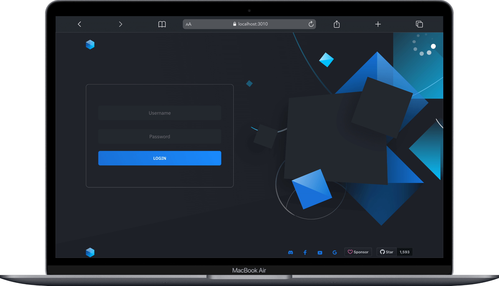

# Host protection



In the configuration file `app/src/config.js`, you can enable security measures for your video conferencing room using the following parameters:

- `host.protected`: Set to `true` to require the host to provide a valid username and password during room initialization. Default is `false`.
- `host.user_auth`: Set to `true` to enable user authentication for hosts. Default is `false`.

- `host.users`: A JSON array containing user objects with usernames and passwords for valid host users.

Example Configuration:

```javascript
host: {
    protected: true,
    user_auth: false,
    users: [
        { username: 'username', password: 'password' },
        { username: 'username2', password: 'password2' },
        // Add more users as needed
    ],
},
```

---

## Host Protection Logic:

If `host.protected` is set to `true`, the following logic applies:

1. Host login with username and password is required.
2. Upon successful login, the IP is saved as a valid authentication IP.
3. After authentication, the host can create a room, join a room, and share the room link.
4. All guests can join until the host logs out.
5. When the host leaves the room or exits the browser, their IP is removed from valid auth IPs to prevent unauthorized access.
6. To access it again, the host needs to provide a username and password.
7. If `host.user_auth` is set to `true`, additional authentication is required through URL parameters.

---

## Room Initialization

To bypass the login page and join a room, use the following URL with parameters:

- [https://your.domain.com/join/?room=test&username=username&password=password](https://sfu.mirotalk.com/join/?room=test&username=username&password=password)

---

## Participant Room Entry

### When `host.protected` is enabled:

Participants can join after host authentication using the URL path:

- [https://sfu.mirotalk.com/join/test](https://sfu.mirotalk.com/join/test)

Alternatively, use query parameters for additional settings:

- [https://your.domain.com/join/?room=test&roomPassword=0&name=mirotalksfu&audio=0&video=0&screen=0&notify=0](https://sfu.mirotalk.com/join/?room=test&roomPassword=0&name=mirotalksfu&audio=0&video=0&screen=0&notify=0)

---

## User Authentication for Participants:

### When `host.user_auth` is enabled:

Participants must join with mandatory credentials using the URL path:

- [https://your.domain.com/join/?room=test&username=username&password=password](https://sfu.mirotalk.com/join/?room=test&username=username&password=password)

Alternatively, use query parameters for additional participant settings:

- [https://your.domain.com/join/?room=test&name=mirotalk&audio=0&video=0&screen=0&notify=0&username=username&password=password](https://sfu.mirotalk.com/join/?room=test&name=mirotalk&audio=0&video=0&screen=0&notify=0&username=username&password=password)

---
