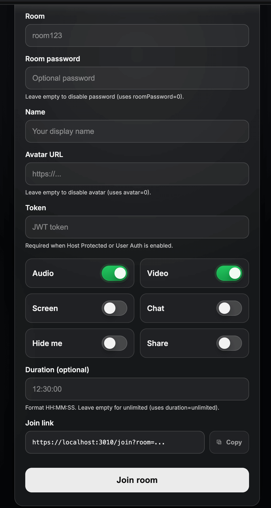

# Joining Room Options

---

**URL**: [https://YOUR-DOMAIN-NAME/join?room=test&roomPassword=0&name=mirotalksfu&avatar=0&audio=0&video=0&screen=0&chat=0&hide=0&notify=0&duration=unlimited](https://sfu.mirotalk.com/join?room=test&roomPassword=0&name=mirotalksfu&avatar=0&audio=0&video=0&screen=0&chat=0&hide=0&notify=0&duration=unlimited)

**Description**: Directly enter a room with full control over your settings. Customize your username, room password, audio, video, screen sharing, notifications, and session duration through URL parameters.

---

## Parameters

| Params         | Type           | Description                                                                                                                                        |
| -------------- | -------------- | -------------------------------------------------------------------------------------------------------------------------------------------------- |
| `room`         | string         | Unique room identifier. Set to `random` for auto-generated ID.         |
| `roomPassword` | string/boolean | Room password. Use `0` for no password.                                     |
| `name`         | string         | Display name. Set to `random` for auto-generated name. |
| `avatar`       | Mixed          | Avatar image URL displayed when camera is off.                                        |
| `audio`        | boolean        | Enable (`1`) or disable (`0`) audio.                                                    |
| `video`        | boolean        | Enable (`1`) or disable (`0`) video.                                                     |
| `screen`       | boolean        | Enable (`1`) or disable (`0`) screen sharing.                                 |
| `chat`         | boolean        | Enable (`1`) or disable (`0`) chat on join.                                               |
| `hide`         | boolean        | Hide self from room view: `1` to hide, `0` to show.                                                      |
| `notify`       | boolean        | Show welcome message: `1` to enable, `0` to disable.       |
| `duration`     | string         | Maximum room duration in `HH:MM:SS` format, or `unlimited`.  |
| `token`        | string         | User token. Required if `host.protected` or `host.user_auth` is enabled in `config.js`.                       |

---

> **Important:** Replace `YOUR-DOMAIN-NAME` with your actual MiroTalk SFU server URL.

> **Note:** If the `name` or `room` parameter is set to `random`, a random value will be generated automatically.

By utilizing these URLs and parameters, you can customize your room entry experience — including identity, room password, media preferences, screen sharing, and welcome messages.

---

`Demo`: [https//YOUR-DOMAIN-NAME/customizeRoom](https://sfu.mirotalk.com/customizeRoom)

