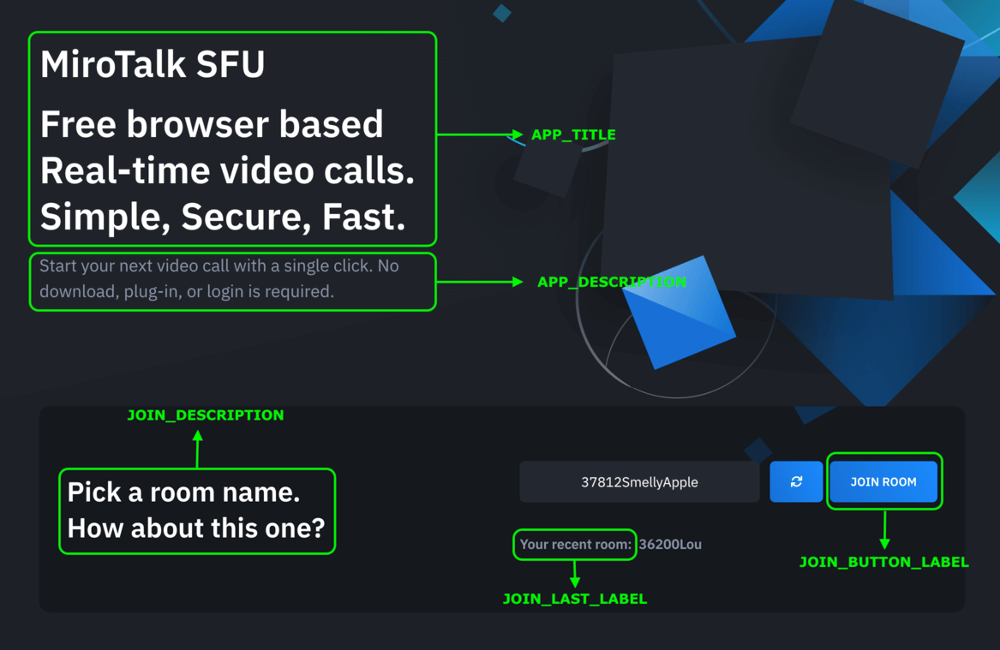
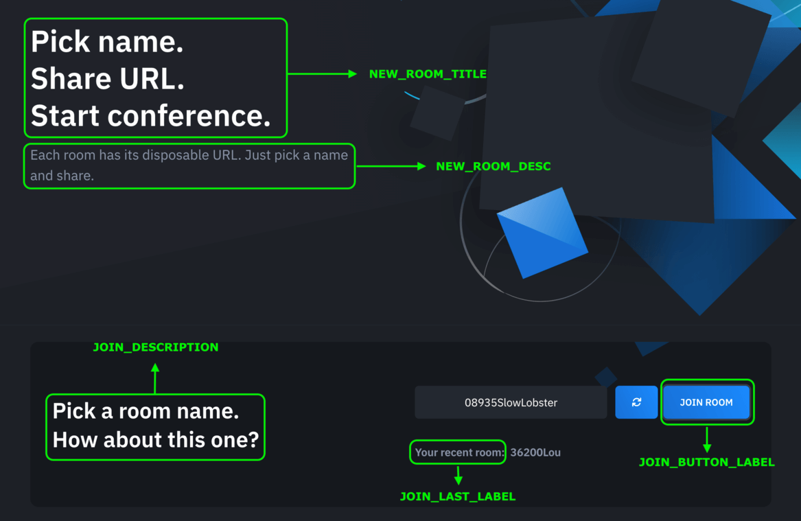
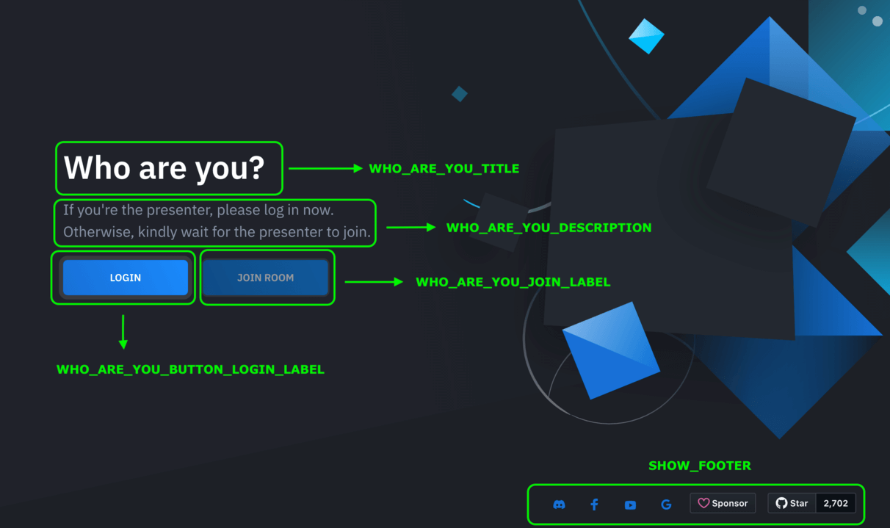

# Rebranding

!!! warning "License Required"

Rebranding requires at least a 👉 **[Regular License](https://codecanyon.net/item/mirotalk-sfu-webrtc-realtime-video-conferences/40769970)**, available on CodeCanyon.

---

There are two ways to rebrand MiroTalk SFU from the `.env` file:

## BRAND_HTML_INJECTION enabled

```bash
BRAND_HTML_INJECTION=true # recommended
```

---

## Landing Page

```bash
APP_TITLE="<h1>MiroTalk SFU</h1> Free browser based Real-time video calls.<br />Simple, Secure, Fast."
APP_DESCRIPTION="Start your next video call with a single click. No download, plug-in, or login is required."
JOIN_DESCRIPTION="Pick a room name.<br />How about this one?"
JOIN_BUTTON_LABEL="JOIN ROOM"
JOIN_LAST_LABEL="Your recent room:"
```



You can also hide optional landing page sections:

```bash
SHOW_TOP_SPONSORS=false
SHOW_FEATURES=false
SHOW_TEAMS=false
SHOW_TRY_EASIER=false
SHOW_POWERED_BY=false
SHOW_SPONSORS=false
SHOW_ADVERTISERS=false
SHOW_FOOTER=false
```

---

## New Room Page



```bash
NEW_ROOM_TITLE="Pick name. <br />Share URL. <br />Start conference."
NEW_ROOM_DESC="Each room has its disposable URL. Just pick a name and share."
```

---

## Who Are You Page



```bash
WHO_ARE_YOU_TITLE="Who are you?"
WHO_ARE_YOU_DESCRIPTION="If you're the presenter, please log in now.<br />Otherwise, kindly wait for the presenter to join."
WHO_ARE_YOU_BUTTON_LOGIN_LABEL="LOGIN"
WHO_ARE_YOU_JOIN_LABEL="JOIN ROOM"
```

---

## BRAND_HTML_INJECTION disabled

```bash
BRAND_HTML_INJECTION=false
```

In this approach, brand injection is disabled and you can fully customize the project for your needs. The frontend files are located in the `app/public/views` folder.

---

## OG (Open Graph)


Open Graph is a protocol used to control how **web pages appear when shared on social media**.


```bash
OG_SITE_NAME=MiroTalk SFU
OG_TITLE='Click the link to make a call.' 
OG_DESCRIPTION='MiroTalk SFU provides real-time video calls and screen sharing.'
OG_IMAGE_URL=https://sfu.mirotalk.com/images/mirotalksfu.png
OG_URL=https://sfu.mirotalk.com
```

---

## Reference

The full environment configuration can be found [here](https://github.com/miroslavpejic85/mirotalksfu/blob/main/.env.template)

## Configuration Note

MiroTalk SFU uses environment variables defined in `.env` (based on .env.template) to configure all core services: signaling, media transport, and more.

The entry point [config.js](https://github.com/miroslavpejic85/mirotalksfu/blob/main/app/src/config.template.js) automatically loads these variables and exposes them to the app.
You should not modify `config.js`; instead, edit the `.env` file.