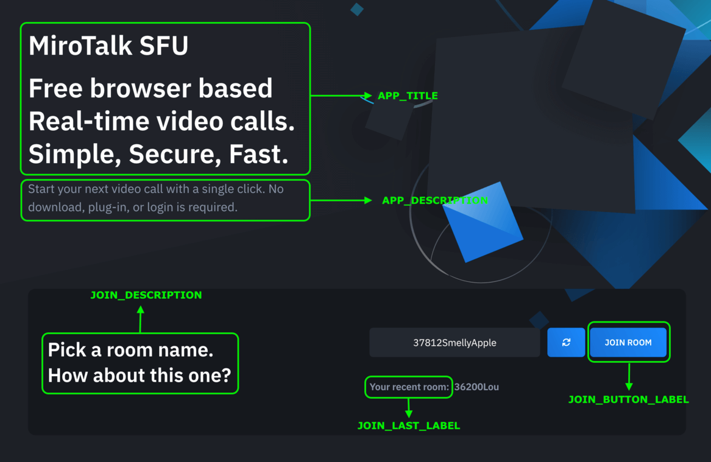
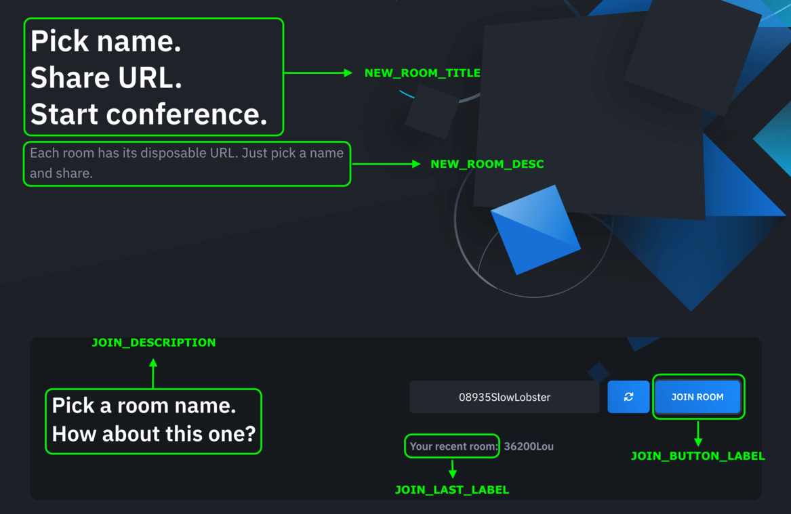
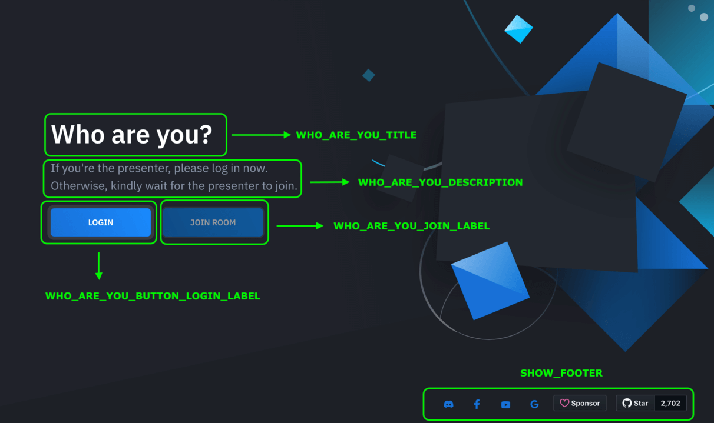

# Rebranding

!!! warning "License Required"

Rebranding requires at least a 👉 **[Regular License](https://codecanyon.net/item/mirotalk-sfu-webrtc-realtime-video-conferences/40769970)**, available on CodeCanyon.

---

There are two approaches to rebrand MiroTalk SFU, both configured through the `.env` file.

---

## Approach 1 — HTML Injection (Recommended)

Enable brand injection to customize text and labels without touching frontend files:

```bash
BRAND_HTML_INJECTION=true
```

---

### Landing Page

Customize the main landing page text:

```bash
APP_TITLE="<h1>MiroTalk SFU</h1> Free browser based Real-time video calls.<br />Simple, Secure, Fast."
APP_DESCRIPTION="Start your next video call with a single click. No download, plug-in, or login is required."
JOIN_DESCRIPTION="Pick a room name.<br />How about this one?"
JOIN_BUTTON_LABEL="JOIN ROOM"
JOIN_LAST_LABEL="Your recent room:"
```



Toggle optional landing page sections:

| Variable | Default | Section |
| :--- | :--- | :--- |
| `SHOW_TOP_SPONSORS` | `false` | Top sponsors banner |
| `SHOW_FEATURES` | `false` | Features overview |
| `SHOW_TEAMS` | `false` | Teams section |
| `SHOW_TRY_EASIER` | `false` | "Try easier" callout |
| `SHOW_POWERED_BY` | `false` | Powered-by badge |
| `SHOW_SPONSORS` | `false` | Sponsors section |
| `SHOW_ADVERTISERS` | `false` | Advertisers section |
| `SHOW_SUPPORT_US` | `false` | Support-us section |
| `SHOW_FOOTER` | `false` | Page footer |

---

### New Room Page



```bash
NEW_ROOM_TITLE="Pick name. <br />Share URL. <br />Start conference."
NEW_ROOM_DESC="Each room has its disposable URL. Just pick a name and share."
```

---

### Who Are You Page



```bash
WHO_ARE_YOU_TITLE="Who are you?"
WHO_ARE_YOU_DESCRIPTION="If you're the presenter, please log in now.<br />Otherwise, kindly wait for the presenter to join."
WHO_ARE_YOU_BUTTON_LOGIN_LABEL="LOGIN"
WHO_ARE_YOU_JOIN_LABEL="JOIN ROOM"
```

---

## Approach 2 — Full Customization

Disable brand injection to get full control over the frontend files:

```bash
BRAND_HTML_INJECTION=false
```

Frontend views are located in `app/public/views` — edit them directly to match your brand.

---

## Open Graph (OG)

Control how your pages appear when shared on social media:


```bash
OG_SITE_NAME=MiroTalk SFU
OG_TITLE='Click the link to make a call.' 
OG_DESCRIPTION='MiroTalk SFU provides real-time video calls and screen sharing.'
OG_IMAGE_URL=https://sfu.mirotalk.com/images/mirotalksfu.png
OG_URL=https://sfu.mirotalk.com
```

---

## Reference

The full environment configuration template is available on GitHub: [`.env.template`](https://github.com/miroslavpejic85/mirotalksfu/blob/main/.env.template)

!!! note "Configuration Tip"
    MiroTalk SFU uses environment variables from `.env` (based on `.env.template`) to configure all core services. The entry point [`config.js`](https://github.com/miroslavpejic85/mirotalksfu/blob/main/app/src/config.template.js) loads these variables automatically — always edit `.env` rather than `config.js`.