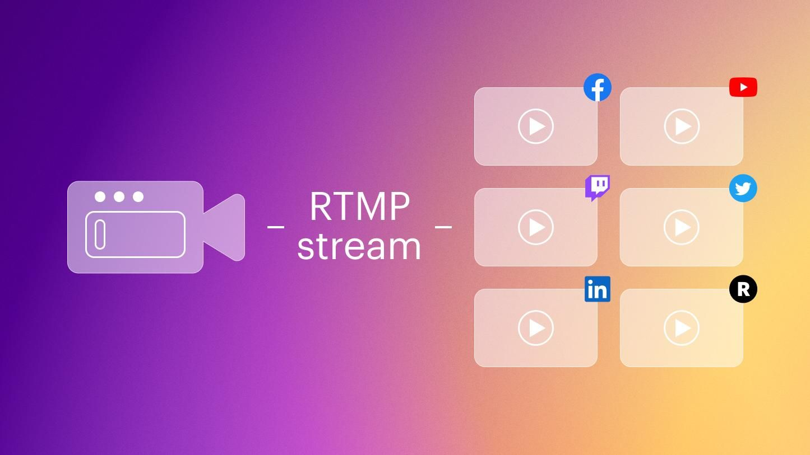

# RTMP Streaming



MiroTalk SFU supports live RTMP streaming through two server options:

| Server | Description |
| :--- | :--- |
| [Node Media Server](https://github.com/illuspas/Node-Media-Server) | Node.js-based, includes admin dashboard and API |
| [Nginx RTMP](https://github.com/tiangolo/nginx-rtmp-docker) | Lightweight Nginx module for simple RTMP streaming |

Both are available under [`rtmpServers/`](https://github.com/miroslavpejic85/mirotalksfu/tree/main/rtmpServers) and integrate seamlessly with MiroTalk SFU.

---

## Prerequisites

Ensure your system has [Docker Engine](https://docs.docker.com/engine/install/), [Docker Compose](https://docs.docker.com/compose/install/), and [FFmpeg](https://ffmpeg.org) installed:

```bash
sudo apt update
sudo apt install -y docker.io docker-compose ffmpeg
```

---

## Option 1: Node Media Server

### Setup

**1. Prepare directories:**

```bash
mkdir -p app/rtmp
cd rtmpServers/node-media-server
```

**2. Configure:**

```bash
cp src/config.template.js src/config.js
cp docker-compose.template.yml docker-compose.yml
```

Generate SSL certificates with Certbot:

```bash
sudo certbot certonly --standalone --email your-email@example.com --agree-tos -d YOUR-DOMAIN-NAME
```

Certificates are saved to `/etc/letsencrypt/live/YOUR-DOMAIN-NAME/`. Mount them in `docker-compose.yml`:
   ```yaml
   services:
     mirotalk-nms:
       container_name: mirotalk-nms
       image: mirotalk/nms:latest
       volumes:
         - ./src/config.js:/app/src/config.js:ro
         - /etc/letsencrypt/live/YOUR-DOMAIN-NAME/fullchain.pem:/app/src/cert.pem:ro
         - /etc/letsencrypt/live/YOUR-DOMAIN-NAME/privkey.pem:/app/src/key.pem:ro
       ports:
         - '1935:1935'
         - '8081:8081'
         - '8043:8043'
       restart: unless-stopped
   ```

**3. Pull the Docker image:**

```bash
docker pull mirotalk/nms:latest
cd ../..  
```

**4. Manage the server:**

| Command | Action |
| :--- | :--- |
| `npm run nms:start` | Start |
| `npm run nms:stop` | Stop |
| `npm run nms:restart` | Restart |
| `npm run nms:logs` | View logs |

### Access Points

| Endpoint | URL |
| :--- | :--- |
| Admin Dashboard | `https://your-domain:8043/admin` |
| Server API | `https://your-domain:8043/api/server` |
| Streams API | `https://your-domain:8043/api/streams` |

---

## Option 2: Nginx RTMP

### Setup

**1. Prepare directories:**

```bash
mkdir -p app/rtmp
cd rtmpServers/nginx-rtmp
```

**2. Configure:**

```bash
cp docker-compose.template.yml docker-compose.yml
```

**3. Pull the Docker image:**

```bash
docker pull mirotalk/rtmp:latest
cd ../..  
```

**4. Manage the server:**

| Command | Action |
| :--- | :--- |
| `npm run rtmp:start` | Start |
| `npm run rtmp:stop` | Stop |
| `npm run rtmp:restart` | Restart |
| `npm run rtmp:logs` | View logs |

### Statistics

---

## MiroTalk SFU Configuration

Configure RTMP settings in `app/src/config.js`:

```javascript
rtmp: {
  enabled: true,
  useNodeMediaServer: true,        // false = use Nginx RTMP instead
  apiSecret: 'mirotalkRtmpApiSecret',
  server: 'rtmp://localhost:1935',
  appName: 'live',
  streamKey: '',                   // leave empty for dynamic generation

  // Node Media Server only (useNodeMediaServer: true)
  secret: 'mirotalkRtmpSecret',   // must match NodeMediaServer config
  expirationHours: 4,             // signed URL expiration
},
```

For all available settings and defaults, see the [source config (RTMP section)](https://github.com/miroslavpejic85/mirotalksfu/blob/main/app/src/config.template.js#L182).

!!! note
    When using Nginx RTMP (`useNodeMediaServer: false`), only `enabled`, `useNodeMediaServer`, `server`, `appName`, and `streamKey` are needed.

---

## Streaming with OBS

1. Open **OBS** → **Settings** → **Stream**.
2. Configure:

| Setting | Value |
| :--- | :--- |
| Service | Custom... |
| Server | `rtmp://your-domain:1935/live` |
| Stream Key | Any unique identifier (e.g., `my-stream-123`) |

3. Click **Start Streaming**.
4. Share your stream URL: `rtmp://your-domain:1935/live/your-stream-key`

---

## Authentication (Node Media Server)

If authentication is enabled in `config.js`:

```javascript
auth: {
   play: true,
   publish: true,
   secret: 'mirotalkRtmpSecret'
},
```

Generate a signed URL:

```bash
node sign.js
```

Use the output URL format:

```
rtmp://your-domain:1935/live/stream-key?sign=signature-token
```

---