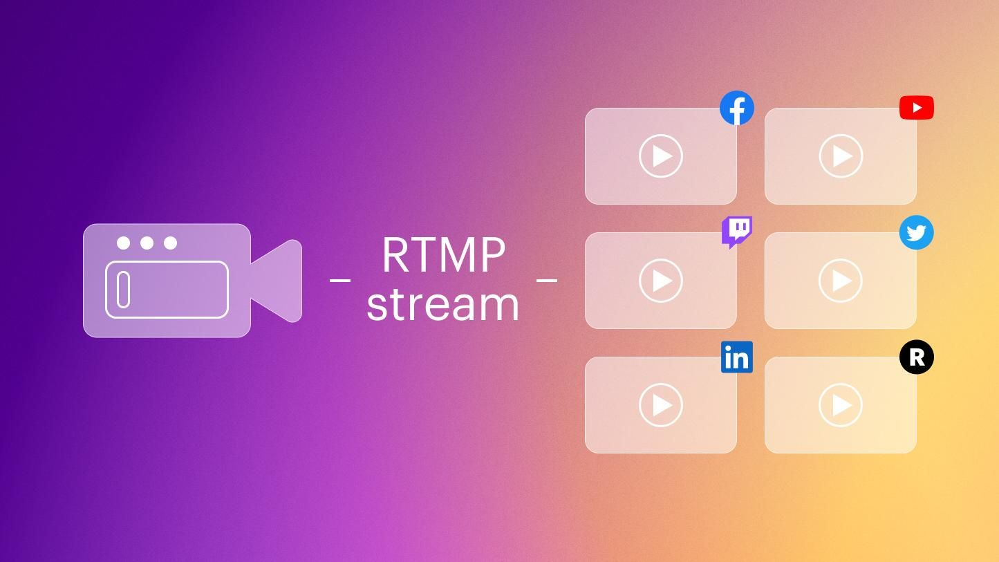

# MiroTalk RTMP Servers Guide



## Overview

MiroTalk offers two **[RTMP (Real-Time Messaging Protocol) servers](https://github.com/miroslavpejic85/mirotalksfu/tree/main/rtmpServers)**:

1. **[Node Media Server](https://github.com/illuspas/Node-Media-Server)** - Node.js-based solution with admin dashboard
2. **[Nginx RTMP](https://github.com/tiangolo/nginx-rtmp-docker)** - Lightweight Nginx module for RTMP streaming

Both integrate seamlessly with MiroTalk SFU (Selective Forwarding Unit).

---

## 🛠 Prerequisites

Before setup, ensure your system has: 
- **[docker-engine](https://docs.docker.com/engine/install/)** 
- **[docker-compose](https://docs.docker.com/compose/install/)**
- **[ffmpeg](https://ffmpeg.org)**

```bash
# Update package lists
sudo apt update

# Install required packages
sudo apt install -y docker.io docker-compose ffmpeg
```

---

## Option 1: Node Media Server

### Features
- Node.js implementation
- Admin dashboard and API endpoints
- Authentication support
- Docker deployment

### 🚀 Setup Guide

1. **Prepare directories**
   ```bash
   mkdir -p app/rtmp
   cd rtmpServers/node-media-server
   ```

2. **Configuration**
   ```bash
   cp src/config.template.js src/config.js  # Edit if needed
   cp docker-compose.template.yml docker-compose.yml
   ```  
   Generate SSL certificates using `Certbot` and `Let's Encrypt` with the following commands:
   ```bash
   sudo certbot certonly --standalone --email your-email@example.com --agree-tos -d YOUR-DOMAIN-NAME
   ```  
   Certificates will be saved in `/etc/letsencrypt/live/YOUR-DOMAIN-NAME/`. Add it in the `docker-compose.yml` file:
   ```yaml
   services:
     mirotalk-nms:
       container_name: mirotalk-nms
       image: mirotalk/nms:latest
       volumes:
         - ./src/config.js:/app/src/config.js:ro
         - /etc/letsencrypt/live/YOUR-DOMAIN-NAME/fullchain.pem:/app/src/cert.pem:ro
         - /etc/letsencrypt/live/YOUR-DOMAIN-NAME/privkey.pem:/app/src/key.pem:ro
       ports:
         - '1935:1935'
         - '8081:8081'
         - '8043:8043'
       restart: unless-stopped
   ```

3. **Pull Docker image**
   ```bash
   docker pull mirotalk/nms:latest
   cd ../..
   ```

4. **Management Commands**
   ```bash
   # Start server
   npm run nms-start

   # Stop server
   npm run nms-stop

   # Restart server
   npm run nms-restart

   # View logs
   npm run nms-logs
   ```

### 🔍 Access Points
- **Admin Dashboard**: `https://your-domain:8043/admin`
- **Server API**: `https://your-domain:8043/api/server`
- **Streams API**: `https://your-domain:8043/api/streams`

---

## Option 2: Nginx RTMP

### Features
- Lightweight Nginx-based solution
- Simple statistics page
- Easy Docker deployment

### 🚀 Setup Guide

1. **Prepare directories**
   ```bash
   mkdir -p app/rtmp
   cd rtmpServers/nginx-rtmp
   ```

2. **Configuration**
   ```bash
   cp docker-compose.template.yml docker-compose.yml  # Edit if needed
   ```

3. **Pull Docker image**
   ```bash
   docker pull mirotalk/rtmp:latest
   cd ../..
   ```

4. **Management Commands**
   ```bash
   # Start server
   npm run rtmp-start

   # Stop server
   npm run rtmp-stop

   # Restart server
   npm run rtmp-restart

   # View logs
   npm run rtmp-logs
   ```

### 📊 Statistics
View stream stats at: `https://your-domain:1935/stat`

---

## 🔌 MiroTalk SFU RTMP Configuration

To integrate with MiroTalk SFU, configure these settings in `app/src/config.js`:

```javascript
/**
 * RTMP Streaming Configuration
 * ---------------------------
 * Settings for Real-Time Messaging Protocol (RTMP) streaming integration
 * with MiroTalk SFU. Configure based on your streaming server choice.
 */
rtmp: {
  // Enable/disable RTMP functionality completely
  enabled: true,

  // Choose between NodeMediaServer (true) or Nginx RTMP (false)
  useNodeMediaServer: true,

  // API secret key for accessing RTMP server APIs
  // Keep this secure and change from default
  apiSecret: 'mirotalkRtmpApiSecret',

  // RTMP server connection details
  // Format: rtmp://[host]:[port]
  server: 'rtmp://localhost:1935',

  // Application name/path on the RTMP server
  // This is typically 'live' or 'stream'
  appName: 'live',

  // Default stream key (can be left empty for dynamic generation)
  // In production, generate unique keys per stream
  streamKey: '',

  /**
   * NodeMediaServer Specific Configuration
   * -------------------------------------
   * Only required when useNodeMediaServer = true
   */
  
  // Secret key for generating signed RTMP URLs
  // Must match the secret in NodeMediaServer config
  secret: 'mirotalkRtmpSecret',

  // Expiration time (in hours) for signed RTMP URLs
  // Helps prevent unauthorized long-term access
  expirationHours: 4,

  /**
   * Note: When using Nginx RTMP (useNodeMediaServer = false),
   * only the following parameters are needed:
   * - enabled
   * - useNodeMediaServer
   * - server
   * - appName
   * - streamKey
   */
},
```

For all available RTMP settings and default values, reference the source configuration:

📄 [MiroTalk SFU config.js (RTMP section)](https://github.com/miroslavpejic85/mirotalksfu/blob/main/app/src/config.template.js#L182)

---

## 🎥 Streaming with OBS

### Configuration Steps:
1. Open OBS → Settings → Stream
2. Set:
   - **Service**: Custom...
   - **Server**: `rtmp://your-domain:1935/live`
   - **Stream Key**: Any unique identifier (e.g., `my-stream-123`)

### Starting Your Stream:
1. Click "Start Streaming" in OBS
2. Share your stream URL:  
   `rtmp://your-domain:1935/live/your-stream-key`

---

## 🔐 Authentication Note (Node Media Server)

If authentication is enabled in `config.js`:

```javascript
auth: {
   play: true,
   publish: true,
   secret: 'mirotalkRtmpSecret'
},
```

### Generating Signed URLs:
1. Run the signing script:
   ```bash
   node sign.js
   ```
2. Use the generated URL format:
   ```
   rtmp://your-domain:1935/live/stream-key?sigh=signature-token
   ```

---