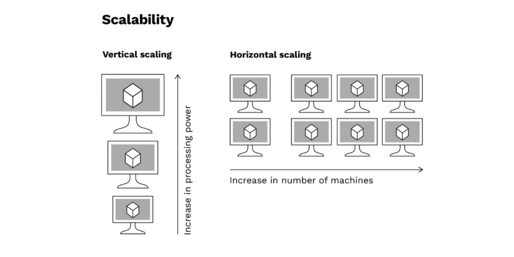

# MiroTalk SFU - Vertical & Horizontal Scaling



## Overview

Scale MiroTalk SFU to **handle 100-1000+ concurrent users** across multiple rooms.

**Two simple options:**

1.  **Vertical Scaling:** Single powerful server (50-100+ users)
2.  **Horizontal Scaling:** Multiple servers + Load Balancer (100-1000+ users)

## Option 1: Vertical Scaling

**Best for:** 50-100+ concurrent users

### Configuration

```bash
SFU_ANNOUNCED_IP=YOUR_PUBLIC_IP
SFU_SERVER=true
SFU_NUM_WORKERS=8
SFU_MIN_PORT=40000
SFU_MAX_PORT=49999
```

### Capacity

-  **4-core server:** ~400 users (4 workers × ~100 users)
-  **8-core server:** ~800 users (8 workers × ~100 users)
-  **16-core server:** ~1600 users (16 workers × ~100 users)

**Formula:** `numWorkers × ~100 users = capacity`

!!! info "Note"

    Official mediasoup docs state ~500 consumers per worker. In a typical room with N users sending audio+video, each user consumes 2×(N-1) streams. For 4-person room = 24 consumers total, so one worker can handle many rooms simultaneously.

## Option 2: Horizontal Scaling + Load Balancer

**Best for:** 100-1000+ concurrent users across multiple rooms

### Architecture

```
                Load Balancer (Nginx/HAProxy)
                    lb.yourdomain.com
                           |
        ┌──────────────────┼──────────────────┐
        |                  |                  |
     SFU #1             SFU #2             SFU #3
    1.1.1.1            2.2.2.2            3.3.3.3
    ~800 users         ~800 users         ~800 users
```

**Key:** Users in the same room stay on the same server (sticky sessions).

### Step 1: Configure Each SFU Server

```bash
# Server 1
SFU_ANNOUNCED_IP=1.1.1.1
SFU_SERVER=true
SFU_NUM_WORKERS=8
SFU_MIN_PORT=40000
SFU_MAX_PORT=49999

# Server 2
SFU_ANNOUNCED_IP=2.2.2.2
SFU_SERVER=true
# ...

# Server 3
SFU_ANNOUNCED_IP=3.3.3.3
SFU_SERVER=true
# ...
```

### Step 2: Setup Load Balancer

**Nginx Configuration:**

**File:** `/etc/nginx/sites-available/mirotalk-lb`

```nginx
# All users joining the same room are routed to the same backend

# Define backends (your MiroTalk SFU instances)
upstream mirotalk_backend {
    hash $uri consistent;  # Hash based on the room path (e.g., /room/xyz)

    server 1.1.1.1:3010 max_fails=3 fail_timeout=30s;
    server 2.2.2.2:3010 max_fails=3 fail_timeout=30s;
    server 3.3.3.3:3010 max_fails=3 fail_timeout=30s;
}

server {
    listen 443 ssl http2;
    server_name sfu.yourdomain.com;

    ssl_certificate /path/to/cert.pem;
    ssl_certificate_key /path/to/key.pem;

    location / {
        proxy_pass https://mirotalk_backend;
        proxy_http_version 1.1;

        # WebSocket support
        proxy_set_header Upgrade $http_upgrade;
        proxy_set_header Connection "upgrade";
        proxy_set_header Host $host;
        proxy_set_header X-Real-IP $remote_addr;

        # Keep connections open for WebRTC signaling
        proxy_read_timeout 600s;
        proxy_send_timeout 600s;
    }
}
```

**What Happens Here**

`hash $uri consistent;` makes Nginx route everyone joining the same room URL (e.g., `/room/xyz`) to the same SFU instance, and if a server fails, only a few rooms are reassigned to other nodes.


**HAProxy Configuration:**

**File:** `/etc/haproxy/haproxy.cfg`

```haproxy
# Ensures same room URL always goes to the same backend

frontend sfu_frontend
    bind *:443 ssl crt /path/to/cert.pem
    default_backend sfu_backend

backend sfu_backend
    balance uri whole  # Balance based on the full URL (e.g., /room/xyz)
    hash-type consistent

    option http-server-close
    option forwardfor

    server sfu1 1.1.1.1:3010 check ssl verify none
    server sfu2 2.2.2.2:3010 check ssl verify none
    server sfu3 3.3.3.3:3010 check ssl verify none
```

**What Happens Here**

`balance uri whole` makes HAProxy send everyone joining the same room URL (e.g., `/room/xyz`) to the same backend, while `hash-type consistent` ensures smooth failover if a server goes down, each SFU instance handles its own rooms independently with full WebSocket and SSL support.

### Step 3: Configure Firewall

```bash
# Check the firewall Status: (active/inactive) If active then allow traffic
ufw status

# On each SFU server
sudo ufw allow 3010/tcp
sudo ufw allow 40000:49999/udp

# On load balancer
sudo ufw allow 80/tcp
sudo ufw allow 443/tcp
```

### Step 4: Test

```bash
# Check individual servers
curl https://1.1.1.1:3010/
curl https://2.2.2.2:3010/
curl https://3.3.3.3:3010/

# Check load balancer
curl https://sfu.yourdomain.com/
```

## Deploy 3-Node Cluster in 30 Minutes

**On each server (1.1.1.1, 2.2.2.2, 3.3.3.3)** just follow the self-hosting guide [here](./self-hosting.md)

**On load balancer server:**

```bash
# Install Nginx
sudo apt update
sudo apt install -y nginx certbot python3-certbot-nginx

# Get SSL cert
sudo certbot --nginx -d sfu.yourdomain.com

# Configure (use Nginx config above)
sudo nano /etc/nginx/sites-available/mirotalk-lb
sudo ln -s /etc/nginx/sites-available/mirotalk-lb /etc/nginx/sites-enabled/
sudo nginx -t
sudo systemctl restart nginx
```

**Done!** Access: `https://sfu.yourdomain.com`

---

## Capacity Planning

| Setup | Concurrent Users | Cost/Month (€) |
|-------|------------------|----------------|
| 1× 8-core, 16GB | ~800 | €14-20 |
| 3× 8-core, 16GB + LB | ~2400 | €47-65 |
| 5× 8-core, 16GB + LB | ~4000 | €75-105 |

### Provider Comparison (8 vCores, 16GB RAM)

| Provider | Plan | CPU | RAM | Storage | Traffic | Price/Month |
|----------|------|-----|-----|---------|---------|-------------|
| **[Hetzner](https://hetzner.cloud/?ref=XdRifCzCK3bn)** | CPX41 | 8 vCPU | 16 GB | 320 GB SSD | 20 TB | **€19.99** |
| **[Netcup](https://www.netcup.com/en/?ref=309627)** | RS 2000 G11 | 8 vCores | 16 GB | 512 GB SSD | Unlimited | **€17.99** |
| **[Contabo](https://www.dpbolvw.net/click-101027391-14462707)** | VPS 20 | 8 vCores | 24 GB | 200 GB SSD | Unlimited | **€14.00** |

### Load Balancer Options

| Option | Cost/Month | Notes |
|--------|------------|-------|
| Small VPS (Nginx) | €5-10 | 2 vCores, 4GB RAM sufficient |
| Hetzner LB | €5.39 | Managed, auto-scaling |
| Netcup VPS 500 G11 | €4.88 | 4 vCores, 4GB RAM |


### Total Cost Examples


**Premium Setup [Hetzner](https://hetzner.cloud/?ref=XdRifCzCK3bn):**

-  3× Hetzner CPX41 (€19.99) = €60
-  1× Hetzner LB = €5.39
-  **Total: ~€65/month** for ~2400 users
-  ⚡ **Best Performance:** Hetzner - Premium network quality, best for production with high traffic

---


**Balanced Setup [Netcup](https://www.netcup.com/en/?ref=309627):**

-  3× Netcup RS 2000 (€17.99) = €54
-  1× Netcup VPS 500 (LB) = €4.88
-  **Total: ~€59/month** for ~2400 users
-  🏆 **Best Overall:** Netcup - Perfect balance of price, performance, and reliability

---


**Budget Setup [Contabo](https://www.dpbolvw.net/click-101027391-14462707):**

-  3× Contabo VPS 20 (€14.00) = €42
-  1× Netcup VPS 500 (LB) = €4.88
-  **Total: ~€47/month** for ~2400 users
-  💰 **Lowest Cost:** Contabo - Good for testing or budget-conscious deployments, but slower network

---

**Bandwidth per user:**

-  Audio only: ~50 Kbps
-  Video 720p: ~1.5 Mbps
-  Video 1080p: ~3 Mbps

---

**Need help?** 

Join our [community forum](https://discord.gg/rgGYfeYW3N) and **Happy Scaling!** 🚀 
