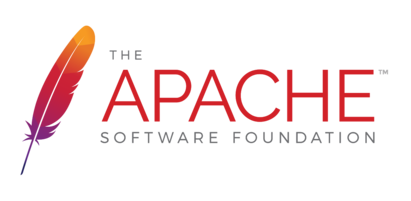

# MiroTalk SFU - Self Hosting


## Description

MiroTalk SFU is a scalable WebRTC solution for multi-party calls, using a Selective Forwarding Unit to forward streams efficiently and reduce bandwidth. Perfect for team meetings, webinars, and online classrooms.

**Live demo**: [https://sfu.mirotalk.com](https://sfu.mirotalk.com)

## Requirements

- Server Selection:
    - [Hetzner](https://www.hetzner.com/cloud) - Use [this link](https://hetzner.cloud/?ref=XdRifCzCK3bn) to receive `€⁠20 in cloud credits`
    - [Netcup](https://www.netcup.com/en/?ref=309627) (Root Server)
    - [Hostinger](https://hostinger.com/?REFERRALCODE=MIROTALK)
    - [Contabo](https://www.dpbolvw.net/click-101027391-14462707)
- OS: Ubuntu 22.04 LTS.
- [Node.js](https://nodejs.org/en/) (LTS) and npm
- [FFmpeg](https://ffmpeg.org/download.html) for optional [RTMP](../mirotalk-sfu/rtmp.md) streaming support.
- Domain or Subdomain Name (e.g., `YOUR.DOMAIN.NAME`) with a DNS A record pointing to your server's IPv4 address.

---

## Installation

!!! note

    Many of the installation steps require `root` or `sudo` access

```bash
# Run all apt commands in non-interactive mode (no prompts)
export DEBIAN_FRONTEND=noninteractive

# Update package lists
apt-get update -y

# Install required system packages
apt-get install -y \
    build-essential \
    git \
    curl \
    wget \
    unzip \
    tzdata \
    software-properties-common \
    ffmpeg

# Install Python 3.8 and pip
add-apt-repository -y ppa:deadsnakes/ppa
apt-get update -y
apt-get install -y python3.8 python3-pip
```

---


Install `NodeJS` and `npm` using [Node Version Manager](../utility/nvm.md)

---

## Quick start

```bash
# Clone the repository
git clone https://github.com/miroslavpejic85/mirotalksfu.git

# Navigate to the project directory
cd mirotalksfu

# Copy the config template and customize as needed
cp app/src/config.template.js app/src/config.js

# Copy the environment template and customize as needed
cp .env.template .env
```

---

### .env

Change the `ENVIRONMENT` and the `SFU_ANNOUNCED_IP` in the `.env`

```bash
ENVIRONMENT=production
SFU_ANNOUNCED_IP=Your-Server-Public-IPv4-or-Domain
```

Set the port range for WebRTC communication. This range is used for the dynamic allocation of UDP ports for media streams.

```bash
: '
    About:
    - Each participant requires 2 ports: one for audio and one for video.
    - The default configuration supports up to 50 participants (50 * 2 ports = 100 ports).
    - To support more participants, simply increase the port range.

    Note: 
    - When running in Docker, use "network mode: host" for improved performance.
    - Alternatively, enable "SFU_SERVER: true" mode for better scalability.
    - Make sure these port ranges are not blocked by the firewall; if they are, add the necessary rules.
'

SFU_MIN_PORT=40000
SFU_MAX_PORT=40100 

SFU_NUM_WORKERS=1 # Maximum workers should not exceed available CPU cores (e.g., 4 workers max on 4-core CPU)
```

<br />

### FireWall

Set the `inbound rules` if needed

| Port range  | Protocol | Source    | Description         |
| ----------- | -------- | --------- | ------------------- |
| 3010        | TCP      | 0.0.0.0/0 | APP listen on TCP   |
| 40000-40100 | TCP      | 0.0.0.0/0 | RTC port ranges TCP |
| 40000-40100 | UDP      | 0.0.0.0/0 | RTC port ranges UDP |

```bash
# Check the firewall Status: (active/inactive)
ufw status

# If active then allow traffic
ufw allow 3010/tcp
ufw allow 40000:40100/tcp
ufw allow 40000:40100/udp

# ssh, http, https, nginx...
ufw allow 22/tcp
ufw allow 80/tcp
ufw allow 443/tcp
```

---

### WebRTCServer (optional)

You can activate the `WebRTCServer` option in the `.env` file:

```bash
SFU_SERVER=true
```

Here's how it works:

- MiroTalk instantiates a `Worker` for each `CPU`.
- Each `Worker` has its own `WebRTCServer`, which listens on a single port starting from `40000`.
- This setup simplifies port management because you only need to open ports for the number of `Workers` you have.

---

### Install dependencies and start the server

```bash
# Install dependencies (first run may take a few minutes)
npm ci

# Start the server
npm start
```

Verify the installation: [http://YOUR.DOMAIN.NAME:3010](http://YOUR.DOMAIN.NAME:3010)

---

## Using [PM2](https://pm2.keymetrics.io) (Process Manager)


```bash
# Install PM2
npm install -g pm2

# Start the server
pm2 start app/src/Server.js --name mirotalksfu

# Save the process list
pm2 save

# Enable auto-start on boot
pm2 startup
```

---

## Using Docker


```bash
# Install Docker and Docker Compose
sudo apt install -y docker.io
sudo apt install -y docker-compose

# Clone the repository
git clone https://github.com/miroslavpejic85/mirotalksfu.git

# Navigate to the project directory
cd mirotalksfu

# Copy and customize the config template
cp app/src/config.template.js app/src/config.js

# Copy and customize the environment template
cp .env.template .env

# Copy and customize the Docker Compose template
cp docker-compose.template.yml docker-compose.yml
```

Example of `docker-compose.yml`:

```yaml 
services:
    mirotalksfu:
        image: mirotalk/sfu:latest
        container_name: mirotalksfu
        hostname: mirotalksfu
        restart: unless-stopped
        network_mode: 'host'
        volumes:
            - ./.env:/src/.env:ro
            - ./app/:/src/app/:ro
            - ./public/:/src/public/:ro
```

```bash
# Pull the official Docker image
docker-compose pull

# Create and start containers (add -d to run in background)
docker-compose up
```

Verify the installation: [http://YOUR.DOMAIN.NAME:3010](http://YOUR.DOMAIN.NAME:3010)

---

## Configuring Nginx & Certbot


To use MiroTalk SFU without the port number and with encrypted communications (required for WebRTC to work correctly), install [Nginx](https://www.nginx.com) and [Certbot](https://certbot.eff.org):

```bash
# Install Nginx
sudo apt-get install -y nginx

# Install Certbot (SSL certificates)
sudo apt install -y snapd
sudo snap install core; sudo snap refresh core
sudo snap install --classic certbot
sudo ln -s /snap/bin/certbot /usr/bin/certbot

# Configure Nginx
sudo vim /etc/nginx/sites-enabled/default
```

Add the following:

```bash
# HTTP — redirect all traffic to HTTPS
server {
    listen 80;
    listen [::]:80;
    server_name YOUR.DOMAIN.NAME;

    return 301 https://$host$request_uri;
}
```

```bash
# Test Nginx configuration
sudo nginx -t

# Enable HTTPS with Certbot (follow the prompts)
sudo certbot certonly --nginx

# Add Let's Encrypt configuration to Nginx
sudo vim /etc/nginx/sites-enabled/default
```

Add the following:

```bash
# MiroTalk SFU - HTTPS — proxy all requests to the Node app
server {
    # Enable HTTP/2
    listen 443 ssl http2;
    listen [::]:443 ssl http2;
    server_name YOUR.DOMAIN.NAME;

    # Use the Let’s Encrypt certificates
    ssl_certificate /etc/letsencrypt/live/YOUR.DOMAIN.NAME/fullchain.pem;
    ssl_certificate_key /etc/letsencrypt/live/YOUR.DOMAIN.NAME/privkey.pem;

    location / {
        proxy_set_header X-Forwarded-For $proxy_add_x_forwarded_for;
        proxy_set_header Host $host;
        proxy_pass http://localhost:3010/;
        proxy_http_version 1.1;
        proxy_set_header Upgrade $http_upgrade;
        proxy_set_header Connection "upgrade";
    }
}
```

```bash
# Test Nginx configuration again
sudo nginx -t

# Restart Nginx
service nginx restart
service nginx status

# Set up auto-renewal for SSL certificates
sudo certbot renew --dry-run --cert-name YOUR.DOMAIN.NAME

# Show certificates
sudo certbot certificates
```

Verify your MiroTalk SFU instance: [https://YOUR.DOMAIN.NAME](https://YOUR.DOMAIN.NAME)

---

## Apache Virtual Host (Alternative to Nginx)



If you prefer `Apache`, configure it with the equivalent settings provided in this guide.

```bash
# Install Apache with Certbot
apt install python3-certbot-apache -y

# Set up SSL
certbot --apache --non-interactive --agree-tos -d YOUR.DOMAIN.NAME -m your.email.address

# Edit the Apache site configuration
sudo vim /etc/apache2/sites-enabled/YOUR.DOMAIN.NAME.conf
```

Add the following:

```bash
# HTTP — redirect all traffic to HTTPS
<VirtualHost *:80>
    ServerName YOUR.DOMAIN.NAME
    Redirect permanent / https://YOUR.DOMAIN.NAME
</VirtualHost>

# MiroTalk SFU - HTTPS — proxy all requests to the Node app
<VirtualHost *:443>
    ServerName YOUR.DOMAIN.NAME

    # SSL Configuration
    SSLEngine on
    SSLCertificateFile /etc/letsencrypt/live/YOUR.DOMAIN.NAME/fullchain.pem
    SSLCertificateKeyFile /etc/letsencrypt/live/YOUR.DOMAIN.NAME/privkey.pem
    Include /etc/letsencrypt/options-ssl-apache.conf

    # Enable HTTP/2 support
    Protocols h2 http/1.1

    <Location />
        # Proxy Configuration for Node.js App
        ProxyPass http://localhost:3010/
        ProxyPassReverse http://localhost:3010/

        ProxyPreserveHost On

        RequestHeader set X-Forwarded-For "%{REMOTE_ADDR}s"
        RequestHeader set X-Forwarded-Proto "https"
        RequestHeader set Host "%{HTTP_HOST}s"

        # Enable WebSocket proxy support for Socket.IO
        RewriteEngine On
        RewriteCond %{HTTP:Upgrade} =websocket [NC]
        RewriteRule /(.*) ws://localhost:3010/socket.io/$1 [P,L]
        # Adjust the WebSocket path according to your Socket.IO configuration
        # For Socket.IO 3.x or higher, use /socket.io/?EIO=4&transport=websocket
    </Location>
</VirtualHost>
```

```bash
# Check configuration
sudo apache2ctl configtest

sudo a2enmod proxy # Enables the `mod_proxy` module, which is essential for proxying HTTP and WebSocket connections.
sudo a2enmod proxy_http # Enables the `mod_proxy_http` module, which adds support for proxying HTTP connections.
sudo a2enmod proxy_wstunnel # Enables the `mod_proxy_wstunnel` module, which provides support for tunneling WebSocket connections

# Restart apache
sudo systemctl restart apache2
```

---

## Updating Your Instance

To keep your MiroTalk SFU instance up to date, create an update script:

```bash
cd
# Create a file sfuUpdate.sh
vim sfuUpdate.sh
```

---

For `PM2`:

```bash
#!/bin/bash

cd mirotalksfu
git pull
sudo npm ci
pm2 restart app/src/Server.js
```

---

For `Docker`:

```bash
#!/bin/bash

cd mirotalksfu
git pull
docker-compose down
docker-compose pull
docker image prune -f
docker-compose up -d
```

---

Make the script executable

```bash
chmod +x sfuUpdate.sh
```

To update your MiroTalk SFU instance to the latest version, run the script:

```bash
./sfuUpdate.sh
```

---

## Changelogs

Stay informed about project updates by following the commits of the MiroTalk SFU project [here](https://github.com/miroslavpejic85/mirotalksfu/commits/main)

---
