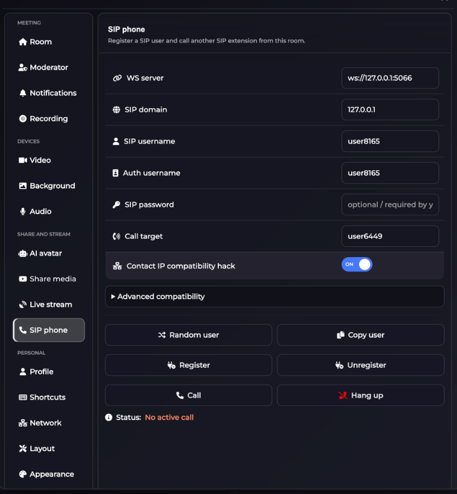

# 📞 SIP phone (Experimental)

Use the built-in **SIP phone** panel in MiroTalk SFU to register SIP users from inside a room and place extension-to-extension calls.

This feature is currently marked as **experimental** and is intended as a practical MVP for SIP interop testing.



---

## 🧪 Experimental SIP demo (Kamailio)

A minimal, self-contained SIP demo is available in [sip/](https://github.com/miroslavpejic85/mirotalksfu/tree/main/sip):

- Kamailio in Docker (`REGISTER` + `INVITE` routing)
- Simple Node.js web SIP client example

Quick start:

```bash
cd sip
chmod +x run.sh
./run.sh
```

Open <http://localhost:8088>. Full instructions: [sip/README.md](https://github.com/miroslavpejic85/mirotalksfu/blob/main/sip/README.md).

You can also test the in-room SIP phone MVP directly in MiroTalk SFU:

1. Start MiroTalk SFU normally.
2. Start the SIP stack (`./sip/run.sh`).
3. Join a room with two browsers/users.
4. Open **Settings → SIP phone**, register random users, and call each other.

---

## Compatibility

The SIP phone works with the bundled demo and is designed to be compatible with **most SIP servers that expose WSS (WebSocket Secure)** transport (for example Kamailio, Asterisk, FreeSWITCH, OpenSIPS, and similar SIP platforms configured for WebRTC clients).

For non-demo deployments, ensure your SIP server provides:

- `wss://` SIP WebSocket endpoint reachable from browsers
- Correct SIP domain/realm for registration
- WebRTC-compatible SIP profile/transports
- DTLS-SRTP / ICE / NAT handling suitable for browser endpoints

!!! warning "Experimental scope"

    SIP interoperability can vary by server configuration, NAT topology, auth policy, and codec/transcoding rules. Validate your full call flow in your own environment before production usage.

---

## In-room SIP phone fields

The SIP phone panel includes the following common parameters:

| Field | Description | Example |
| --- | --- | --- |
| WS server | SIP WebSocket endpoint used by the browser SIP stack. | `ws://127.0.0.1:5066` or `wss://sip.example.com:7443` |
| SIP domain | SIP realm/domain sent in SIP registration and INVITE flows. | `127.0.0.1` |
| SIP username | SIP account/extension to register. | `user8165` |
| Auth username | Authentication username (can match or differ from SIP username). | `user8165` |
| SIP password | Optional in open/local test setups, required when server auth is enabled. | `••••••••` |
| Call target | Destination extension or SIP user to call. | `user6449` |

Buttons:

- **Random user**: generates test users quickly
- **Copy user**: copies current user details for easier second-browser tests
- **Register / Unregister**: controls SIP registration lifecycle
- **Call / Hang up**: starts and ends active SIP calls

---

## Recommended test flow

1. Launch SFU and SIP demo stack.
2. Open room in Browser A and Browser B.
3. In both browsers, open **Settings → SIP phone**.
4. Click **Random user**, then **Register** on both sides.
5. Copy Browser B user and paste into Browser A **Call target**.
6. Press **Call** in Browser A.
7. Verify two-way audio and call teardown with **Hang up**.

---

## Troubleshooting

### Registration fails

- Confirm SIP server is running and listening on the configured WS/WSS endpoint.
- Verify `SIP domain`, username, auth username, and password.
- Check browser console and SIP server logs for auth (`401/403`) or transport errors.

### Call does not connect

- Confirm both users are successfully registered first.
- Verify target extension exists and is reachable.
- Check SIP routing rules (`INVITE` path) in your SIP server.

### No media / one-way audio

- Review NAT traversal and ICE candidate reachability.
- Validate DTLS-SRTP and RTP profile compatibility.
- Confirm UDP/TCP media ports and firewall policies allow media traffic.

### WSS errors in browser

- Use valid TLS certificates on SIP WSS endpoint.
- Ensure hostname in certificate matches the WS/WSS URL used by the client.
- Avoid mixed-content issues (`https` app pages calling insecure `ws://` endpoints).

---

## Notes

- SIP phone is currently intended for **experimental and integration testing**.
- For internet-facing usage, prefer `wss://` with trusted certificates.
- Keep SIP logs enabled while validating third-party interop profiles.
