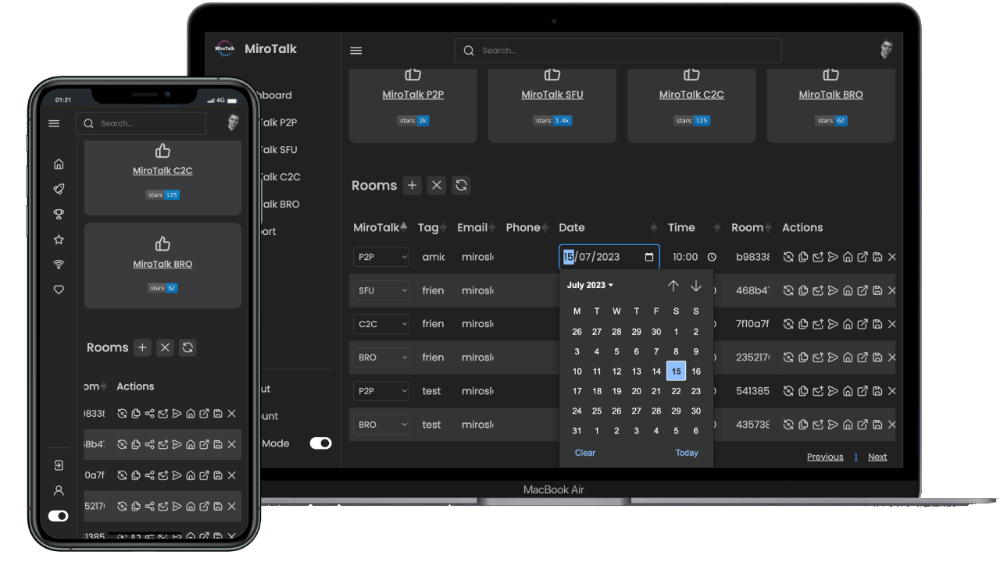

# MiroTalk WEB

A browser workspace for accounts, rooms, schedules, invitations, and meeting administration. WEB organizes communication workflows and launches the appropriate MiroTalk experience; the selected communication product determines how meeting media travels.

[Use MiroTalk Cloud](https://webrtc.mirotalk.com){ .md-button .md-button--primary }
[Self-host MiroTalk WEB](self-hosting.md){ .md-button }

{ .product-shot }

## WEB and MiroTalk Cloud

MiroTalk Cloud is the managed service powered by MiroTalk WEB. Choose Cloud when MiroTalk should operate the infrastructure and updates; self-host WEB when you need to operate and configure the workspace on your own infrastructure.

| Responsibility | MiroTalk Cloud | Self-hosted WEB |
| --- | --- | --- |
| Application operation | Managed by MiroTalk | Managed by your team |
| Updates and maintenance | Managed service | Your responsibility |
| Configuration and integrations | Service offering | Controlled in your deployment |
| Meeting media | Determined by launched product | Determined by launched product |

[Compare Cloud and self-hosting](../cloud/index.md){ .md-button }

## Workspace capabilities

- User registration, authentication, and administration
- Room creation, scheduling, and reusable meeting links
- Email and SMS invitations where providers are configured
- Meeting reminders and participant availability
- Google Calendar and Outlook Calendar actions
- Dashboard access to supported MiroTalk communication products
- MongoDB-backed application data

## Build with WEB

| Goal | Documentation |
| --- | --- |
| Integrate workspace operations | [REST API](api.md) |
| Embed the workspace | [Iframe integration](integration.md) |
| Configure SaaS payments | [Stripe billing](stripe.md) |

## Self-host and operate

| Stage | Documentation |
| --- | --- |
| Install | [Self-hosting guide](self-hosting.md) |
| Configure accounts and services | [Configuration reference](configurations.md) |
| Develop locally | [Ngrok guide](ngrok.md) |

!!! note "WEB is not the media engine"

    Room performance, media trust boundaries, and participant capacity depend on the communication product launched by WEB and its deployment.

## Licensing and support

Use the official licensing page as the source of truth for commercial requirements.

[Compare licensing options](../license/index.md){ .md-button .md-button--primary }
[Review the WEB commercial package](https://codecanyon.net/item/a-selfhosted-mirotalks-webrtc-rooms-scheduler-server/42643313){ .md-button }
[Contact MiroTalk Enterprise](../enterprise/index.md){ .md-button }