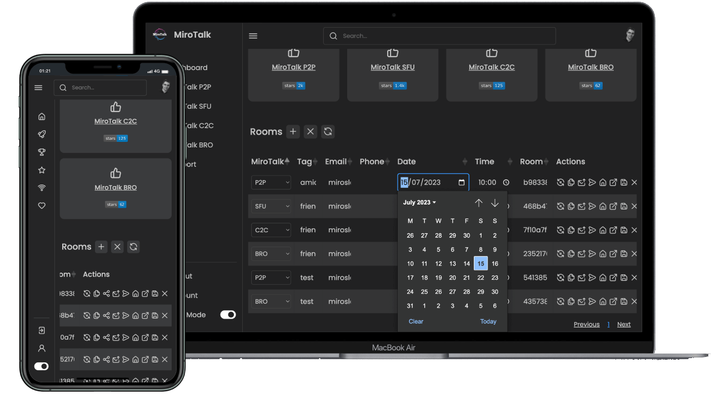

# MiroTalk WEB - Self hosting



## Description

MiroTalk WEB is a browser-based room scheduler for organizing and managing team meetings. Streamlines internal communication and collaboration for organizations.

## Requirements

- Server Selection:
    - [Hetzner](https://www.hetzner.com/cloud) - Use [this link](https://hetzner.cloud/?ref=XdRifCzCK3bn) to receive `€⁠20 in cloud credits`
    - [Hostinger](https://hostinger.com/?REFERRALCODE=MIROTALK)
    - [Contabo](https://www.dpbolvw.net/click-101027391-14462707)
- OS: Ubuntu 22.04 LTS.
- [Node.js](https://nodejs.org/en/) (LTS) and npm
- Domain or Subdomain Name (e.g., `YOUR.DOMAIN.NAME`) with a DNS A record pointing to your server's IPv4 address.

---

## Installation


Install `NodeJS` and `npm` using [Node Version Manager](../utility/nvm.md)

---

## Quick start

```bash
# Clone the project repo
$ git clone https://github.com/miroslavpejic85/mirotalkwebrtc.git

# Go to project dir
$ cd mirotalkwebrtc

# Copy .env.template to .env and customize it according to your needs
$ cp .env.template .env

# Copy config.template.js to config.js and customize it according to your needs
$ cp backend/config.template.js backend/config.js
```

---

### Config.js

Customize the `backend/config.js` according to your needs:

```javascript
"use-strict";

module.exports = {
  //...
  MiroTalk: {
    P2P: {
      Visible: true,
      Home: "https://P2P-DOMAIN-NAME",
      Room: "https://P2P-DOMAIN-NAME/newcall",
      Join: "https://P2P-DOMAIN-NAME/join/",
      //...
    },
    SFU: {
      Visible: true,
      Home: "https://SFU-DOMAIN-NAME",
      Room: "https://SFU-DOMAIN-NAME/newroom",
      Join: "https://SFU-DOMAIN-NAME/join/",
      //...
    },
    C2C: {
      Visible: true,
      Home: "https://C2C-DOMAIN-NAME",
      Room: "https://C2C-DOMAIN-NAME/?room=",
      //...
    },
    BRO: {
      Visible: true,
      Home: "https://BRO-DOMAIN-NAME",
      Broadcast: "https://BRO-DOMAIN-NAME/broadcast?id=",
      Viewer: "https://BRO-DOMAIN-NAME/viewer?id=",
      //...
    },
  },
  //...
};
```

---

**Here's a breakdown of the structure:**

- `Visible`: Display on MiroTalk WEB dashboard (boolean).
- `Home`: Homepage URL.
- `Room`: URL for creating a new call/room.
- `Join`: URL for joining an existing call/room.
- `Broadcast`: URL for broadcasting.
- `Viewer`: URL for viewing a broadcast.

---

To use this configuration file, you would replace the placeholder values like `'https://P2P-DOMAIN-NAME'` with the actual domain or subdomain names where your MiroTalk instances are hosted. This ensures that the application correctly generates the URLs for different MiroTalk functionalities.

For example, if your P2P instance is hosted at `https://mirotalk-p2p.example.com`, you would replace `'https://P2P-DOMAIN-NAME'` with `'https://mirotalk-p2p.example.com'` in the `config.js` file. Repeat this process for each component and its corresponding URLs.

---

### MongoDb


#### Local MongoDB Deployment

Install `Docker` and `Docker Compose`:

```bash
# Install docker
$ sudo apt install -y docker.io

# Instal docker-compose
$ sudo apt install -y docker-compose
```

To run MongoDB locally with [Docker Compose](https://docs.docker.com/compose/install/), you can use the following commands:

Start the MongoDB container:

```bash
$ npm run mongo:up
```

Stop the MongoDB container:

```bash
$ npm run mongo:down
```

<details>
<summary>Cloud MongoDB Deployment (Optional)</summary>

<br />

For cloud MongoDB deployments, such as with <a href="https://www.mongodb.com/" target="_blank">MongoDB Atlas</a>, make sure to update the credentials in the `.env` file accordingly.

```bash
# MongoDB Configuration (See: https://www.mongodb.com/)
MONGO_URL=mongodb://${MONGO_USERNAME}:${MONGO_PASSWORD}@${MONGO_HOST}:${MONGO_PORT}
MONGO_DATABASE=mirotalk
```

</details>

<details>
<summary>User Email Verification (Optional)</summary>

<br />


<br /><br />

By default, email verification is disabled. To enable it, set <strong>EMAIL_VERIFICATION</strong> to <strong>true</strong> in the <strong>.env</strong> file, and ensure the email settings are properly configured.

```bash
# Email Configuration (See: https://support.google.com/mail/answer/185833?hl=en)
EMAIL_VERIFICATION=true
EMAIL_HOST=yourEmailHost
EMAIL_PORT=yourEmailPort
EMAIL_USERNAME=yourEmailUsername
EMAIL_PASSWORD=yourEmailPassword
EMAIL_FROM=yourEmailFrom
```

</details>

### Install dependencies and start the server

```bash
# Install dependencies
$ npm ci

# Start the server
$ npm start
```

Check if is correctly installed: [http://YOUR.DOMAIN.NAME:9000](http://YOUR.DOMAIN.NAME:9000)

---

## Using PM2 (Process Manager)


Install [PM2](https://pm2.keymetrics.io):

```bash
# Install pm2
$ npm ci -g pm2

# Start the server
$ pm2 start backend/server.js --name mirotalkweb

# Takes a snapshot
$ pm2 save

# Add it on startup
$ pm2 startup
```

---

## Using Docker


Install `Docker` and `Docker Compose`:

```bash
# Install docker
$ sudo apt install -y docker.io

# Install docker-compose
$ sudo apt install -y docker-compose

# Clone the project repo
$ git clone https://github.com/miroslavpejic85/mirotalkwebrtc.git

# Go to project dir
$ cd mirotalkwebrtc

# Copy env.template to .env and customize it according to your needs
$ cp .env.template .env

# Copy config.template.js to config.js and customize it according to your needs
$ cp backend/config.template.js backend/config.js

# Copy docker-compose.template.yml in docker-compose.yml and customize it according to your needs if needed
$ cp docker-compose.template.yml docker-compose.yml

# Pull the official Docker image
$ docker pull mirotalk/webrtc:latest

# Create and start containers (-d as daemon)
$ docker-compose up
```

Check if is correctly installed: [https://YOUR.DOMAIN.NAME:9000](https://YOUR.DOMAIN.NAME:9000)

---

## Configuring Nginx & Certbot


In order to use it without the port number and to have encrypted communications (`mandatory to make it work correctly`), we going to install [nginx](https://www.nginx.com) and [certbot](https://certbot.eff.org)

```bash
# Install Nginx
$ sudo apt-get install -y nginx

# Install Certbot (SSL certificates)
$ sudo apt install -y snapd
$ sudo snap install core; sudo snap refresh core
$ sudo snap install --classic certbot
$ sudo ln -s /snap/bin/certbot /usr/bin/certbot

# Configure Nginx
$ sudo vim /etc/nginx/sites-enabled/default
```

Add the following:

```bash
# HTTP — redirect all traffic to HTTPS
server {
    listen 80;
    listen [::]:80;
    server_name YOUR.DOMAIN.NAME;

    return 301 https://$host$request_uri;
}
```

```bash
# Test Nginx configuration
$ sudo nginx -t

# Enable HTTPS with Certbot (follow the instruction)
$ sudo certbot certonly --nginx

# Add Let's Encrypt configuration to Nginx
$ sudo vim /etc/nginx/sites-enabled/default
```

Add the following:

```bash
# MiroTalk WebRTC admin - HTTPS — proxy all requests to the Node app
server {
    # Enable HTTP/2
    listen 443 ssl http2;
    listen [::]:443 ssl http2;
    server_name YOUR.DOMAIN.NAME;

    # Use the Let’s Encrypt certificates
    ssl_certificate /etc/letsencrypt/live/YOUR.DOMAIN.NAME/fullchain.pem;
    ssl_certificate_key /etc/letsencrypt/live/YOUR.DOMAIN.NAME/privkey.pem;

    location / {
        proxy_set_header X-Forwarded-For $proxy_add_x_forwarded_for;
        proxy_set_header Host $host;
        proxy_pass http://localhost:9000/;
        proxy_http_version 1.1;
        proxy_set_header Upgrade $http_upgrade;
        proxy_set_header Connection "upgrade";
    }
}
```

```bash
# Test Nginx configuration again
$ sudo nginx -t

# Restart nginx
$ service nginx restart
$ service nginx status

# Set up auto-renewal for SSL certificates
$ sudo certbot renew --dry-run

# Show certificates
$ sudo certbot certificates
```

Check Your MiroTalk WEB instance: [https://YOUR.DOMAIN.NAME](https://YOUR.DOMAIN.NAME)

---

## Apache Virtual Host (Alternative to Nginx)


If you prefer `Apache`, configure it with the equivalent settings provided in this guide.

```bash
# Install apache with certbot
$ apt install python3-certbot-apache -y

# Setting up ssl
$ certbot --apache --non-interactive --agree-tos -d YOUR.DOMAIN.NAME -m your.email.address

# Edit the apache sites
$ sudo vim /etc/apache2/sites-enabled/YOUR.DOMAIN.NAME.conf
```

Add the following:

```bash
# HTTP — redirect all traffic to HTTPS
<VirtualHost *:80>
    ServerName YOUR.DOMAIN.NAME
    Redirect permanent / https://YOUR.DOMAIN.NAME
</VirtualHost>

<VirtualHost *:443>
    ServerName YOUR.DOMAIN.NAME

    # SSL Configuration
    SSLEngine on
    SSLCertificateFile /etc/letsencrypt/live/YOUR.DOMAIN.NAME/fullchain.pem
    SSLCertificateKeyFile /etc/letsencrypt/live/YOUR.DOMAIN.NAME/privkey.pem
    Include /etc/letsencrypt/options-ssl-apache.conf

    # Enable HTTP/2 support
    Protocols h2 http/1.1

    <Location />
        # Proxy Configuration for Node.js App
        ProxyPass http://localhost:9000/
        ProxyPassReverse http://localhost:9000/

        ProxyPreserveHost On

        RequestHeader set X-Forwarded-For "%{REMOTE_ADDR}s"
        RequestHeader set X-Forwarded-Proto "https"
        RequestHeader set Host "%{HTTP_HOST}s"

        # Enable WebSocket proxy support for Socket.IO
        RewriteEngine On
        RewriteCond %{HTTP:Upgrade} =websocket [NC]
        RewriteRule /(.*) ws://localhost:9000/socket.io/$1 [P,L]
        # Adjust the WebSocket path according to your Socket.IO configuration
        # For Socket.IO 3.x or higher, use /socket.io/?EIO=4&transport=websocket
    </Location>
</VirtualHost>
```

```bash
# Check configuration
sudo apache2ctl configtest

sudo a2enmod proxy # Enables the `mod_proxy` module, which is essential for proxying HTTP and WebSocket connections.
sudo a2enmod proxy_http # Enables the `mod_proxy_http` module, which adds support for proxying HTTP connections.
sudo a2enmod proxy_wstunnel # Enables the `mod_proxy_wstunnel` module, which provides support for tunneling WebSocket connections

# Restart apache
sudo systemctl restart apache2
```

---

## Updating Your Instance

To keep your MiroTalk WEB instance up to date, create an update script:

```bash
$ cd
# Create a file webUpdate.sh
$ vim webUpdate.sh
```

---

For `PM2`:

```bash
#!/bin/bash

cd mirotalkwebrtc
git pull
sudo npm ci
pm2 restart backend/server.js
```

---

For `Docker`:

```bash
#!/bin/bash

cd mirotalkwebrtc
git pull
docker-compose down
docker-compose pull
docker image prune -f
docker-compose up -d
```

---

Make the script executable

```bash
chmod +x webUpdate.sh
```

To update your MiroTalk WEB instance to the latest version, run the script:

```bash
./webUpdate.sh
```

---

## Changelogs

Stay informed about project updates by following the commits of the MiroTalk WEB project [here](https://github.com/miroslavpejic85/mirotalkwebrtc/commits/master)

---
