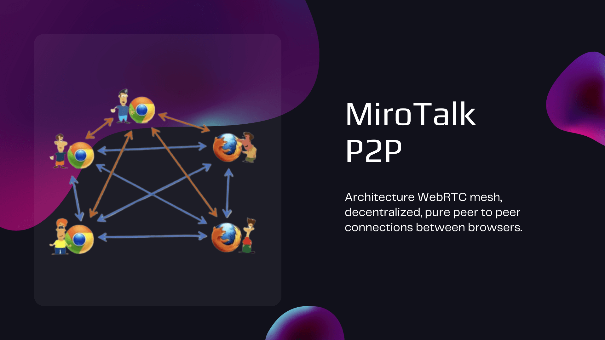
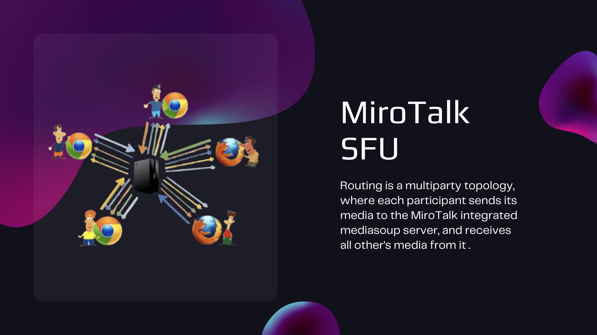

<header class="editorial-hero overview-hero">
    Technical decision guide
    <h1>Compare MiroTalk products and architectures</h1>
    
Understand where media travels, what each service operates, and which capabilities, integrations, and deployment responsibilities fit your workflow.

    

        <a class="md-button md-button--primary" href="#compare-media-architectures">Compare architectures</a>
        <a class="md-button" href="/projects/">Choose by workflow</a>
    

</header>

    
<strong>P2P</strong>Media travels between participants when direct connections succeed.

    
<strong>SFU</strong>A media server receives and forwards selected participant streams.

    
<strong>Broadcast</strong>One presenter distributes media directly or through an SFU.

!!! info "Looking for a recommendation?"

    Start with the [product chooser](../projects/index.md). This page is a technical reference, not a sizing promise. Validate capacity and infrastructure in your own environment.

## Product roles

MiroTalk has three layers. The communication products carry calls or broadcasts; WEB organizes meeting workflows; ADMIN operates deployed services.

| Product | Layer | Primary role | Participation model |
| --- | --- | --- | --- |
| [CME](../mirotalk-cme/index.md) | Communication | Click-to-call availability and private calls | A caller connects to an available user |
| [C2C](../mirotalk-c2c/index.md) | Communication | Focused camera-to-camera rooms | Two participants per room |
| [P2P](../mirotalk-p2p/index.md) | Communication | Private small-group meetings | Participants connect in a mesh |
| [SFU](../mirotalk-sfu/index.md) | Communication | Group meetings, classes, and webinars | A media server forwards participant streams |
| [BRO](../mirotalk-bro/index.md) | Communication | One-to-many live broadcasting | One presenter and multiple viewers |
| [WEB](../mirotalk-web/index.md) | User workspace | Accounts, scheduling, rooms, and invitations | Launches supported communication experiences |
| [ADMIN](../mirotalk-admin/index.md) | Infrastructure | Configuration, updates, and process management | Operates MiroTalk services on your servers |

## Compare media architectures

| Product | Media path | Server responsibility | Client responsibility | Primary scaling constraint |
| --- | --- | --- | --- | --- |
| **CME** | Direct P2P when possible; TURN relay when required | Signaling, availability, authentication, and optional relay | Send and receive one call stream | Network reachability and TURN bandwidth |
| **C2C** | Direct P2P when possible; TURN relay when required | Signaling, room coordination, and optional relay | Send and receive one peer stream | Network reachability and TURN bandwidth |
| **P2P** | Mesh between participants; TURN relay when required | Signaling, room coordination, and optional relay | Send to and receive from every participant | Participant uplink, downlink, and device CPU |
| **SFU** | Every participant sends to the SFU; the SFU forwards selected streams | Receive, route, and transmit media | Upload one stream and receive selected streams | Server CPU, network throughput, and media quality |
| **BRO** | P2P distribution or SFU distribution, depending on configuration | Signaling plus optional relay or media forwarding | Broadcaster uploads; viewers receive | Broadcaster uplink in P2P mode or server resources in SFU mode |
| **WEB** | Determined by the communication product it launches | Accounts, schedules, invitations, and application data | Browser workspace and meeting launch | Application services plus the selected media architecture |
| **ADMIN** | Does not carry meeting media | Service configuration and operational control | Browser administration interface | Number of managed services and operational workload |

    

        Interactive presentation
        <strong>MiroTalk WebRTC: P2P and SFU</strong>
        Explore the architecture concepts in a 37-slide Canva presentation.
    

    <button class="md-button md-button--primary architecture-deck-button" data-embed-button type="button">Open presentation</button>
    <noscript><a href="https://www.canva.com/design/DAE693uLOIU/view">View the architecture presentation on Canva</a></noscript>

### Mesh P2P

P2P keeps routine media off the application server when direct connections succeed. Each new participant adds send and receive work to every other participant, so device and access-network limits become important as a room grows.

### Selective Forwarding Unit

An SFU receives each participant's encrypted transport and forwards selected streams. This reduces distribution work on participant devices but makes server CPU and bandwidth part of the capacity model.

### Broadcast distribution

BRO can distribute directly from the presenter for smaller audiences or through an SFU when distribution should move to server infrastructure. The selected mode changes both the broadcaster's uplink requirement and server cost.

## Security boundaries

WebRTC transport is encrypted in every architecture, but “encrypted in transit” and “end-to-end encrypted between participants” describe different trust boundaries.

| Product | Media protection | Access and API controls documented by the project | Important boundary |
| --- | --- | --- | --- |
| **CME** | P2P media is encrypted between callers, including when relayed by TURN | Host protection and JWT | Availability and room metadata still pass through application services |
| **C2C** | P2P media is encrypted between the two participants | OIDC and JWT | TURN can relay encrypted packets when a direct path fails |
| **P2P** | Mesh media is encrypted between participants | OIDC, host protection, and JWT | Every participant is a media endpoint |
| **SFU** | DTLS-SRTP protects media between each client and the SFU | OIDC, host protection, and JWT | The self-hosted SFU is inside the media trust boundary so it can forward streams |
| **BRO** | P2P mode encrypts presenter-viewer paths; SFU mode uses encrypted client-server transports | OIDC and JWT | The trust boundary changes with distribution mode |
| **WEB** | HTTPS protects portal traffic; meeting media follows the launched product | JWT | WEB is a workspace, not the media engine |
| **ADMIN** | HTTPS protects dashboard traffic | JWT and administrator authentication | ADMIN has privileged access to managed infrastructure |

!!! note "TURN does not remove transport encryption"

    When TURN relays a P2P connection, it forwards encrypted WebRTC packets. It does consume relay bandwidth, so include TURN traffic in operating estimates.

[Read about STUN and TURN](../coturn/stun-turn.md){ .md-button }
[Review WebRTC architecture concepts](../webrtc/architectures.md){ .md-button }

## Capability matrix

“Available” means the project documents the capability. Exact behavior and configuration can vary by release.

| Capability | CME | C2C | P2P | SFU | BRO | WEB | ADMIN |
| --- | --- | --- | --- | --- | --- | --- | --- |
| One-to-one video | Available | Core workflow | Available | Available | Presenter/viewer | Launches meetings | Not applicable |
| Group meetings | Not its role | Not available | Core workflow | Core workflow | Not its role | Organizes meetings | Not applicable |
| One-to-many broadcast | Not its role | Not available | Not its role | Available | Core workflow | Launches broadcasts | Not applicable |
| Screen sharing | Available | Available | Available | Available | Broadcaster | Determined by meeting type | Not applicable |
| Text messaging | Available | Available | Group and private chat | Group and private chat | Viewer messaging | Workspace and meeting dependent | Not applicable |
| File sharing | Available | Available | Available | Available | Not documented here | Meeting dependent | Not applicable |
| Recording | Not documented here | Local recording | Local recording | Local and server-side options | Available | Meeting dependent | Not applicable |
| Moderation and webinar tools | Host controls | Minimal | Host controls | Lobby, room lock, roles, polls, and breakout rooms | Presenter controls | Organizes access | Not applicable |
| Scheduling and invitations | Not its role | Not its role | Not its role | Not its role | Not its role | Core workflow | Not applicable |
| Service operations | Not its role | Not its role | Not its role | Not its role | Not its role | User administration | Core workflow |

## Integration matrix

| Integration | CME | C2C | P2P | SFU | BRO | WEB | ADMIN |
| --- | --- | --- | --- | --- | --- | --- | --- |
| REST API | Available | Available | Available | Available | Available | Available | Available |
| Iframe | Available | Available | Available | Available | Available | Available | Not applicable |
| Widget | Available | Not documented here | Available | Available | Not documented here | Not documented here | Not applicable |
| Webhooks | Available | Not documented here | Available | Available | Not documented here | Not documented here | Not documented here |
| Calendar | Not its role | Not its role | Not its role | Not its role | Not its role | Google and Outlook | Not applicable |
| Observability | Not documented here | Sentry | Sentry | Sentry | Sentry | Sentry | Process monitoring |
| Collaboration platforms | Not documented here | Mattermost | Slack and Mattermost | Slack, Mattermost, and Discord | Not documented here | Not documented here | Not applicable |
| Storage and recording services | Not documented here | Local browser storage | Local browser storage | S3-compatible storage and server recording options | Local recording | Meeting dependent | Not applicable |

[Browse REST APIs](../build/index.md#rest-apis){ .md-button }
[Browse embedding guides](../build/index.md#embedding){ .md-button }

## Deployment comparison

| Product | Runtime and packaging | Network considerations | Operating focus |
| --- | --- | --- | --- |
| **CME** | Node.js; PM2 or Docker | HTTPS, signaling, STUN, and TURN | Availability, authentication, and call routing |
| **C2C** | Node.js; PM2 or Docker | HTTPS, signaling, STUN, and TURN | Small application footprint and reliable NAT traversal |
| **P2P** | Node.js; PM2 or Docker | HTTPS, signaling, STUN, and TURN | Client bandwidth plus relay capacity |
| **SFU** | Node.js; PM2 or Docker with media services | Public media ports, HTTPS, and sufficient network throughput | Media-server CPU, bandwidth, recording, and scaling |
| **BRO** | Node.js; PM2 or Docker | Requirements depend on P2P or SFU mode | Presenter uplink or server-side distribution capacity |
| **WEB** | Node.js; PM2 or Docker | HTTPS plus email, calendar, and meeting-service connectivity | Accounts, database-backed workflows, invitations, and dependent meeting services |
| **ADMIN** | Node.js; PM2 or Docker | Secure dashboard access plus SSH or Docker access to managed hosts | Privileged credentials, updates, configuration, and process health |

Do not treat a CPU, RAM, storage, or participant figure as a universal minimum or capacity guarantee. Browser mix, codecs, resolution, frame rate, recording, AI features, TURN usage, and concurrent rooms all change resource demand.

[Open self-hosting guides](../self-host/index.md){ .md-button .md-button--primary }
[Review SFU scalability](../mirotalk-sfu/scalability.md){ .md-button }

## Next steps

| Goal | Destination |
| --- | --- |
| Decide which workflow fits | [Choose a MiroTalk product](../projects/index.md) |
| Avoid operating infrastructure | [Start MiroTalk Cloud](https://webrtc.mirotalk.com) |
| Deploy open-source MiroTalk | [Open the self-hosting path](../self-host/index.md) |
| Integrate an API or iframe | [Open the developer path](../build/index.md) |
| Review commercial use | [Compare licensing options](../license/index.md) |
