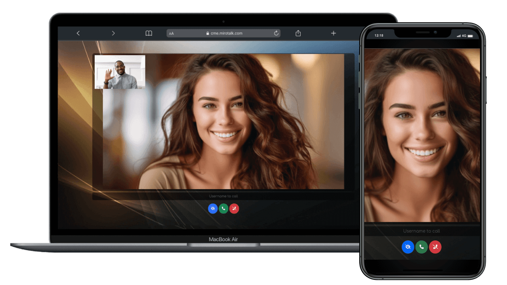

# Which MiroTalk product should I choose?

Start with what you want to do, how people participate, and how much infrastructure you want to operate. You do not need to understand WebRTC before choosing a useful starting point.

[Find your product](#choose-by-goal){ .md-button .md-button--primary }
[Compare architectures](../overview/index.md){ .md-button }

## Choose by goal

    <a class="chooser-choice choice-sfu" href="/mirotalk-sfu/">
        SFU
        <strong>Complete group meetings</strong><small>Classes, webinars, conferences, and room to grow</small>
    </a>
    <a class="chooser-choice choice-p2p" href="/mirotalk-p2p/">
        P2P
        <strong>Private or small meetings</strong><small>Direct participant connections and lower routine server demand</small>
    </a>
    <a class="chooser-choice choice-c2c" href="/mirotalk-c2c/">
        C2C
        <strong>Simple two-person video</strong><small>A focused camera-to-camera experience</small>
    </a>
    <a class="chooser-choice choice-cme" href="/mirotalk-cme/">
        CME
        <strong>Click to call a user</strong><small>Incoming calls for support and direct communication</small>
    </a>
    <a class="chooser-choice choice-bro" href="/mirotalk-bro/">
        BRO
        <strong>Broadcast to an audience</strong><small>One presenter with many viewers</small>
    </a>
    <a class="chooser-choice choice-web" href="/mirotalk-web/">
        WEB
        <strong>Schedule and organize</strong><small>Accounts, rooms, invitations, and a meeting workspace</small>
    </a>
    <a class="chooser-choice choice-admin" href="/mirotalk-admin/">
        ADMIN
        <strong>Manage installations</strong><small>Configure and operate services on your servers</small>
    </a>

Do not want to operate the service yourself? [Start with MiroTalk Cloud](../cloud/index.md), the managed service powered by MiroTalk WEB.

{ .chooser-preview }

## Understand the three product layers

MiroTalk products solve related problems, but they are not seven competing versions of the same application.

| Layer | Products | Purpose |
| --- | --- | --- |
| **Communication** | SFU, P2P, C2C, CME, BRO | Where people meet, call, or broadcast |
| **User workspace** | WEB | Accounts, rooms, schedules, and invitations |
| **Infrastructure administration** | ADMIN | Management of services running on your servers |

Choose the communication experience first. Add WEB or ADMIN only when you need the workflow around it.

## Communication products

### MiroTalk SFU

{ .product-shot }

Use SFU for group meetings, classes, webinars, conferences, and other workflows that need a complete meeting experience. Each participant sends media to a Selective Forwarding Unit, which forwards the required streams.

**Best fit:** growing groups and richer meeting workflows.  
**Infrastructure:** the media server consumes CPU, memory, and bandwidth as usage grows.  
**Main trade-off:** better room scalability requires more server resources than direct peer-to-peer calls.

[Learn about SFU](../mirotalk-sfu/index.md){ .md-button .md-button--primary }
[Try the SFU demo](https://sfu.mirotalk.com){ .md-button }

### MiroTalk P2P

{ .product-shot }

Use P2P for private calls and small group meetings where participants can exchange media directly. The application server coordinates the room but does not normally forward every media stream.

**Best fit:** private calls and small groups.  
**Infrastructure:** routine server demand is lower when media remains between participants.  
**Main trade-off:** every additional participant increases work on participant devices, and TURN relay traffic can add server bandwidth.

[Learn about P2P](../mirotalk-p2p/index.md){ .md-button .md-button--primary }
[Try the P2P demo](https://p2p.mirotalk.com){ .md-button }

### MiroTalk C2C

{ .product-shot }

Use C2C when the experience should remain a focused camera-to-camera call between two people. It is a practical base for embedding or adapting one-to-one video without the surface area of a group meeting product.

**Best fit:** exactly two participants.  
**Infrastructure:** media normally travels between the two participants.  
**Main trade-off:** it is not designed for group meetings or one-to-many broadcasts.

[Learn about C2C](../mirotalk-c2c/index.md){ .md-button .md-button--primary }
[Try the C2C demo](https://c2c.mirotalk.com){ .md-button }

### MiroTalk CME

{ .product-shot }

Use CME for click-to-call workflows where a caller needs to reach a specific available user. The workflow is centered on incoming calls rather than conventional meeting rooms.

**Best fit:** support, consultation, and direct-calling workflows.  
**Infrastructure:** the call media normally uses a peer-to-peer path.  
**Main trade-off:** the specialized caller/user flow is not intended to replace group meetings.

[Learn about CME](../mirotalk-cme/index.md){ .md-button .md-button--primary }
[Try the CME demo](https://cme.mirotalk.com){ .md-button }

### MiroTalk BRO

{ .product-shot }

Use BRO when one presenter needs to reach an audience. P2P mode can suit smaller audiences; SFU mode moves distribution work to the server when the audience grows.

**Best fit:** live broadcasts and one-to-many events.  
**Infrastructure:** demand varies with the selected P2P or SFU mode.  
**Main trade-off:** the audience size and distribution mode directly affect server bandwidth and cost.

[Learn about BRO](../mirotalk-bro/index.md){ .md-button .md-button--primary }
[Try the BRO demo](https://bro.mirotalk.com){ .md-button }

## Supporting products

### MiroTalk WEB organizes meetings

{ .product-shot }

WEB provides a user-facing workspace for accounts, rooms, schedules, and invitations. It organizes communication workflows; it is not itself a replacement for every communication architecture.

[Learn about WEB](../mirotalk-web/index.md){ .md-button }
[Use the managed service](https://webrtc.mirotalk.com){ .md-button .md-button--primary }

### MiroTalk ADMIN manages infrastructure

{ .product-shot }

ADMIN helps operators configure and manage MiroTalk services running on their servers. It is an infrastructure tool rather than a meeting or calling experience.

[Learn about ADMIN](../mirotalk-admin/index.md){ .md-button }
[View ADMIN on GitHub](https://github.com/miroslavpejic85/mirotalk-admin){ .md-button }

## Compare products

This is relative guidance, not a capacity promise or hosting quote. Actual infrastructure depends on concurrent users, media quality, traffic, region, network conditions, and TURN relaying.

| Product | Primary job | Typical participation | Media path | Relative server demand | Main trade-off |
| --- | --- | --- | --- | --- | --- |
| **SFU** | Meetings and webinars | Small to larger groups | Through a media server | Higher | More infrastructure to operate |
| **P2P** | Private and small meetings | Small groups | Between participants, or TURN when required | Lower | More participants increase device and network load |
| **C2C** | Camera-to-camera calls | Two people | Between participants, or TURN when required | Lower | Limited to two participants |
| **CME** | Direct click-to-call | Caller and user | Between participants, or TURN when required | Lower | Specialized calling workflow |
| **BRO** | One-to-many broadcast | Presenter and viewers | P2P or SFU | Variable | Audience size changes infrastructure needs |
| **WEB** | Meeting workspace | Any supported workflow | Not a media engine | Additional application services | Requires a communication product |
| **ADMIN** | Infrastructure management | Multiple services | Not a media engine | Additional application service | Not required for simple deployments |

!!! note "TURN can change P2P costs"

    Restrictive networks can force peer-to-peer media through a TURN relay. Relayed traffic consumes server bandwidth, so a P2P deployment is not always free of media infrastructure costs.

## Where does the video travel?

### P2P: between participants

Each participant sends media directly to the others when the network permits it. This reduces routine media-server work but limits practical room size because every device handles more streams as participants join.

### SFU: through your media server

Each participant sends one upstream media feed to the SFU. The server forwards selected streams to the other participants. Server demand is higher, but participant devices do less distribution work.

### BRO: from one presenter to many viewers

The broadcaster sends to viewers directly in P2P mode or through an SFU. The best mode depends on audience size and the infrastructure available.

[Read the WebRTC architecture guide](../webrtc/architectures.md){ .md-button }
[Compare product architectures](../overview/index.md){ .md-button }
[Review SFU scalability](../mirotalk-sfu/scalability.md){ .md-button }

## Why separate products?

1. **Different workloads need different architectures.** P2P minimizes routine server media work, SFU makes larger rooms practical, and BRO centers a presenter/audience flow.
2. **Self-hosting makes infrastructure a real decision.** A two-person call and a large group meeting should not require identical deployments.
3. **Focused codebases are easier to understand and adapt.** A smaller C2C or CME application exposes less unrelated behavior when the workflow is narrow.
4. **Products can work together.** WEB can organize an SFU meeting, while ADMIN can help operate the deployed service.

## Still unsure?

Start with MiroTalk SFU when you need a complete group meeting experience and room to grow. Choose MiroTalk Cloud when you do not want to manage the infrastructure.

[Explore MiroTalk SFU](../mirotalk-sfu/index.md){ .md-button .project-action }
[Start MiroTalk Cloud](https://webrtc.mirotalk.com){ .md-button .md-button--primary .project-action }

## Choose how to use MiroTalk

MiroTalk source is available under AGPLv3. For commercial licensing requirements, use the official licensing page as the source of truth.

[Read the AGPLv3 terms](https://www.gnu.org/licenses/agpl-3.0.html){ .md-button .project-action }
[Compare licensing options](../license/index.md){ .md-button .md-button--primary .project-action }
[Contact MiroTalk](mailto:miroslav.pejic.85@gmail.com){ .md-button .project-action }