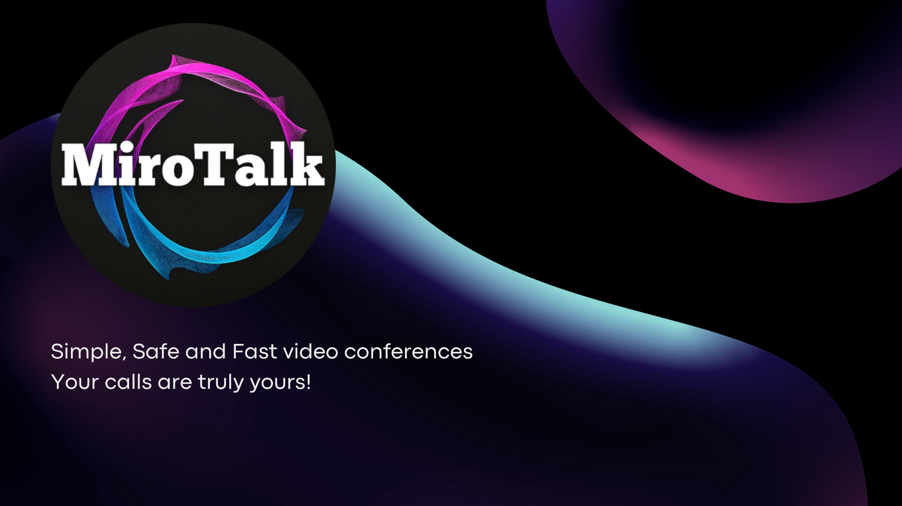

# 🎬 The Story Behind MiroTalk

---

## It Started With a Pandemic

In 2020, the world stopped. But communication couldn't.

Overnight, video calls became our classrooms, our offices, our lifelines. Like millions of others, I found myself living through a screen, desperately trying to stay connected with friends, family, and collaborators.

But the more I used these platforms, the more something gnawed at me.

The tools we depended on every single day were convenient, sure. But they came with a cost nobody was talking about: **our privacy**.

---

## The Problem Hiding in Plain Sight

Every major video platform was controlled by **massive corporations**. Closed ecosystems. Black boxes. Users had **zero control** over where their data went, who saw it, or how it was used.

Think about that for a moment:

- **Privacy?** An afterthought, buried in 50-page terms of service nobody reads.
- **Vendor lock-in?** By design. Switching costs kept everyone trapped.
- **Data collection?** Not a bug. **The business model itself.**

Your face. Your voice. Your conversations. Your meetings. All flowing through servers you don't own, governed by policies you didn't write, stored in databases you'll never see.

> 💡 *"Why should we hand over our most private conversations to companies that treat our data as a product?"*

That question haunted me. It kept me up at night. And eventually, it pushed me to do something about it.

---

## A Bold Idea Takes Shape

I didn't just want to complain. I wanted to **build the alternative**.

The idea was deceptively simple: a **free, open-source WebRTC platform** that anyone, anywhere in the world, could deploy on their own server, in minutes.

No subscriptions. No tracking pixels. No corporate overlords watching your every call.

**Just pure, private communication, whether peer-to-peer or through your own media server.**

The mission came down to four non-negotiable principles:

| Principle | What It Means |
| :--- | :--- |
| **No vendor lock-in** | Your platform, your rules, forever |
| **Full data control** | Your data never leaves your hands |
| **Privacy by design** | Not a toggle in settings, it's the architecture |
| **Open source for all** | Every line of code, visible to everyone |

---

## How It Got Its Name

Friends and colleagues have always called me **"Miro."**

And since this whole project was born from one person's belief that people deserve to communicate **freely and fearlessly**, the name wrote itself:

> ### ✨ Miro + Talk = **MiroTalk**

A simple name with a powerful promise: open communication built with a **personal touch** and a whole lot of heart. ❤️

---

## From Side Project to Global Movement

Here's what I never expected.

What started as a **solo experiment during lockdown** took on a life of its own. Developers found it. Then educators. Then entire organizations.

Today, MiroTalk is trusted by people **across the globe**:

| Who | Why They Chose MiroTalk |
| :--- | :--- |
| **Developers** | Because they read the code and trust what they see |
| **Educators** | Because students deserve privacy, not surveillance |
| **Teams** | Because private conversations should actually be private |
| **Communities** | Because communication tools should empower people, not exploit them |

Not because of a marketing budget. Not because of a sales team. **Because the code speaks for itself.**

---

## Shaped by the People Who Use It

Once people started using MiroTalk, something unexpected happened: they didn't just use it, they **shaped it**. Every feature request, every bug report, every conversation became a reason to make it better.

No boardroom decided the roadmap. **Real users did.** Teachers, developers, teams, they told me what they needed, and I built it.

> 💡 *"The best software isn't built in isolation. It's shaped by the people who depend on it every day."*

That's the secret no corporation can replicate: **when you build in the open, your users become your co-creators.**

---

## This Is Just the Beginning

MiroTalk is more than software. It's a statement.

A statement that **privacy is not a luxury**. That **open source is not a compromise**. That the tools we use to connect with each other should belong to **us**, not to corporations.

> **This is a movement toward a more open, private, and decentralized web.**
>
> **One call at a time. One server at a time. One person at a time.**

And if you're reading this, you're already part of it. 🚀