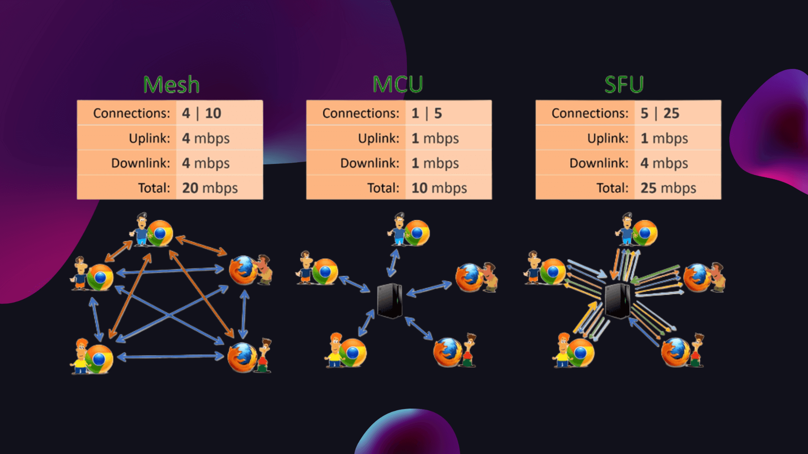
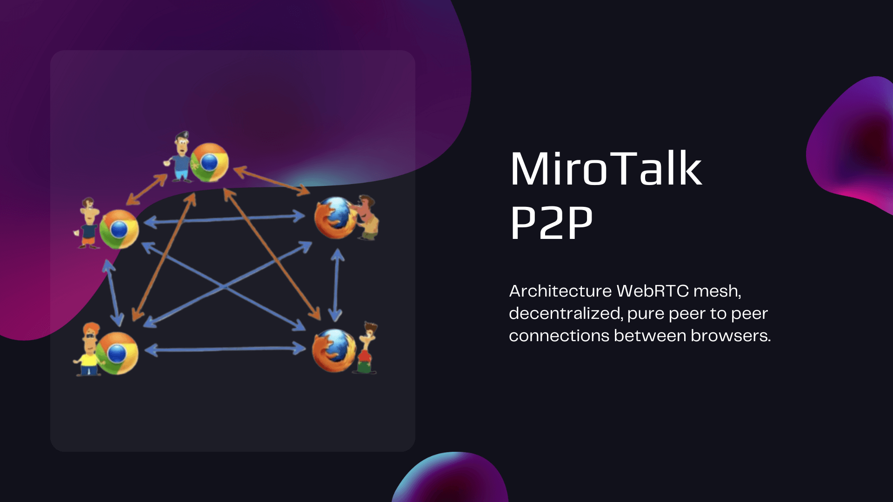
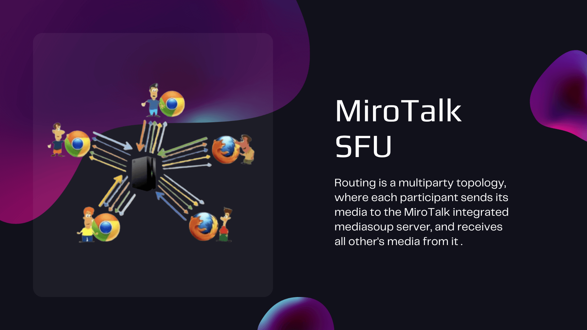
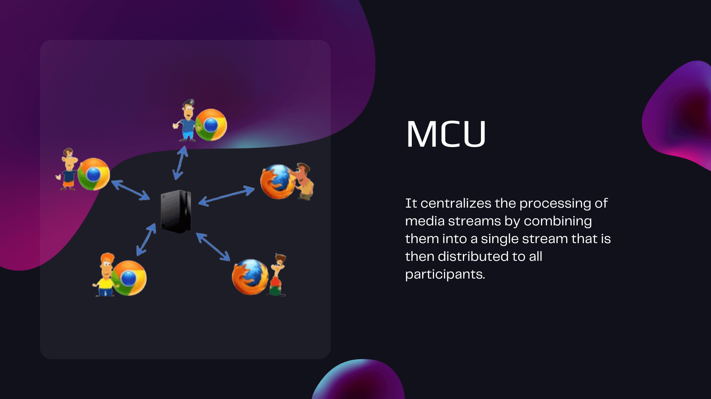
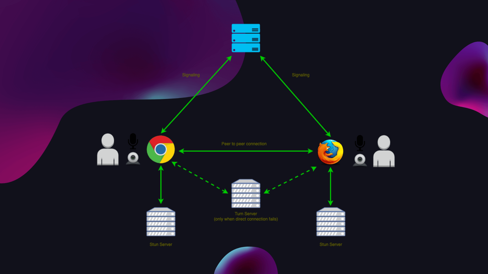

# WebRTC

## Introduction

Web Real-Time Communication (WebRTC) has revolutionized the way we communicate online by enabling real-time audio and video communication directly in web browsers. Behind the scenes, WebRTC relies on various architectures to facilitate seamless communication. This article delves into the differences between Mesh, Selective Forwarding Unit (SFU), Multipoint Control Unit (MCU) architectures in WebRTC and the crucial role played by STUN/TURN servers.

## WebRTC Architectures

### Mesh Architecture
   
  

In a Mesh architecture, each participant in a communication session connects directly to every other participant. This creates a fully connected network where data is exchanged directly between peers. While this approach is straightforward and requires minimal infrastructure, it becomes impractical as the number of participants increases. The bandwidth and processing power required for direct connections grow exponentially, leading to performance challenges.

### SFU (Selective Forwarding Unit) Architecture
  
  

SFU architecture addresses the limitations of Mesh by introducing a central server that acts as an intermediary. Instead of sending data to all participants, each user sends their media stream to the SFU, which then selectively forwards it to the intended recipients. This reduces the overall bandwidth requirements and allows for more scalable and efficient communication. SFU is particularly advantageous in scenarios with a larger number of participants.

### MCU (Multipoint Control Unit) Architecture
  
 

MCU architecture, on the other hand, takes a different approach. It centralizes the processing of media streams by combining them into a single stream that is then distributed to all participants. While this simplifies the communication process, it can be resource-intensive on the server, especially as the number of participants grows. MCU architectures are often employed in scenarios where centralized control and mixing of media streams are essential, such as video conferencing with special effects or overlays.

## Stun/Turn

STUN (Session Traversal Utilities for NAT) and TURN (Traversal Using Relays around NAT) Servers:

WebRTC operates in a peer-to-peer fashion, and in many cases, participants may be behind NAT (Network Address Translation) or firewalls, making direct communication challenging. This is where STUN and TURN servers come into play.

1. **STUN Server:**

    STUN servers (Session Traversal Utilities for NAT) help discover and communicate the public IP addresses and ports of peers. They enable the establishment of direct peer-to-peer connections whenever possible by overcoming NAT traversal issues. STUN servers are typically used in scenarios where participants can establish direct communication without the need for relaying.

2. **TURN Server:**

    In cases where direct communication is not possible due to stringent firewalls or symmetric NAT, a TURN server (Traversal Using Relays around NAT) is employed. TURN servers relay the media traffic between participants, acting as intermediaries. While this introduces some latency, it ensures that communication can occur even when direct connections are not feasible.

## Conclusion

In the realm of WebRTC, choosing the right architecture is crucial for achieving optimal performance and scalability. Mesh, SFU, and MCU architectures cater to different use cases, balancing factors such as bandwidth, processing power, and scalability. Meanwhile, STUN and TURN servers play a pivotal role in ensuring that participants can establish communication even in challenging network conditions. Understanding these architectures and their roles is essential for developers and architects aiming to create robust and efficient real-time communication applications on the web.
